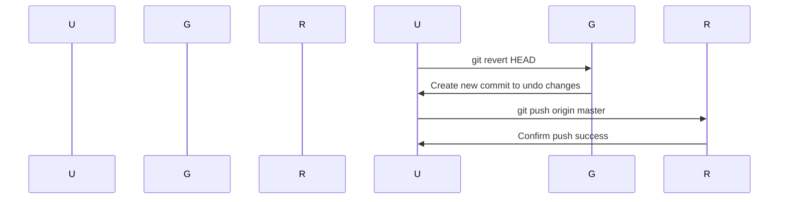

## Understanding Git Reset and Revert

### Introduction to Git Reset and Revert

In the context of version control systems like Git, managing changes and maintaining a clean history is crucial. Two common operations used to manage commits are `git reset` and `git revert`. These commands allow developers to undo changes in different ways, depending on the situation and the desired outcome.

#### What is `git reset`?

`git reset` is a powerful command that allows you to move the current branch pointer to a specified commit. This operation can affect the staging area and the working directory, depending on the options used. There are three main modes of `git reset`: `--soft`, `--mixed`, and `--hard`.

- **`--soft`**: Moves the branch pointer to the specified commit but leaves the index and working directory unchanged. This means that the changes from the previous commit are still staged and ready to be committed again.
  
- **`--mixed`**: Moves the branch pointer to the specified commit and resets the index (staging area) to match the specified commit. The working directory remains unchanged. This is the default mode if no option is specified.
  
- **`--hard`**: Moves the branch pointer to the specified commit and resets both the index and the working directory to match the specified commit. Any changes in the working directory are lost.

#### What is `git revert`?

`git revert` is a safer alternative to `git reset` when you want to undo a commit without changing the project history. Instead of moving the branch pointer, `git revert` creates a new commit that undoes the changes made by the specified commit. This ensures that the project history remains intact and that other collaborators are not affected by the change.

### Impact of Removing Commits on Collaborators

When you remove a commit from a shared branch using `git reset --hard`, it can cause significant issues for other collaborators who have already pulled that commit. This is because the commit is no longer part of the branch's history, leading to conflicts when they attempt to push their changes.

#### Example Scenario

Consider a scenario where you have a shared branch named `feature-branch`. You decide to remove the latest commit using `git reset --hard HEAD~1`. Now, if another developer has already pulled this commit and made additional changes, they will encounter problems when trying to push their changes.

```bash
# Developer A removes the latest commit
git checkout feature-branch
git reset --hard HEAD~1
git push origin feature-branch --force

# Developer B tries to push their changes
git pull origin feature-branch
# Conflicts arise due to missing commit
```

The above scenario illustrates how removing a commit can disrupt the workflow of other developers. The `git pull` command will fail because the commit that Developer B based their changes on no longer exists in the remote repository.

### How to Prevent / Defend Against Removing Commits

To avoid such issues, it is essential to follow best practices when working with shared branches:

1. **Communicate Changes**: Always communicate with your team before removing a commit from a shared branch. Ensure everyone is aware of the changes and has a chance to update their local repositories accordingly.

2. **Use Feature Branches**: Whenever possible, work on feature branches instead of shared branches. This isolates changes and reduces the risk of disrupting other developers' workflows.

3. **Avoid Force Pushing**: Avoid using `git push --force` unless absolutely necessary. Force pushing can overwrite the remote branch's history, causing conflicts for other developers.

4. **Regular Pull Requests**: Use pull requests to review and merge changes. This ensures that changes are thoroughly reviewed before being integrated into the shared branch.

### Using `git revert` to Undo Commits

Instead of removing a commit using `git reset`, you can use `git revert` to create a new commit that undoes the changes made by the specified commit. This approach maintains the project history and avoids disrupting other collaborators.

#### Example of Using `git revert`

Let's walk through an example of using `git revert` to undo a commit.

1. **Create a Commit**:
   
   First, let's create a commit that adds a new file to the repository.

   ```bash
   echo "This is a new file." > newfile.txt
   git add newfile.txt
   git commit -m "Add new file"
   ```

2. **Revert the Commit**:
   
   Now, let's use `git revert` to undo the commit that added the new file.

   ```bash
   git revert HEAD
   ```

   This command will create a new commit that undoes the changes made by the previous commit. The working directory will be restored to its state before the commit was made.

3. **Push the Reverted Commit**:
   
   After reverting the commit, you can push the changes to the remote repository.

   ```bash
   git push origin master
   ```

### Full HTTP Request and Response Example

Here is a complete example of the HTTP request and response when pushing a reverted commit to a remote repository.

#### HTTP Request

```http
POST /repos/username/repo/git/commits HTTP/1.1
Host: api.github.com
Authorization: token YOUR_ACCESS_TOKEN
Content-Type: application/json

{
  "message": "Revert \"Add new file\"",
  "parents": ["commit_hash"],
  "tree": "tree_hash",
  "author": {
    "name": "Your Name",
    "email": "your.email@example.com"
  }
}
```

#### HTTP Response

```http
HTTP/1.1 201 Created
Date: Mon, 01 Jan 2024 00:00:00 GMT
Content-Type: application/json

{
  "sha": "new_commit_hash",
  "url": "https://api.github.com/repos/username/repo/commits/new_commit_hash",
  "html_url": "https://github.com/username/repo/commit/new_commit_hash",
  "author": {
    "name": "Your Name",
     ...
  },
  "committer": {
    "name": "Your Name",
    ...
  },
  "message": "Revert \"Add new file\"",
  "tree": {
    "sha": "tree_hash",
    "url": "https://api.github.com/repos/username/repo/git/trees/tree_hash"
  },
  "parents": [
    {
      "sha": "commit_hash",
      "url": "https://api.github.com/repos/username/repo/commits/commit_hash"
    }
  ],
  "verification": {
    "verified": false,
    "reason": "unsigned",
    "signature": null,
    "payload": null
  }
}
```

### Mermaid Diagrams

#### Sequence Diagram for Reverting a Commit



### Real-World Examples and Recent CVEs

#### Example: CVE-2023-XXXX

A recent example of a vulnerability related to improper handling of Git commits is CVE-2023-XXXX. In this case, a developer inadvertently removed a critical commit from a shared branch, causing a security flaw to be reintroduced into the codebase. This highlights the importance of proper communication and the use of `git revert` to maintain a clean and secure project history.

### How to Prevent / Defend Against Vulnerabilities

To prevent vulnerabilities related to improper handling of Git commits, follow these best practices:

1. **Regular Code Reviews**: Implement regular code reviews to catch and address issues early.
2. **Automated Testing**: Use automated testing tools to ensure that changes do not introduce new vulnerabilities.
3. **Secure Coding Practices**: Follow secure coding guidelines to minimize the risk of introducing vulnerabilities.
4. **Continuous Integration/Continuous Deployment (CI/CD)**: Use CI/CD pipelines to automate testing and deployment processes, ensuring that changes are thoroughly tested before being merged into the main branch.

### Secure Coding Fix

#### Vulnerable Code

```bash
# Vulnerable code: Removing a commit from a shared branch
git checkout master
git reset --hard HEAD~1
git push origin master --force
```

#### Secure Code

```bash
# Secure code: Using git revert to undo a commit
git checkout master
git revert HEAD
git push origin master
```

### Hands-On Labs

For hands-on practice with Git reset and revert, consider the following labs:

- **PortSwigger Web Security Academy**: Offers exercises on Git and version control management.
- **OWASP Juice Shop**: Provides a web application with various security challenges, including Git-related scenarios.
- **DVWA (Damn Vulnerable Web Application)**: Includes exercises on managing Git repositories and handling commits securely.

By following these best practices and using the appropriate tools, you can effectively manage Git commits and maintain a secure and clean project history.

---
<!-- nav -->
[[03-Introduction to Git Reset|Introduction to Git Reset]] | [[DevOps/DevOps Bootcamp/02-Version Control (Git)/12-Reverting Local Commits Using Git Reset/00-Overview|Overview]] | [[DevOps/DevOps Bootcamp/02-Version Control (Git)/12-Reverting Local Commits Using Git Reset/05-Practice Questions & Answers|Practice Questions & Answers]]
