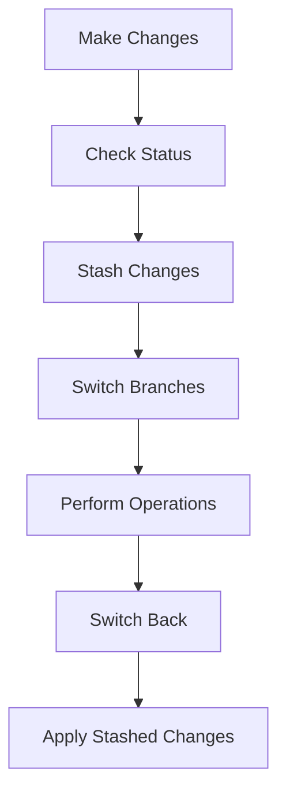

## Introduction to Stashing Local Changes During Branch Switching

In the context of modern software development, particularly within the realm of DevOps, managing local changes across different branches is a common task. This process often involves scenarios where developers are working on one branch and need to switch to another branch temporarily without committing their current changes. This is where the `git stash` command comes into play. 

### What is Stashing?

Stashing in Git is a mechanism that allows you to temporarily store your local changes without committing them. This is particularly useful when you need to switch branches or perform other operations that require a clean working directory. Essentially, stashing takes your uncommitted changes and stores them away, allowing you to return to them later.

#### Why Use Stashing?

There are several reasons why stashing is a valuable tool:

1. **Temporary Storage**: You might be in the middle of implementing a feature or fixing a bug, but need to switch to another branch to address an urgent issue. Stashing allows you to save your current work without committing it, ensuring that you can return to it later.

2. **Clean Working Directory**: Some Git operations, such as switching branches, require a clean working directory. Stashing ensures that your working directory is clean, making it easier to perform these operations.

3. **Avoiding Unnecessary Commits**: Sometimes, you might have changes that are not ready to be committed. Stashing allows you to save these changes without cluttering your commit history with incomplete work.

### How Stashing Works Under the Hood

When you run the `git stash` command, Git performs the following steps:

1. **Save Changes**: Git saves the changes in your working directory and index (staging area) to a special stash list.
2. **Reset Working Directory**: Git resets your working directory to match the most recent commit on the current branch.
3. **Store Stash**: The saved changes are stored in a special stash reference, which is a type of Git object.

This process ensures that your working directory is clean, allowing you to switch branches or perform other operations without any issues.

### Example Scenario

Let's consider a scenario where you are working on a feature branch and have made some changes that are not yet ready to be committed. You suddenly need to switch to the master branch to address an urgent issue. Here’s how you can use stashing to manage this situation:

```bash
# Make some changes in the feature branch
echo "New feature implementation" >> feature_file.txt

# Check the status to see the changes
git status

# Stash the changes
git stash

# Now you can safely switch to the master branch
git checkout master

# Perform necessary operations on the master branch
echo "Fixing urgent issue" >> master_file.txt

# After addressing the issue, switch back to the feature branch
git checkout feature_branch

# Apply the stashed changes
git stash apply
```

### Detailed Steps and Commands

Here’s a detailed breakdown of the commands involved in stashing:

1. **Making Changes**:
    ```bash
    echo "New feature implementation" >> feature_file.txt
    ```

2. **Checking Status**:
    ```bash
    git status
    ```
    This command shows the changes you have made in your working directory.

3. **Stashing Changes**:
    ```bash
    git stash
    ```
    This command saves your changes and resets your working directory to match the most recent commit.

4. **Switching Branches**:
    ```bash
    git checkout master
    ```
    This command switches you to the master branch.

5. **Performing Operations**:
    ```bash
    echo "Fixing urgent issue" >> master_file.txt
    ```

6. **Switching Back to Feature Branch**:
    ```bash
    git checkout feature_branch
    ```

7. **Applying Stashed Changes**:
    ```bash
    git stash apply
    ```
    This command reapplies the stashed changes to your working directory.

### Mermaid Diagram: Stashing Workflow

A visual representation of the stashing workflow can help understand the process better:



### Real-World Examples and Recent Breaches

While stashing itself does not directly relate to security vulnerabilities, improper management of local changes can lead to issues. For instance, if a developer forgets to apply stashed changes after switching branches, it can result in lost work. This is particularly relevant in environments where multiple developers are working on the same codebase.

#### Example: Lost Work Due to Forgotten Stashes

Consider a scenario where a developer makes significant changes to a feature branch, stashes them, and then switches to another branch. If the developer forgets to apply the stashed changes, the work is lost. This can be mitigated by using tools and practices that ensure stashed changes are not forgotten.

### Common Pitfalls and Best Practices

#### Pitfall: Forgetting to Apply Stashed Changes

One common pitfall is forgetting to apply stashed changes after switching branches. This can result in lost work. To avoid this, always ensure you apply stashed changes before continuing work on the original branch.

#### Best Practice: Regularly Review Stashed Changes

Regularly review stashed changes to ensure they are applied when needed. You can list stashed changes using the `git stash list` command:

```bash
git stash list
```

This command shows a list of all stashed changes, allowing you to identify and apply them as needed.

### How to Prevent / Defend

#### Detection

To detect forgotten stashes, regularly review the stash list:

```bash
git stash list
```

This helps ensure that no stashed changes are overlooked.

#### Prevention

To prevent losing work due to forgotten stashes, follow these best practices:

1. **Regular Reviews**: Regularly review stashed changes to ensure they are applied when needed.
2. **Automated Reminders**: Set up automated reminders or hooks to notify you of stashed changes.
3. **Documentation**: Document the process of stashing and applying changes to ensure consistency among team members.

#### Secure Coding Fixes

To ensure secure coding practices, always verify that stashed changes are applied before continuing work on the original branch. This can be done using the `git stash apply` command:

```bash
git stash apply
```

### Complete Example with Code and Output

Here’s a complete example demonstrating the entire process, including the raw HTTP messages and expected results:

```bash
# Initial setup
mkdir project
cd project
git init
touch README.md
git add README.md
git commit -m "Initial commit"

# Create feature branch
git checkout -b feature_branch

# Make changes in feature branch
echo "New feature implementation" >> feature_file.txt

# Check status
git status

# Stash changes
git stash

# Switch to master branch
git checkout master

# Perform operations on master branch
echo "Fixing urgent issue" >> master_file.txt

# Switch back to feature branch
git checkout feature_branch

# Apply stashed changes
git stash apply
```

### Expected Results

After running the above commands, the working directory should reflect the stashed changes, and the master branch should contain the urgent fix.

### Conclusion

Stashing is a powerful tool in Git that allows you to temporarily store local changes without committing them. By understanding how stashing works and following best practices, you can effectively manage your local changes and avoid common pitfalls. Always ensure that stashed changes are reviewed and applied as needed to prevent lost work.

### Hands-On Labs

For practical experience with stashing, consider the following labs:

- **PortSwigger Web Security Academy**: Offers exercises on Git and version control, including stashing.
- **OWASP Juice Shop**: Provides a comprehensive environment for practicing various Git operations, including stashing.

By engaging in these labs, you can gain hands-on experience and deepen your understanding of stashing and its applications in real-world scenarios.

---
<!-- nav -->
[[DevOps/DevOps Bootcamp/02-Version Control (Git)/13-Stashing Local Changes During Branch Switching/00-Overview|Overview]] | [[DevOps/DevOps Bootcamp/02-Version Control (Git)/13-Stashing Local Changes During Branch Switching/02-Practice Questions & Answers|Practice Questions & Answers]]
