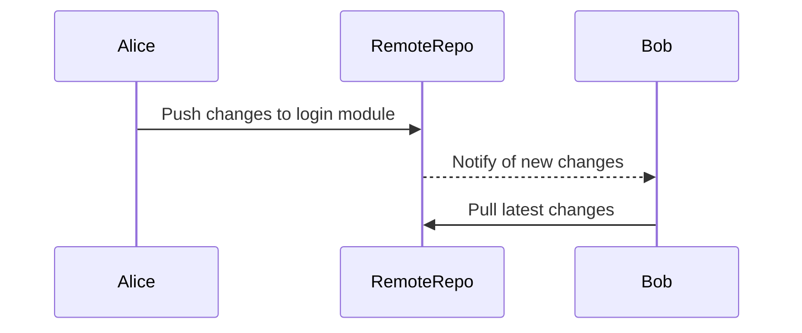
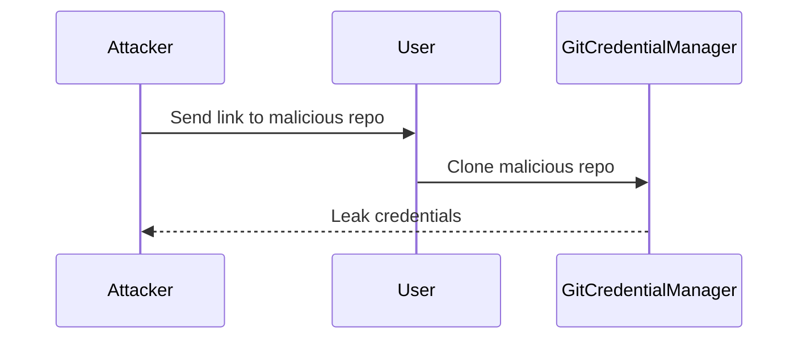

## Understanding Git Components and Workflow

### Introduction to Git

Git is a distributed version control system designed to handle everything from small to very large projects with speed and efficiency. It was created by Linus Torvalds in 2005 for the development of the Linux kernel. Git allows developers to track changes in their codebase, collaborate with others, and maintain a history of modifications.

#### Key Concepts

1. **Repository**: A directory containing all the project files and a hidden `.git` directory that stores the version control information.
2. **Commit**: A snapshot of the entire project at a specific point in time. Each commit has a unique identifier (SHA-1 hash) and contains metadata such as author, date, and a log message.
3. **Branch**: A separate line of development within a repository. Branches allow developers to work on different features or bug fixes simultaneously without interfering with the main codebase.
4. **Remote Repository**: A repository hosted on a remote server, such as GitHub, GitLab, or Bitbucket. This allows multiple developers to collaborate on the same project.

### Git Workflow

The typical Git workflow involves several steps:

1. **Clone**: Copy the remote repository to your local machine.
2. **Checkout**: Switch to a specific branch.
3. **Add**: Stage changes to be committed.
4. **Commit**: Save the staged changes as a new commit.
5. **Push**: Send the commits to the remote repository.
6. **Pull**: Fetch and merge changes from the remote repository.

#### Detailed Steps

1. **Clone**:
   ```sh
   git clone https://github.com/user/repo.git
   ```
   This command creates a local copy of the remote repository.

2. **Checkout**:
   ```sh
   git checkout feature-branch
   ```
   This switches the working directory to the specified branch.

3. **Add**:
   ```sh
   git add .
   ```
   This stages all changes in the current directory for the next commit.

4. **Commit**:
   ```sh
   git commit -m "Fix bug in login module"
   ```
   This saves the staged changes as a new commit with a descriptive message.

5. **Push**:
   ```sh
   git push origin feature-branch
   ```
   This sends the commits to the remote repository.

6. **Pull**:
   ```sh
   git pull origin main
   ```
   This fetches and merges changes from the remote repository into the local branch.

### Example Scenario

Consider a scenario where two developers, Alice and Bob, are working on a project hosted on GitHub. Alice makes some changes to the `login` module and commits her changes to her local repository. She then pushes these changes to the remote repository.



Bob pulls the latest changes from the remote repository and continues his work.

### Common Pitfalls and How to Avoid Them

1. **Merge Conflicts**:
   - **What**: Merge conflicts occur when two developers make conflicting changes to the same file.
   - **Why**: Git cannot automatically resolve the conflict because it doesn't know which change to keep.
   - **How**: Resolve the conflict manually by editing the conflicted file and choosing the correct changes.
   - **Prevent**: Communicate with team members about who is working on which parts of the codebase. Use tools like `git mergetool` to help resolve conflicts.

2. **Untracked Files**:
   - **What**: Untracked files are files that Git does not know about.
   - **Why**: These files are not included in the repository and can be lost if not added.
   - **How**: Add untracked files using `git add`.
   - **Prevent**: Regularly check the status of your repository using `git status` to ensure all important files are tracked.

3. **Lost Commits**:
   - **What**: Lost commits occur when a developer accidentally overwrites or deletes commits.
   - **Why**: This can happen due to incorrect use of commands like `git reset` or `git rebase`.
   - **How**: Recover lost commits using `git reflog` to find the commit hash and then use `git cherry-pick` to restore the commit.
   - **Prevent**: Always double-check the effects of destructive commands and use `git stash` to save changes temporarily.

### Secure Coding Practices

1. **Commit Messages**:
   - **Vulnerable**: Commit messages should be descriptive and meaningful.
   - **Fixed**:
     ```sh
     git commit -m "Fix bug in login module"
     ```
     Instead of:
     ```sh
     git commit -m "Update code"
     ```

2. **Sensitive Data**:
   - **Vulnerable**: Accidentally committing sensitive data like API keys or passwords.
   - **Fixed**: Use `.gitignore` to exclude sensitive files and use environment variables to store secrets.
     ```sh
     echo "secrets.txt" >> .gitignore
     ```

### Real-World Examples

#### CVE-2021-22205: Git Credential Manager Core

In 2021, a vulnerability was discovered in the Git Credential Manager Core, which could allow an attacker to steal credentials. This highlights the importance of keeping Git tools up-to-date and using secure credential management practices.

#### Example Exploit

An attacker could exploit this vulnerability by tricking a user into cloning a malicious repository that triggers the credential manager to leak credentials.



### Detection and Prevention

1. **Detection**:
   - Use static analysis tools like `git-secrets` to scan repositories for sensitive data.
   - Monitor access logs and alert on suspicious activity.

2. **Prevention**:
   - Keep Git tools and dependencies up-to-date.
   - Use secure credential management solutions like SSH keys and OAuth tokens.
   - Educate developers on secure coding practices and the risks of committing sensitive data.

### Hands-On Practice

For hands-on practice with Git, consider the following resources:

- **PortSwigger Web Security Academy**: Offers interactive labs to practice Git usage in a web application context.
- **OWASP Juice Shop**: A deliberately insecure web application for practicing various security concepts, including version control.
- **DVWA (Damn Vulnerable Web Application)**: Another web application for practicing security skills, including Git usage.

These resources provide real-world scenarios and challenges to reinforce the concepts learned in this chapter.

### Conclusion

Understanding Git components and workflow is crucial for effective collaboration in software development. By mastering the key concepts, following secure coding practices, and being aware of common pitfalls, developers can ensure smooth and secure collaboration in their projects.

---
<!-- nav -->
[[01-Introduction to Git|Introduction to Git]] | [[DevOps/DevOps Bootcamp/02-Version Control (Git)/14-Understanding Git Components And Workflow/00-Overview|Overview]] | [[DevOps/DevOps Bootcamp/02-Version Control (Git)/14-Understanding Git Components And Workflow/03-Practice Questions & Answers|Practice Questions & Answers]]
