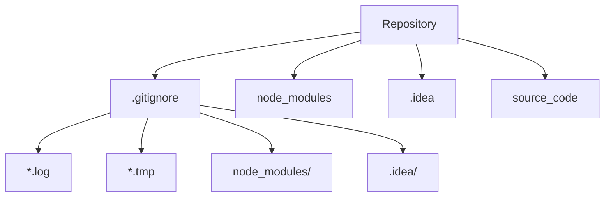
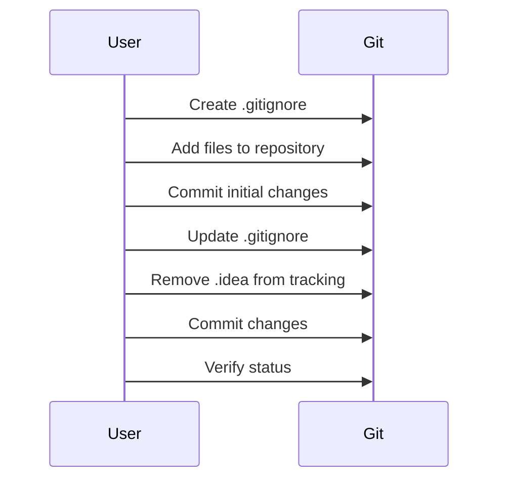

## Understanding Git Ignore Files

### Introduction to Git Ignore Files

Git Ignore files are essential components of any Git repository. They allow developers to specify which files and directories should be ignored by Git, preventing them from being tracked and included in the repository. This is particularly useful for excluding files that are generated automatically, contain sensitive information, or are specific to a local development environment.

#### What is a `.gitignore` File?

A `.gitignore` file is a text file located at the root of a Git repository. It contains patterns that match the filenames and directories that should be ignored by Git. These patterns can include wildcards, negations, and comments.

#### Why Use a `.gitignore` File?

Using a `.gitignore` file helps maintain a clean and manageable repository by excluding unnecessary files. This includes:

- **Generated Files**: Files like compiled binaries, log files, or temporary files that are generated during the build process.
- **Environment-Specific Files**: Configuration files that are specific to a developer’s local environment, such as IDE settings.
- **Sensitive Information**: Files containing sensitive data like API keys, passwords, or other credentials that should not be stored in the repository.

### Creating and Using a `.gitignore` File

To create a `.gitignore` file, simply create a new text file named `.gitignore` at the root of your Git repository. You can then add patterns to this file to specify which files and directories should be ignored.

#### Example `.gitignore` File

Here is an example of a `.gitignore` file:

```plaintext
# Ignore all .log files
*.log

# Ignore all .tmp files
*.tmp

# Ignore the node_modules directory
node_modules/

# Ignore the .idea directory
.idea/
```

This `.gitignore` file will ignore all `.log` and `.tmp` files, as well as the `node_modules` and `.idea` directories.

### Adding and Removing Files from Git Tracking

When you initially commit a file or directory to a Git repository, Git starts tracking it. To stop tracking a file or directory after it has been committed, you need to remove it from the repository while keeping it in the working directory.

#### Removing a Tracked Directory

Let's say you have a directory named `.idea` that was previously committed to the repository. To remove it from Git tracking, follow these steps:

1. **Add the directory to the `.gitignore` file**:
    ```plaintext
    .idea/
    ```

2. **Remove the directory from Git tracking**:
    ```sh
    git rm --cached -r .idea
    ```

3. **Commit the changes**:
    ```sh
    git commit -m "Stop tracking .idea directory"
    ```

4. **Verify the changes**:
    ```sh
    git status
    ```

After these steps, the `.idea` directory will no longer be tracked by Git, but it will remain in your working directory.

### Common Pitfalls and Best Practices

#### Pitfall: Ignoring Already Tracked Files

If you try to ignore a file or directory that is already tracked by Git, Git will continue to track it unless you explicitly remove it from tracking. This is a common mistake that can lead to confusion and unnecessary clutter in the repository.

#### Best Practice: Regularly Review `.gitignore` Files

It is a good practice to regularly review and update your `.gitignore` file to ensure that it is up-to-date with the current project requirements. This includes adding new patterns as necessary and removing outdated ones.

### Real-World Examples and Recent Breaches

#### Example: Exposing Sensitive Data via Git

In 2021, a breach occurred where sensitive data, including API keys and database credentials, were accidentally committed to a public Git repository. This happened because the `.gitignore` file did not properly exclude these files.

**Vulnerable Code**:
```plaintext
# .gitignore
# Missing exclusion for sensitive files
```

**Secure Code**:
```plaintext
# .gitignore
secrets.json
credentials.txt
```

By ensuring that sensitive files are excluded from the repository, you can prevent such breaches.

### How to Prevent / Defend

#### Detection

To detect files that should be ignored but are not, you can use tools like `git check-ignore`. This command allows you to check whether a file is ignored by the `.gitignore` rules.

```sh
git check-ignore -v path/to/file
```

#### Prevention

To prevent accidental commits of sensitive data, you can use pre-commit hooks. Pre-commit hooks are scripts that run before a commit is made. You can configure these hooks to check for sensitive data and prevent the commit if any is found.

**Example Pre-Commit Hook**:
```sh
#!/bin/sh
grep -q 'api_key' * && echo "Sensitive data detected! Aborting commit." && exit 1
```

#### Secure Coding Practices

Ensure that sensitive data is never committed to the repository. Instead, use environment variables or external configuration files that are excluded by the `.gitignore` file.

**Vulnerable Pattern**:
```json
{
  "apiKey": "your_api_key_here"
}
```

**Secure Pattern**:
```json
{
  "apiKey": "${API_KEY}"
}
```

### Complete Example

#### Full Workflow

1. **Create a `.gitignore` file**:
    ```plaintext
    # .gitignore
    *.log
    *.tmp
    node_modules/
    .idea/
    ```

2. **Initial Commit**:
    ```sh
    git add .
    git commit -m "Initial commit"
    ```

3. **Add `.idea` to `.gitignore`**:
    ```plaintext
    # .gitignore
    .idea/
    ```

4. **Remove `.idea` from Git tracking**:
    ```sh
    git rm --cached -r .idea
    ```

5. **Commit the changes**:
    ```sh
    git commit -m "Stop tracking .idea directory"
    ```

6. **Verify the changes**:
    ```sh
    git status
    ```

### Mermaid Diagrams

#### Repository Structure



#### Workflow Diagram



### Hands-On Labs

For practical experience with Git Ignore files, consider using the following labs:

- **PortSwigger Web Security Academy**: Offers exercises on securing web applications, including managing Git repositories.
- **OWASP Juice Shop**: Provides a vulnerable web application for learning security concepts, including Git management.
- **DVWA (Damn Vulnerable Web Application)**: Another resource for practicing web application security, including Git usage.

These labs provide real-world scenarios and challenges to help you master the use of Git Ignore files effectively.

### Conclusion

Understanding and effectively using Git Ignore files is crucial for maintaining a clean and secure Git repository. By excluding unnecessary files and directories, you can ensure that your repository remains organized and free from sensitive data. Regularly reviewing and updating your `.gitignore` file, along with using tools and practices to prevent accidental commits, will help you manage your Git repository efficiently and securely.

---
<!-- nav -->
[[DevOps/DevOps Bootcamp/02-Version Control (Git)/16-Understanding Git Ignore Files/00-Overview|Overview]] | [[02-Understanding `.gitignore` Files in Git Repositories|Understanding `.gitignore` Files in Git Repositories]]
