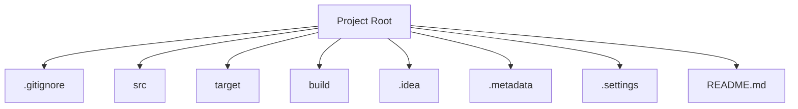
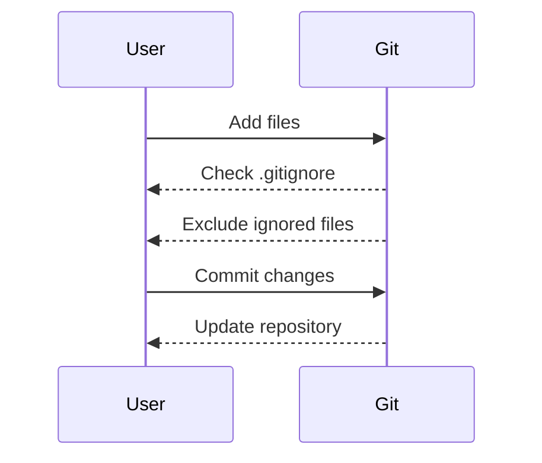

## Understanding `.gitignore` Files in Git Repositories

### Introduction to `.gitignore`

In the context of version control systems like Git, the `.gitignore` file plays a crucial role in managing which files and directories should be tracked and which should be ignored. This file is particularly useful in ensuring that unnecessary files, such as those generated by development environments or build processes, do not clutter the repository. 

The `.gitignore` file is a simple text file located at the root of a Git repository. Its name starts with a dot (`.`) to indicate that it is a hidden file. Each line in the file specifies a pattern that matches the files or directories to be ignored. These patterns can be exact file names, directory names, or wildcard expressions.

### Why Use `.gitignore`?

The primary reason for using a `.gitignore` file is to exclude files and directories that are not necessary for the project's core functionality. For instance, IDE-specific files, build artifacts, and temporary files are typically excluded. Including these files in the repository would lead to unnecessary bloat and potential conflicts among team members using different development environments.

#### Real-World Example: IDE-Specific Files

Consider a scenario where a team of developers is working on a Java project using different Integrated Development Environments (IDEs). One developer might be using IntelliJ IDEA, while others might be using Eclipse or Visual Studio Code. Each IDE generates its own set of configuration files and directories:

- IntelliJ IDEA creates a `.idea` directory.
- Eclipse creates `.metadata` and `.settings` directories.
- Visual Studio Code creates `.vscode` directories.

These directories contain settings and configurations specific to the IDE and are not needed by other developers. By including these directories in the `.gitignore` file, each developer can maintain their preferred IDE setup without affecting others.

### How `.gitignore` Works

The `.gitignore` file operates based on pattern matching. Patterns can be exact file names, directory names, or wildcard expressions. Here are some key points about how `.gitignore` works:

- **Exact File Names**: You can specify exact file names to be ignored.
- **Directory Names**: You can specify entire directories to be ignored.
- **Wildcards**: Wildcard characters (`*`, `?`, `[ ]`) can be used to match patterns.
- **Negation**: You can negate patterns using `!`.

#### Example `.gitignore` File

Here is an example of a `.gitignore` file for a typical Java project:

```plaintext
# Ignore IDE-specific directories
.idea/
.metadata/
.settings/

# Ignore build artifacts
target/
build/

# Ignore log files
*.log

# Ignore temporary files
*.tmp

# Ignore specific file types
*.class
*.jar

# Negate specific files
!README.md
```

### Pattern Matching Rules

Understanding the rules for pattern matching is essential for effectively using `.gitignore`. Here are some key rules:

- **Leading Slash (`/`)**: Matches files and directories in the root of the repository.
- **Trailing Slash (`/`)**: Matches only directories.
- **Double Asterisk (`**`)**: Matches any path segment.
- **Single Asterisk (`*`)**: Matches any sequence of characters except `/`.
- **Question Mark (`?`)**: Matches any single character.
- **Character Set (`[ ]`)**: Matches any character within the set.

#### Example Patterns

- `*.log`: Matches any file ending with `.log`.
- `/logs/`: Matches only the `logs` directory in the root of the repository.
- `**/*.log`: Matches any `.log` file in any directory.
- `!README.md`: Negates the exclusion of `README.md`.

### Common Pitfalls and Best Practices

While `.gitignore` is a powerful tool, it is also prone to misuse. Here are some common pitfalls and best practices to avoid them:

#### Pitfall: Ignoring Too Much

Ignoring too many files can lead to important files being excluded from the repository. For example, excluding all `.java` files would prevent the source code from being tracked.

#### Best Practice: Use Specific Patterns

Use specific patterns to ensure that only the intended files are ignored. Avoid using overly broad patterns like `*`.

#### Pitfall: Ignoring Files Already Tracked

If a file is already tracked by Git, adding it to the `.gitignore` file will not remove it from the repository. You need to explicitly untrack the file using `git rm --cached <file>`.

#### Best Practice: Untrack Files Before Ignoring

Before adding a file to the `.gitignore` file, ensure it is untracked using `git rm --cached <file>`.

### Real-World Examples and Case Studies

#### Example: Build Artifacts

Build artifacts, such as compiled classes and JAR files, should not be included in the repository. Instead, they should be generated during the build process.

```plaintext
# Ignore build artifacts
target/
build/
```

#### Example: Log Files

Log files are often generated during runtime and should not be included in the repository.

```plaintext
# Ignore log files
*.log
```

#### Example: Temporary Files

Temporary files, such as those generated by IDEs, should be ignored to prevent clutter.

```plaintext
# Ignore temporary files
*.tmp
```

### How to Prevent / Defend

#### Detection

To detect files that should be ignored but are not, you can use tools like `git check-ignore`. This command checks whether a given file is ignored by the `.gitignore` file.

```bash
$ git check-ignore -v <file>
```

#### Prevention

To prevent accidental inclusion of ignored files, ensure that the `.gitignore` file is correctly configured and that all team members follow the same conventions.

#### Secure Coding Fixes

Compare the vulnerable and secure versions of the `.gitignore` file:

**Vulnerable Version**

```plaintext
# Incorrectly ignoring all .java files
*.java
```

**Secure Version**

```plaintext
# Correctly ignoring specific files
.idea/
.metadata/
.settings/
```

### Complete Example

Here is a complete example of a `.gitignore` file for a typical Java project:

```plaintext
# Ignore IDE-specific directories
.idea/
.metadata/
.settings/

# Ignore build artifacts
target/
build/

# Ignore log files
*.log

# Ignore temporary files
*.tmp

# Ignore specific file types
*.class
*.jar

# Negate specific files
!README.md
```

### Full HTTP Request and Response

While `.gitignore` itself does not involve HTTP requests or responses, it is often used in conjunction with Git operations that do involve HTTP. Here is an example of a full HTTP request and response for a Git push operation:

```http
POST /repos/user/repo/git/refs/heads/main HTTP/1.1
Host: api.github.com
Authorization: token <your-token>
Content-Type: application/json

{
  "sha": "new-commit-sha",
  "force": false
}
```

```http
HTTP/1.1 200 OK
Date: Mon, 01 Jan 2024 00:00:00 GMT
Content-Type: application/json

{
  "ref": "refs/heads/main",
  "url": "https://api.github.com/repos/user/repo/git/refs/heads/main",
  "object": {
    "type": "commit",
    "sha": "new-commit-sha",
    "url": "https://api.github.com/repos/user/repo/git/commits/new-commit-sha"
  }
}
```

### Mermaid Diagrams

#### Directory Structure

A mermaid diagram showing the directory structure of a typical Java project with `.gitignore`:



#### Workflow Diagram

A mermaid diagram showing the workflow of adding and committing files while respecting `.gitignore`:



### Hands-On Labs

For hands-on practice with `.gitignore`, consider the following labs:

- **PortSwigger Web Security Academy**: While primarily focused on web security, this platform offers exercises that involve setting up and managing Git repositories.
- **OWASP Juice Shop**: This interactive web application includes exercises on setting up and maintaining a Git repository with proper `.gitignore` configurations.
- **DVWA (Damn Vulnerable Web Application)**: Although primarily focused on web vulnerabilities, DVWA includes scenarios where you can practice managing Git repositories and `.gitignore` files.

By following these detailed explanations and examples, you can gain a comprehensive understanding of how to effectively use `.gitignore` files in your Git repositories.

---
<!-- nav -->
[[01-Understanding Git Ignore Files|Understanding Git Ignore Files]] | [[DevOps/DevOps Bootcamp/02-Version Control (Git)/16-Understanding Git Ignore Files/00-Overview|Overview]] | [[DevOps/DevOps Bootcamp/02-Version Control (Git)/16-Understanding Git Ignore Files/03-Practice Questions & Answers|Practice Questions & Answers]]
