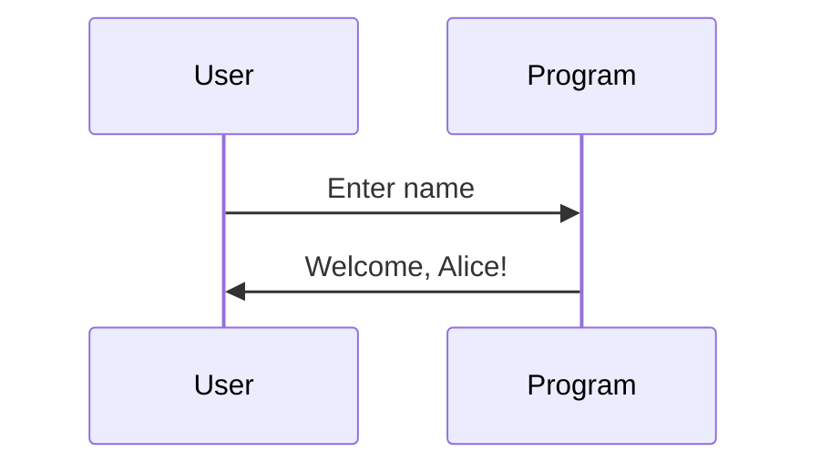

## Introduction to Printing Basics in Python

In this section, we will delve deep into the basics of printing in Python, starting with the simplest examples and gradually building up to more complex scenarios. We'll cover the syntax, practical applications, potential pitfalls, and best practices for securing your code. By the end of this chapter, you should have a comprehensive understanding of how to effectively use the `print` function in Python.

### What is the `print` Function?

The `print` function in Python is used to display output on the console. It is one of the most fundamental functions in Python and is often the first thing new programmers learn. The basic syntax of the `print` function is:

```python
print(value)
```

Here, `value` can be any data type that you want to display, such as integers, strings, lists, etc.

#### Example 1: Printing an Integer

Let's start with a simple example where we print an integer:

```python
print(1)
```

When you run this code, the output will be:

```
1
```

This is the simplest form of using the `print` function. You can also print multiple values by separating them with commas:

```python
print(1, 2, 3)
```

Output:

```
1 2 3
```

### Displaying Text

Next, let's look at how to print text. In Python, text is enclosed within quotes (either single `'` or double `"`).

#### Example 2: Printing a String

```python
print("Hello, World!")
```

Output:

```
Hello, World!
```

You can also use single quotes:

```python
print('Hello, World!')
```

Output:

```
Hello, World!
```

### Combining Multiple Values

You can combine multiple values of different types in a single `print` statement. This is useful when you want to display a mix of numbers and text.

#### Example 3: Mixing Integers and Strings

```python
print("The number is", 42)
```

Output:

```
The number is 42
```

### Formatting Output

Sometimes, you might want to format the output in a specific way. Python provides several ways to format strings, including f-strings, which are available in Python 3.6 and later.

#### Example 4: Using f-Strings

```python
name = "Alice"
age = 30
print(f"My name is {name} and I am {age} years old.")
```

Output:

```
My name is Alice and I am 30 years old.
```

### Handling Newlines and Indentation

By default, the `print` function adds a newline character (`\n`) at the end of the output. However, you can control this behavior using the `end` parameter.

#### Example 5: Controlling Newline Characters

```python
print("Hello", end=" ")
print("World")
```

Output:

```
Hello World
```

In this example, the `end=" "` parameter ensures that the second `print` statement continues on the same line.

### Practical Applications

Printing is a fundamental operation in programming, used for debugging, logging, and user interaction. Here are some real-world examples where printing is crucial.

#### Example 6: Debugging

Consider a scenario where you are debugging a piece of code that calculates the sum of two numbers:

```python
def add_numbers(a, b):
    result = a + b
    print(f"The sum of {a} and {b} is {result}")
    return result

add_numbers(5, 7)
```

Output:

```
The sum of 5 and b is 12
```

This simple print statement helps you understand the intermediate steps and verify the correctness of your code.

### Real-World Examples and CVEs

While the `print` function itself is generally safe, improper use can lead to security vulnerabilities, especially when dealing with user input.

#### Example 7: User Input and Security

Consider a web application that takes user input and prints it back to the user:

```python
user_input = input("Enter your name: ")
print(f"Welcome, {user_input}!")
```

If the user inputs malicious content, it could potentially lead to Cross-Site Scripting (XSS) attacks. For instance, if the user inputs `<script>alert('XSS')</script>`, the output would be:

```
Welcome, <script>alert('XSS')</script>!
```

This could execute JavaScript code in the context of the user's browser, leading to security issues.

### How to Prevent / Defend

To prevent such vulnerabilities, you should sanitize user input and escape special characters before printing them.

#### Example 8: Sanitizing User Input

```python
import html

user_input = input("Enter your name: ")
safe_input = html.escape(user_input)
print(f"Welcome, {safe_input}!")
```

Now, even if the user inputs malicious content, it will be escaped and rendered harmless:

```
Welcome, &lt;script&gt;alert('XSS')&lt;/script&gt;!
```

### Complete Code Examples

Let's put together a complete example that demonstrates the use of `print` in a real-world scenario, including handling user input securely.

#### Example 9: Full Application with User Input

```python
import html

def main():
    user_input = input("Enter your name: ")
    safe_input = html.escape(user_input)
    print(f"Welcome, {safe_input}!")

if __name__ == "__main__":
    main()
```

### HTTP Requests and Responses

While the `print` function itself does not involve HTTP requests or responses, it can be used to log and debug HTTP interactions. For example, consider a simple HTTP GET request using the `requests` library:

#### Example 10: Logging HTTP Requests

```python
import requests

response = requests.get("https://api.example.com/data")
print(response.status_code)
print(response.text)
```

Output:

```
200
{
  "data": [
    {
      "id": 1,
      "name": "John Doe"
    }
  ]
}
```

### Mermaid Diagrams

Let's visualize the flow of a simple application that uses the `print` function.



### Common Mistakes and Pitfalls

1. **Forgetting to Escape User Input**: Always sanitize user input before printing it to avoid security vulnerabilities.
2. **Incorrect Syntax**: Ensure you use the correct syntax for the `print` function, especially when combining multiple values.
3. **Improper Use of `end` Parameter**: Be cautious when using the `end` parameter to avoid unexpected output formatting.

### Hands-On Labs

To practice these concepts, you can use the following labs:

- **PortSwigger Web Security Academy**: Offers interactive labs to practice web security concepts, including secure coding practices.
- **OWASP Juice Shop**: A deliberately insecure web application for practicing web security skills.

### Conclusion

In this chapter, we covered the basics of printing in Python, including syntax, practical applications, and security considerations. We explored various examples, real-world scenarios, and provided detailed explanations to ensure a comprehensive understanding of the topic. By following the best practices outlined here, you can effectively use the `print` function in your Python programs while maintaining security and robustness.

---
<!-- nav -->
[[DevOps/DevOps Bootcamp/03-Python & Scripting/02-Printing Basics In Python/00-Overview|Overview]] | [[DevOps/DevOps Bootcamp/03-Python & Scripting/02-Printing Basics In Python/02-Practice Questions & Answers|Practice Questions & Answers]]
