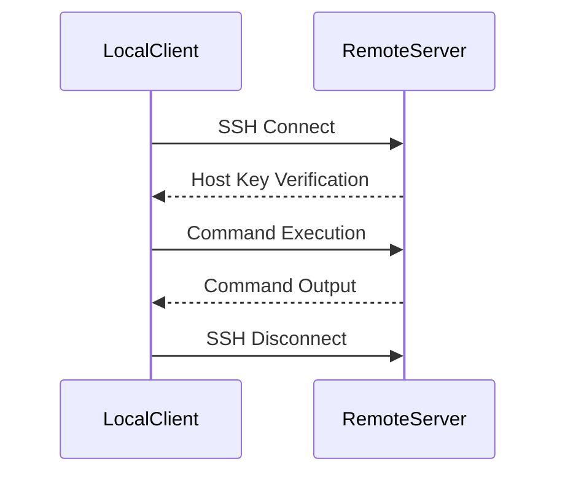

## Introduction to Automated Application Recovery Using Python SSH

In the realm of DevOps, automating tasks such as application recovery is crucial for maintaining high availability and reliability of systems. One powerful method to achieve this is through automated SSH connections using Python. This chapter delves into the details of how to establish SSH connections programmatically using Python, specifically leveraging the `paramiko` library. We'll cover the theoretical foundations, practical implementation, and security considerations involved in this process.

### Background Theory

#### What is SSH?
Secure Shell (SSH) is a cryptographic network protocol used for secure data communication, remote command-line login, remote command execution, and other secure network services between two networked computers. It provides a secure channel over an unsecured network in a client-server architecture, connecting a local client to a remote host.

#### Why Use SSH in Python?
Using SSH in Python allows you to automate tasks that would otherwise require manual intervention. This is particularly useful in DevOps scenarios where you might need to perform maintenance tasks, deploy updates, or recover applications across multiple servers. By automating these processes, you can reduce human error, improve efficiency, and ensure consistency.

### Installing and Importing Paramiko

To begin, we need to install the `paramiko` library, which is an external package available on PyPI (Python Package Index).

```bash
pip install paramiko
```

Once installed, we can import the `paramiko` module in our Python script:

```python
import paramiko
```

### Establishing an SSH Connection

The core functionality of `paramiko` revolves around creating an SSH client and connecting to a remote server. Here’s a step-by-step guide on how to do this:

1. **Create an SSH Client**:
   An SSH client is an object that represents the connection to the remote server. You create this object using the `SSHClient` class from the `paramiko` module.

2. **Set Up Auto Add Policy**:
   By default, `paramiko` does not automatically accept new host keys. To bypass this, you can set up an auto-add policy using `set_missing_host_key_policy`.

3. **Connect to the Remote Server**:
   Use the `connect` method to establish a connection to the remote server. This method requires parameters such as the hostname, port, username, and password.

Here’s a complete example:

```python
import paramiko

# Create an SSH client
ssh = paramiko.SSHClient()

# Set up auto-add policy
ssh.set_missing_host_key_policy(paramiko.AutoAddPolicy())

# Connect to the remote server
ssh.connect('public_ip_address', port=22, username='username', password='password')
```

### Executing Commands on the Remote Server

Once connected, you can execute commands on the remote server using the `exec_command` method. This method returns three file objects: stdin, stdout, and stderr.

```python
# Execute a command
stdin, stdout, stderr = ssh.exec_command('docker ps')

# Print the output
print(stdout.read().decode())
print(stderr.read().decode())

# Close the connection
ssh.close()
```

### Example: Automated Application Recovery Using Docker

Let’s consider a scenario where we need to restart a Docker container if it crashes. We can automate this process using Python and `paramiko`.

#### Step-by-Step Implementation

1. **Check the Status of the Docker Container**:
   First, check if the Docker container is running.

2. **Restart the Container if Necessary**:
   If the container is not running, restart it.

Here’s the complete code:

```python
import paramiko

def check_and_restart_container(hostname, port, username, password, container_name):
    # Create an SSH client
    ssh = paramiko.SSHClient()
    ssh.set_missing_host_key_policy(paramiko.AutoAddPolicy())
    
    # Connect to the remote server
    ssh.connect(hostname, port=port, username=username, password=password)
    
    # Check the status of the Docker container
    stdin, stdout, stderr = ssh.exec_command(f'docker inspect --format="{{{{.State.Running}}}}" {container_name}')
    status = stdout.read().decode().strip()
    
    if status == 'false':
        print(f"{container_name} is not running. Restarting...")
        # Restart the Docker container
        ssh.exec_command(f'docker start {container_name}')
        print(f"{container_name} has been restarted.")
    else:
        print(f"{container_name} is already running.")
    
    # Close the connection
    ssh.close()

# Example usage
check_and_restart_container('public_ip_address', 22, 'username', 'password', 'my_container')
```

### Diagram: SSH Connection Flow

A visual representation of the SSH connection flow can help understand the process better.



### Common Pitfalls and How to Avoid Them

#### Incorrect Hostname or IP Address
Ensure that the hostname or IP address provided is correct. Double-check the spelling and format.

#### Authentication Issues
Make sure the username and password are correct. Consider using SSH keys for more secure authentication.

#### Network Connectivity
Verify that the network connection between the local machine and the remote server is stable and working correctly.

### How to Prevent / Defend

#### Secure Authentication
Instead of using passwords, use SSH keys for authentication. This enhances security by eliminating the risk of password-based attacks.

```python
import paramiko

# Load the private key
private_key = paramiko.RSAKey.from_private_key_file('/path/to/private/key')

# Create an SSH client
ssh = paramiko.SSHClient()
ssh.set_missing_host_key_policy(paramiko.AutoAddPolicy())

# Connect using SSH key
ssh.connect('public_ip_address', port=22, username='username', pkey=private_key)
```

#### Detecting Unauthorized Access
Regularly monitor the SSH logs for unauthorized access attempts. Tools like `fail2ban` can help block suspicious IP addresses.

#### Hardening SSH Configuration
Configure the SSH server to disable root login and limit access to specific users. Update the SSH configuration file (`/etc/ssh/sshd_config`) accordingly.

```plaintext
PermitRootLogin no
PasswordAuthentication no
PubkeyAuthentication yes
```

### Real-World Examples

#### Recent Breaches and CVEs
Consider the recent breach of a major cloud provider where unauthorized access was gained through weak SSH configurations. Ensuring strong SSH practices can prevent such incidents.

### Practice Labs

For hands-on practice, consider the following labs:

- **PortSwigger Web Security Academy**: Offers a variety of labs related to SSH and remote command execution.
- **OWASP Juice Shop**: Provides a simulated environment for practicing various security techniques, including SSH automation.

By mastering the concepts covered in this chapter, you’ll be well-equipped to automate critical tasks and enhance the reliability of your applications using Python and SSH.

---
<!-- nav -->
[[DevOps/DevOps Bootcamp/03-Python & Scripting/05-Automated Application Recovery Using Python SSH/00-Overview|Overview]] | [[02-Introduction to Linode Tokens and API Authentication|Introduction to Linode Tokens and API Authentication]]
