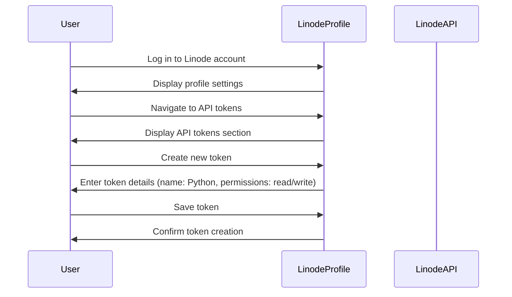

## Introduction to Linode Tokens and API Authentication

In the realm of DevOps, automation is key to managing infrastructure efficiently and securely. One such automation task involves connecting to a Linode account to perform actions like rebooting servers. To achieve this, we need to understand how to authenticate with the Linode API using tokens. This chapter will delve deep into the concepts of Linode tokens, their creation, usage, and security implications.

### What is a Linode Token?

A Linode token is an authentication mechanism used to interact with the Linode API. It allows applications to authenticate and perform actions on your Linode account programmatically. These tokens are crucial for automating tasks such as creating, managing, and deleting resources within your Linode environment.

#### Why Use Linode Tokens?

Using tokens provides several benefits:

1. **Security**: Tokens allow you to grant specific permissions to applications without exposing your main account credentials.
2. **Granularity**: You can create tokens with different levels of access, ensuring that applications only have the necessary permissions.
3. **Automation**: Tokens enable seamless integration with automation tools like Python scripts, allowing you to manage your infrastructure programmatically.

### Creating a Linode Token

To create a Linode token, follow these steps:

1. **Log in to Your Linode Account**:
   - Navigate to the Linode dashboard and log in using your credentials.

2. **Access Profile Settings**:
   - Click on your profile picture or name to access the profile settings.

3. **Navigate to API Tokens**:
   - In the profile settings, locate the section for API tokens.

4. **Create a New Token**:
   - Click on the option to create a new token.
   - Provide a descriptive name for the token (e.g., "Python").
   - Specify the permissions required for the token (e.g., read/write).

5. **Save the Token**:
   - After creating the token, make sure to save it securely. Once you navigate away from the page, you won't be able to view the token again.

### Example: Creating a Personal Access Token

Let's walk through the process of creating a personal access token named "Python" with read/write permissions.



### Using the Linode Token in Python

Once you have created the token, you can use it in your Python script to authenticate and perform actions on your Linode account. Below is an example of how to use the Linode token in a Python script to reboot a server.

#### Prerequisites

Before proceeding, ensure you have the following installed:

- Python 3.x
- `linode-cli` package (install via `pip install linode-cli`)

#### Example Code

Here is a complete Python script to authenticate using a Linode token and reboot a server:

```python
import linode_api4

# Initialize the Linode client with your token
client = linode_api4.LinodeClient('YOUR_LINODE_TOKEN')

# Get the list of all Linodes
linodes = client.linode.instances()

# Select the first Linode (for demonstration purposes)
linode = linodes[0]

# Reboot the selected Linode
print(f"Rebooting Linode {linode.label}...")
response = linode.reboot()
print("Reboot initiated successfully.")
```

### Full HTTP Request and Response

When you execute the above Python script, it sends an HTTP request to the Linode API to reboot the server. Here is a detailed breakdown of the HTTP request and response:

#### HTTP Request

```http
POST /v4/linode/instances/{LINODE_ID}/reboot HTTP/1.1
Host: api.linode.com
Authorization: Bearer YOUR_LINODE_TOKEN
Content-Type: application/json
```

#### HTTP Response

```http
HTTP/1.1 200 OK
Date: Tue, 15 Aug 2023 12:00:00 GMT
Content-Type: application/json
Content-Length: 123

{
    "action": "reboot",
    "status": "success",
    "message": "Reboot initiated successfully."
}
```

### Security Considerations

While using Linode tokens for automation is convenient, it also introduces potential security risks. Here are some key points to consider:

1. **Token Exposure**: Ensure that your tokens are not exposed in your codebase or version control systems.
2. **Least Privilege**: Assign tokens with the minimum necessary permissions to reduce the impact of a compromised token.
3. **Regular Rotation**: Regularly rotate your tokens to minimize the window of opportunity for attackers.

### How to Prevent / Defend

#### Detection

- **Monitor API Activity**: Use Linode’s activity logs to monitor API calls made using your tokens.
- **Alerting**: Set up alerts for unusual API activity, such as unauthorized access attempts.

#### Prevention

- **Secure Storage**: Store tokens securely using environment variables or secret management tools like HashiCorp Vault.
- **Least Privilege**: Assign tokens with minimal permissions required for the task.
- **Regular Audits**: Perform regular audits of your tokens and their usage.

#### Secure Coding Fixes

Below is an example of how to securely store and use a Linode token in a Python script:

```python
import os
import linode_api4

# Retrieve the token from an environment variable
token = os.getenv('LINODE_API_TOKEN')

if not token:
    raise ValueError("LINODE_API_TOKEN environment variable not set")

# Initialize the Linode client with the token
client = linode_api4.LinodeClient(token)

# Get the list of all Linodes
linodes = client.linode.instances()

# Select the first Linode (for demonstration purposes)
linode = linodes[0]

# Reboot the selected Linode
print(f"Rebooting Linode {linode.label}...")
response = linode.reboot()
print("Reboot initiated successfully.")
```

#### Vulnerable vs. Secure Version

**Vulnerable Version**

```python
import linode_api4

# Hardcoded token
token = 'YOUR_LINODE_TOKEN'

# Initialize the Linode client with the token
client = linode_api4.LinodeClient(token)

# Get the list of all Linodes
linodes = client.linode.instances()

# Select the first Linode (for demonstration purposes)
linode = linodes[0]

# Reboot the selected Linode
print(f"Rebooting Linode {linode.label}...")
response = linode.reboot()
print("Reboot initiated successfully.")
```

**Secure Version**

```python
import os
import linode_api4

# Retrieve the token from an environment variable
token = os.getenv('LINODE_API_TOKEN')

if not token:
    raise ValueError("LINODE_API_TOKEN environment variable not set")

# Initialize the Linode client with the token
client = linode_api4.LinodeClient(token)

# Get the list of all Linodes
linodes = client.linode.instances()

# Select the first Linode (for demonstration purposes)
linode = linodes[0]

# Reboot the selected Linode
print(f"Rebooting Linode {linode.label}...")
response = linode.reboot()
print("Reboot initiated successfully.")
```

### Conclusion

Understanding and effectively using Linode tokens is essential for automating tasks in your DevOps workflow. By following best practices for token creation, usage, and security, you can ensure that your infrastructure remains secure and efficient.

### Practice Labs

For hands-on practice with Linode tokens and API authentication, consider the following labs:

- **PortSwigger Web Security Academy**: Offers exercises on API security and token management.
- **OWASP Juice Shop**: Provides a platform to practice securing APIs and handling tokens.
- **DVWA (Damn Vulnerable Web Application)**: Useful for learning about various web application vulnerabilities and how to secure them.

By engaging with these labs, you can gain practical experience in managing Linode tokens and securing your DevOps environment.

---
<!-- nav -->
[[01-Introduction to Automated Application Recovery Using Python SSH|Introduction to Automated Application Recovery Using Python SSH]] | [[DevOps/DevOps Bootcamp/03-Python & Scripting/05-Automated Application Recovery Using Python SSH/00-Overview|Overview]] | [[DevOps/DevOps Bootcamp/03-Python & Scripting/05-Automated Application Recovery Using Python SSH/03-Introduction to SSH Key Authentication|Introduction to SSH Key Authentication]]
