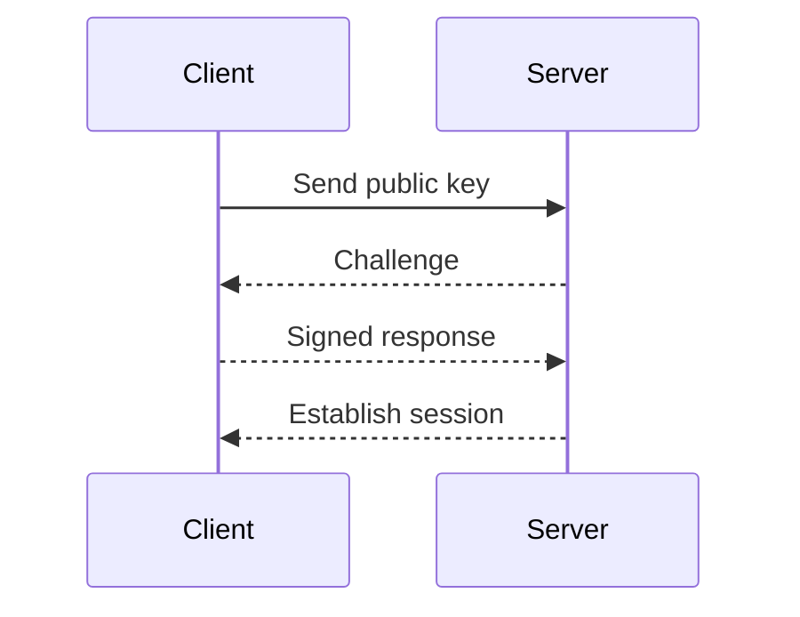

## Introduction to SSH Key Authentication

Secure Shell (SSH) is a cryptographic network protocol used to securely operate network services over an unsecured network. One of the most critical aspects of SSH is key-based authentication, which provides a more secure alternative to traditional password-based authentication. In this section, we will delve into the details of how SSH key authentication works, why it is important, and how to implement it effectively.

### What is SSH Key Authentication?

SSH key authentication uses a pair of keys: a public key and a private key. The public key is stored on the server, while the private key is kept on the client machine. When a user attempts to connect to the server, the server uses the public key to verify the identity of the user by checking the signature created with the corresponding private key.

#### Why Use SSH Key Authentication?

1. **Security**: Passwords can be stolen, guessed, or brute-forced. In contrast, SSH keys are much harder to compromise. They are typically protected by a passphrase, making them more secure.
2. **Convenience**: Once set up, SSH key authentication allows for seamless login without the need to enter a password each time.
3. **Automation**: SSH keys are essential for automating tasks such as deploying applications, running scripts, and managing servers.

### How SSH Key Authentication Works

Let's break down the process of SSH key authentication:

1. **Key Generation**:
   - A pair of keys (public and private) is generated using tools like `ssh-keygen`.
   - The public key is placed on the server.
   - The private key is kept on the client machine.

2. **Connection Request**:
   - When a client attempts to connect to the server, the SSH client sends the public key to the server.
   - The server checks if the public key is authorized to access the account.

3. **Authentication**:
   - If the public key is authorized, the server challenges the client to prove possession of the corresponding private key.
   - The client signs a challenge with the private key and sends the signed response back to the server.
   - The server verifies the signature using the public key.

4. **Session Establishment**:
   - If the signature is valid, the server establishes the SSH session.

### Example: Setting Up SSH Key Authentication

Let's walk through the steps to set up SSH key authentication on a Linode server.

#### Step 1: Generate SSH Keys

First, generate an SSH key pair on your local machine using `ssh-keygen`:

```bash
ssh-keygen -t rsa -b 4096 -C "your_email@example.com"
```

This command generates a 4096-bit RSA key pair with a comment indicating the email address associated with the key.

#### Step 2: Copy Public Key to Server

Next, copy the public key to the server using `ssh-copy-id`:

```bash
ssh-copy-id -i ~/.ssh/id_rsa.pub user@server_ip
```

This command copies the public key (`id_rsa.pub`) to the specified user on the server.

#### Step 3: Connect to the Server

Now, you can connect to the server using SSH without entering a password:

```bash
ssh user@server_ip
```

### SSH Key Locations

By default, SSH looks for the private key in the following locations:

- `~/.ssh/id_rsa`
- `~/.ssh/id_dsa`
- `~/.ssh/id_ecdsa`
- `~/.ssh/id_ed25519`

If the private key is located elsewhere, you must specify the path using the `-i` option:

```bash
ssh -i /path/to/private_key user@server_ip
```

### Mermaid Diagram: SSH Key Authentication Flow



### Common Pitfalls and How to Avoid Them

1. **Incorrect Permissions**: Ensure the permissions on the `.ssh` directory and the private key file are correct.
   - `.ssh` directory should have `700` permissions.
   - Private key file should have `600` permissions.

2. **Passphrase Protection**: Protect your private key with a strong passphrase to prevent unauthorized access.

3. **Backup Private Key**: Keep a backup of your private key in a secure location.

### Real-World Examples and Breaches

#### CVE-2021-20225: SSH Key Management Vulnerability

In 2021, a vulnerability was discovered in the SSH key management system of a popular cloud provider. This vulnerability allowed attackers to gain unauthorized access to servers by manipulating the SSH key storage mechanism.

**Impact**: Unauthorized access to sensitive data and systems.

**Defense**:
- Regularly audit SSH key usage and access logs.
- Implement strict access controls and monitoring.
- Use multi-factor authentication (MFA) alongside SSH key authentication.

### Secure Coding Practices

#### Vulnerable Code Example

```python
import paramiko

ssh = paramiko.SSHClient()
ssh.set_missing_host_key_policy(paramiko.AutoAddPolicy())
ssh.connect('server_ip', username='user')
```

#### Secure Code Example

```python
import paramiko

ssh = paramiko.SSHClient()
ssh.set_missing_host_key_policy(paramiko.AutoAddPolicy())
ssh.connect('server_ip', username='user', key_filename='/path/to/private_key')
```

### Configuration Hardening

#### SSHD Configuration

Ensure your SSH daemon is configured securely by editing the `/etc/ssh/sshd_config` file:

```plaintext
# Disable root login
PermitRootLogin no

# Only allow specific users
AllowUsers user1 user2

# Disable password authentication
PasswordAuthentication no

# Enable key-based authentication
PubkeyAuthentication yes
```

### Detection and Prevention

#### Detection

Monitor SSH access logs for unauthorized access attempts:

```bash
tail -f /var/log/auth.log
```

#### Prevention

Implement the following measures to prevent unauthorized access:

1. **Use Strong Passphrases**: Protect your private key with a strong passphrase.
2. **Regular Audits**: Regularly review SSH key usage and access logs.
3. **Multi-Factor Authentication (MFA)**: Use MFA alongside SSH key authentication.

### Hands-On Labs

To practice and reinforce your understanding of SSH key authentication, consider the following labs:

- **PortSwigger Web Security Academy**: Offers interactive labs on SSH key management and authentication.
- **OWASP Juice Shop**: Provides a web application environment where you can practice securing SSH access.
- **DVWA (Damn Vulnerable Web Application)**: Includes scenarios where SSH key authentication can be exploited.

By following these detailed steps and practices, you can ensure that your SSH connections are secure and efficient.

---
<!-- nav -->
[[02-Introduction to Linode Tokens and API Authentication|Introduction to Linode Tokens and API Authentication]] | [[DevOps/DevOps Bootcamp/03-Python & Scripting/05-Automated Application Recovery Using Python SSH/00-Overview|Overview]] | [[04-Automated Application Recovery Using Python SSH|Automated Application Recovery Using Python SSH]]
