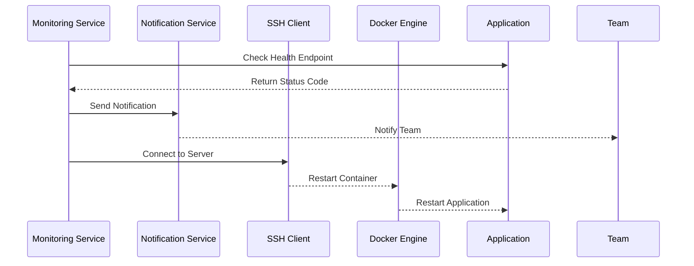

## Automated Application Recovery Using Python SSH

### Background Theory

In modern DevOps environments, ensuring high availability and quick recovery of applications is crucial. One common approach is to automate the process of detecting and recovering from application failures. This can be achieved through monitoring services, notifications, and automated recovery scripts. In this section, we will delve into the details of how to implement an automated recovery mechanism using Python and SSH to restart a Docker container.

### Problem Scenario

Consider a scenario where an application running inside a Docker container crashes or stops unexpectedly. The application might return a non-success status code, indicating that it is not functioning correctly. To address this, we need to:

1. Detect the failure.
2. Notify the appropriate team members.
3. Automatically restart the application.

### Detection Mechanism

To detect whether the application is returning a non-success status code, we can periodically check the application's health endpoint. This can be done using an HTTP request to the application's API.

#### Example HTTP Request

```http
GET /health HTTP/1.1
Host: example.com
```

The expected response should be a `200 OK` status code with a JSON body indicating the health status of the application.

#### Example HTTP Response

```http
HTTP/1.1 200 OK
Content-Type: application/json

{
  "status": "UP",
  "details": {
    "database": "UP",
    "cache": "UP"
  }
}
```

If the application returns a non-success status code (e.g., `500 Internal Server Error`), it indicates that the application is not functioning correctly.

#### Example HTTP Response for Failure

```http
HTTP/1.1 500 Internal Server Error
Content-Type: application/json

{
  "status": "DOWN",
  "details": {
    "database": "DOWN",
    "cache": "DOWN"
  }
}
```

### Notification Mechanism

Once the failure is detected, the next step is to notify the appropriate team members. This can be done via email, SMS, or a messaging service like Slack.

#### Example Email Notification

```python
import smtplib
from email.mime.text import MIMEText

def send_notification(email_to, subject, body):
    msg = MIMEText(body)
    msg['Subject'] = subject
    msg['From'] = 'noreply@example.com'
    msg['To'] = email_to

    s = smtplib.SMTP('localhost')
    s.sendmail(msg['From'], [msg['To']], msg.as_string())
    s.quit()

send_notification('team@example.com', 'Application Down', 'The application is returning a non-success status code.')
```

### Automated Recovery Mechanism

After notifying the team, the next step is to automatically restart the Docker container. This can be achieved by connecting to the server using SSH and executing the necessary Docker commands.

#### SSH Connection Setup

To establish an SSH connection from Python, we can use the `paramiko` library. First, ensure you have `paramiko` installed:

```bash
pip install paramiko
```

#### Example SSH Connection and Command Execution

```python
import paramiko

def restart_docker_container(hostname, username, password, container_name):
    client = paramiko.SSHClient()
    client.set_missing_host_key_policy(paramiko.AutoAddPolicy())
    client.connect(hostname, username=username, password=password)

    # Execute the Docker restart command
    stdin, stdout, stderr = client.exec_command(f'docker restart {container_name}')
    
    # Print the output
    print(stdout.read().decode())
    print(stderr.read().decode())

    client.close()

# Example usage
restart_docker_container('linode.example.com', 'user', 'password', 'engine-x')
```

### Mermaid Diagrams

#### Sequence Diagram for Automated Recovery



### Common Pitfalls and How to Prevent Them

#### Pitfall 1: Incorrect SSH Credentials

**Problem**: If the SSH credentials are incorrect, the connection will fail, leading to the inability to restart the container.

**Prevention**:
- Ensure that the SSH credentials are correct.
- Use SSH key-based authentication instead of passwords for better security.

#### Pitfall 2: Docker Command Errors

**Problem**: If the Docker command fails due to incorrect syntax or other issues, the container will not be restarted.

**Prevention**:
- Test the Docker command manually before integrating it into the script.
- Handle exceptions and errors gracefully in the script.

### Secure Coding Practices

#### Vulnerable Code Example

```python
import paramiko

def restart_docker_container(hostname, username, password, container_name):
    client = paramiko.SSHClient()
    client.set_missing_host_key_policy(paramiko.AutoAddPolicy())
    client.connect(hostname, username=username, password=password)

    # Execute the Docker restart command
    stdin, stdout, stderr = client.exec_command(f'docker restart {container_name}')
    
    # Print the output
    print(stdout.read().decode())
    print(stderr.read().decode())

    client.close()
```

#### Secure Code Example

```python
import paramiko

def restart_docker_container(hostname, username, private_key_path, container_name):
    client = paramiko.SSHClient()
    client.set_missing_host_key_policy(paramiko.AutoAddPolicy())
    key = paramiko.RSAKey.from_private_key_file(private_key_path)
    client.connect(hostname, username=username, pkey=key)

    # Execute the Docker restart command
    stdin, stdout, stderr = client.exec_command(f'docker restart {container_name}')
    
    # Print the output
    print(stdout.read().decode())
    print(stderr.read().decode())

    client.close()
```

### Real-World Examples and Breaches

#### Example: CVE-2021-21315

In 2021, a critical vulnerability was discovered in Docker, allowing attackers to escalate privileges and gain root access to the host system. This highlights the importance of securing Docker and the underlying infrastructure.

#### Example: Docker Hub Breach

In 2021, Docker Hub experienced a breach where unauthorized access was gained to user accounts. This underscores the importance of securing SSH connections and using strong authentication mechanisms.

### Hands-On Labs

For practical experience with automated application recovery using Python SSH, consider the following labs:

- **PortSwigger Web Security Academy**: Offers a variety of labs related to web application security, including automated recovery scenarios.
- **OWASP Juice Shop**: A deliberately insecure web application for security training purposes, which can be used to practice automated recovery techniques.
- **DVWA (Damn Vulnerable Web Application)**: Another popular web application for security training, offering various scenarios for automated recovery.

### Conclusion

Automating the recovery of applications using Python and SSH is a powerful technique for ensuring high availability and quick recovery in modern DevOps environments. By combining monitoring, notification, and automated recovery mechanisms, we can significantly improve the reliability and resilience of our applications.

---
<!-- nav -->
[[DevOps/DevOps Bootcamp/03-Python & Scripting/05-Automated Application Recovery Using Python SSH/03-Introduction to SSH Key Authentication|Introduction to SSH Key Authentication]] | [[DevOps/DevOps Bootcamp/03-Python & Scripting/05-Automated Application Recovery Using Python SSH/00-Overview|Overview]] | [[DevOps/DevOps Bootcamp/03-Python & Scripting/05-Automated Application Recovery Using Python SSH/05-Practice Questions & Answers|Practice Questions & Answers]]
