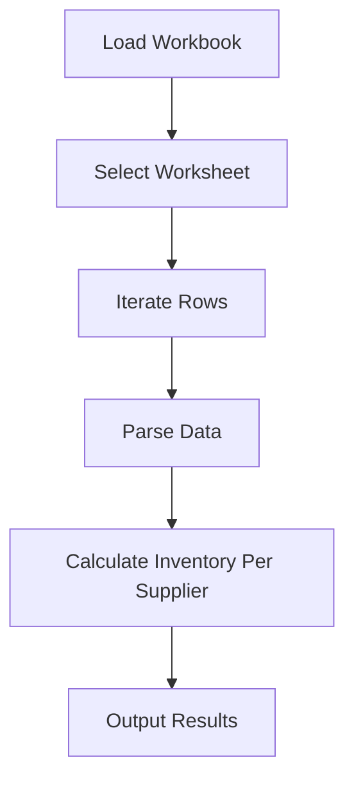

## Introduction to Automating Spreadsheet Data Processing with Python

In this section, we will delve into the process of automating spreadsheet data processing using Python. This is a fundamental skill in the realm of DevOps and data management, enabling efficient handling of large datasets and repetitive tasks. By leveraging Python, we can create robust applications that interact with spreadsheets, perform complex calculations, and generate actionable insights.

### Background Theory

Spreadsheets are widely used in various industries for managing data, performing calculations, and generating reports. Common spreadsheet formats include Microsoft Excel (.xlsx), Google Sheets, and CSV files. Automating the processing of these files can significantly enhance productivity and reduce human error.

Python provides several libraries that facilitate interaction with spreadsheets:

1. **`openpyxl`**: A library specifically designed for reading and writing Excel 2010 xlsx/xlsm/xltx/xltm files.
2. **`pandas`**: A powerful data manipulation library that supports various file formats, including Excel and CSV.
3. **`csv`**: A built-in module for reading and writing CSV files.

### Setting Up the Environment

Before diving into the code, ensure you have the necessary libraries installed. You can install `openpyxl` and `pandas` using pip:

```bash
pip install openpyxl pandas
```

### Example Spreadsheet Structure

Let's consider an example spreadsheet named `inventory.xlsx`. The structure of the spreadsheet might look like this:

| Product Number | Inventory | Price | Supplier |
|----------------|-----------|-------|----------|
| 1001           | 50        | 10.00 | SupplierA |
| 1002           | 30        | 15.00 | SupplierB |
| 1003           | 20        | 20.00 | SupplierA |
| 1004           | 40        | 25.00 | SupplierC |

This spreadsheet simulates a typical inventory management scenario where each row represents a product, its inventory level, price, and supplier.

### Reading the Spreadsheet

To read the spreadsheet, we will use the `openpyxl` library. Here’s how you can load the workbook and access the data:

```python
from openpyxl import load_workbook

# Load the workbook
workbook = load_workbook(filename='inventory.xlsx')

# Select the active worksheet
worksheet = workbook.active

# Iterate through rows and print data
for row in worksheet.iter_rows(values_only=True):
    print(row)
```

### Parsing the Data

Once the spreadsheet is loaded, we can parse the data to extract meaningful information. For instance, we can calculate the total inventory per supplier.

#### Using `openpyxl`

```python
from collections import defaultdict

# Initialize a dictionary to store inventory per supplier
inventory_per_supplier = defaultdict(int)

# Iterate through rows and accumulate inventory per supplier
for row in worksheet.iter_rows(min_row=2, values_only=True):
    product_number, inventory, price, supplier = row
    inventory_per_supplier[supplier] += inventory

# Print the results
for supplier, total_inventory in inventory_per_supplier.items():
    print(f"{supplier}: {total_inventory}")
```

#### Using `pandas`

Alternatively, we can use `pandas` for more advanced data manipulation:

```python
import pandas as pd

# Read the spreadsheet into a DataFrame
df = pd.read_excel('inventory.xlsx')

# Group by supplier and sum the inventory
inventory_per_supplier = df.groupby('Supplier')['Inventory'].sum()

# Print the results
print(inventory_per_supplier)
```

### Mermaid Diagrams

To visualize the workflow, we can use a mermaid diagram:



### Real-World Examples

Automating spreadsheet data processing is crucial in various scenarios. For instance, in financial institutions, automated scripts can process large volumes of transaction data to identify anomalies or generate reports. In manufacturing, such scripts can manage inventory levels and trigger alerts when stock runs low.

### Pitfalls and Best Practices

#### Common Mistakes

1. **Incorrect File Paths**: Ensure the file path is correct and accessible.
2. **Data Type Errors**: Handle data type conversions carefully to avoid errors.
3. **Memory Usage**: Large datasets can consume significant memory; use efficient data structures and techniques.

#### Secure Coding Practices

1. **Input Validation**: Validate input data to prevent injection attacks.
2. **Error Handling**: Implement robust error handling to manage exceptions gracefully.
3. **Logging**: Log important events and errors for debugging and auditing purposes.

### How to Prevent / Defend

#### Detection

Use logging and monitoring tools to track the execution of your scripts and detect any anomalies or errors.

#### Prevention

1. **Secure File Access**: Ensure proper file permissions and access controls.
2. **Data Encryption**: Encrypt sensitive data stored in spreadsheets.
3. **Regular Audits**: Conduct regular audits to ensure compliance and security.

#### Secure Code Fix

Here’s an example of a vulnerable script and its secure version:

**Vulnerable Script**

```python
from openpyxl import load_workbook

# Load the workbook
workbook = load_workbook(filename='inventory.xlsx')

# Select the active worksheet
worksheet = workbook.active

# Iterate through rows and print data
for row in worksheet.iter_rows(values_only=True):
    print(row)
```

**Secure Script**

```python
from openpyxl import load_workbook

def read_spreadsheet(file_path):
    try:
        # Load the workbook
        workbook = load_workbook(filename=file_path)
        
        # Select the active worksheet
        worksheet = workbook.active
        
        # Iterate through rows and print data
        for row in worksheet.iter_rows(values_only=True):
            print(row)
    except Exception as e:
        print(f"An error occurred: {e}")

# Call the function with the file path
read_spreadsheet('inventory.xlsx')
```

### Conclusion

Automating spreadsheet data processing with Python is a powerful technique that enhances efficiency and reduces manual errors. By leveraging libraries like `openpyxl` and `pandas`, you can handle complex data manipulation tasks with ease. Always ensure secure coding practices to protect your data and systems.

### Practice Labs

For hands-on practice, consider the following labs:

- **PortSwigger Web Security Academy**: Focuses on web application security but also covers data handling and automation.
- **OWASP Juice Shop**: A deliberately insecure web application for learning about web security, which includes handling data from various sources.
- **DVWA (Damn Vulnerable Web Application)**: Another web application for practicing security skills, including data handling and automation.

These labs provide practical experience in handling data securely and efficiently.

---
<!-- nav -->
[[DevOps/DevOps Bootcamp/03-Python & Scripting/06-Automating Spreadsheet Data Processing With Python/00-Overview|Overview]] | [[02-Introduction to OpenPyXL|Introduction to OpenPyXL]]
