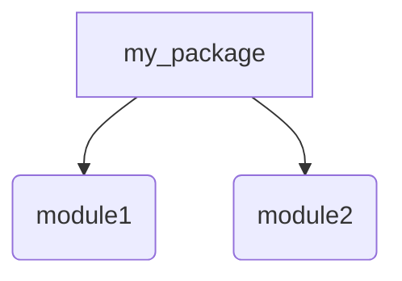
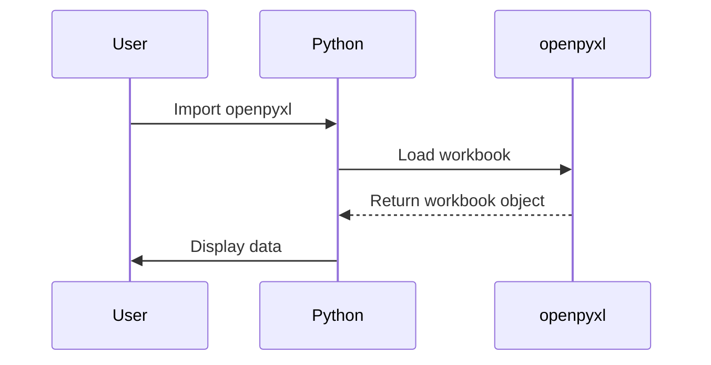

## Understanding Modules, Packages, and Libraries in Python

### Modules

A **module** in Python is simply a file containing Python definitions and statements. The file name is the module name with the suffix `.py` added. For example, a file named `inventory.py` would be a module named `inventory`. Modules allow you to logically organize your Python code. You can define functions, classes, and variables in a module and then import them into your main program or another module.

#### Why Modules Matter

Modules help in organizing code into manageable chunks. They also promote reusability and maintainability. By breaking down your code into smaller, modular pieces, you can easily reuse these pieces across different parts of your application or even in different applications.

#### How Modules Work Under the Hood

When you import a module, Python looks for the corresponding `.py` file in the directories listed in the `sys.path` list. This list includes the current directory, the installation-dependent default directory, and any directories specified by the PYTHONPATH environment variable.

```python
import sys
print(sys.path)
```

This code snippet prints out the list of directories Python searches for modules.

### Packages

A **package** in Python is a way of structuring code into a hierarchical namespace using directories. A package is simply a directory that contains a special file called `__init__.py`. This file can be empty, but it signals to Python that the directory should be treated as a package.

#### Why Packages Matter

Packages allow you to group related modules together, making it easier to manage large codebases. They also provide a way to avoid naming conflicts between modules.

#### How Packages Work Under the Hood

When you import a package, Python looks for the `__init__.py` file in the directory. This file can contain initialization code for the package. Additionally, you can import submodules within the package using the dot notation.

```python
# Example of a package structure
# my_package/
# ├── __init__.py
# ├── module1.py
# └── module2.py

from my_package import module1
from my_package.module2 import some_function
```

In this example, `my_package` is a package, and `module1` and `module2` are modules within the package.

### Libraries

A **library** in Python is a collection of packages and modules that provide additional functionality. Libraries are often distributed as packages and can be installed using tools like `pip`.

#### Why Libraries Matter

Libraries extend the capabilities of Python by providing pre-written code that can be reused. They save time and effort by allowing developers to leverage existing solutions rather than reinventing the wheel.

#### How Libraries Work Under the Hood

Libraries are typically installed using `pip`, which installs the necessary files in the appropriate directories. Once installed, you can import the library's modules and use their functions and classes.

```bash
pip install openpyxl
```

This command installs the `openpyxl` library, which provides support for reading and writing Excel files.

### Differences Between Modules, Packages, and Libraries

Understanding the differences between modules, packages, and libraries is crucial for effective Python development:

- **Module**: A single Python file containing code.
- **Package**: A directory containing multiple modules and an `__init__.py` file.
- **Library**: A collection of packages and modules that provide additional functionality.

### Reading Spreadsheet Files Using Python

Now that we understand the basics of modules, packages, and libraries, let's move on to reading spreadsheet files using Python. We'll use the `openpyxl` library, which is designed to work with Excel files.

#### Installing the `openpyxl` Library

First, ensure that the `openpyxl` library is installed:

```bash
pip install openpyxl
```

#### Loading a Workbook

To read an Excel file, you need to load the workbook using the `load_workbook` function from the `openpyxl` library.

```python
from openpyxl import load_workbook

# Load the workbook
workbook = load_workbook('inventory.xlsx')
```

In this example, `inventory.xlsx` is the name of the Excel file you want to read.

#### Accessing Worksheet Data

Once the workbook is loaded, you can access individual worksheets and their data.

```python
# Access the first worksheet
worksheet = workbook.active

# Iterate through rows and columns
for row in worksheet.iter_rows(values_only=True):
    print(row)
```

This code snippet iterates through the rows of the active worksheet and prints each row.

### Complete Example

Let's put it all together with a complete example.

#### Inventory File (`inventory.xlsx`)

Assume the `inventory.xlsx` file contains the following data:

| Item | Quantity |
|------|----------|
| Apples | 100     |
| Bananas | 200    |
| Oranges | 150    |

#### Python Code to Read the Inventory File

```python
from openpyxl import load_workbook

# Load the workbook
workbook = load_workbook('inventory.xlsx')

# Access the first worksheet
worksheet = workbook.active

# Iterate through rows and columns
for row in worksheet.iter_rows(values_only=True):
    print(row)
```

### HTTP Request and Response Example

While this example does not involve HTTP requests, it's important to understand how HTTP requests and responses work in the context of web applications.

#### Full Raw HTTP Request

```http
GET /api/inventory HTTP/1.1
Host: example.com
Accept: application/json
```

#### Full Raw HTTP Response

```http
HTTP/1.1 200 OK
Content-Type: application/json
Content-Length: 102

{
  "items": [
    {"name": "Apples", "quantity": 100},
    {"name": "Bananas", "quantity": 200},
    {"name": "Oranges", "quantity": 150}
  ]
}
```

### Mermaid Diagrams

#### Package Structure Diagram



#### Workflow Diagram



### Pitfalls and Common Mistakes

#### Incorrect Module Names

Ensure that the module names match the file names exactly. For example, if you have a file named `inventory.py`, the module name should be `inventory`.

#### Missing `__init__.py`

If you forget to include the `__init__.py` file in a package, Python will not recognize it as a package.

### How to Prevent / Defend

#### Secure Coding Practices

- **Use Strong Authentication**: Ensure that any API endpoints are protected with strong authentication mechanisms.
- **Input Validation**: Validate all inputs to prevent injection attacks.
- **Error Handling**: Implement proper error handling to avoid exposing sensitive information.

#### Secure Configuration

- **Limit Permissions**: Ensure that the user running the Python script has the minimum necessary permissions.
- **Secure Storage**: Store sensitive data securely, such as using encrypted storage.

#### Detection and Prevention

- **Static Analysis Tools**: Use static analysis tools like `bandit` to detect potential security issues in your code.
- **Code Reviews**: Regularly review code changes to catch security vulnerabilities early.

### Real-World Examples

#### Recent CVEs and Breaches

- **CVE-2021-44228 (Log4Shell)**: This vulnerability in Apache Log4j allowed attackers to execute arbitrary code. While not directly related to Python, it highlights the importance of keeping dependencies up-to-date.
- **SolarWinds Supply Chain Attack**: This attack involved the compromise of SolarWinds software, leading to widespread breaches. It underscores the importance of supply chain security.

### Practice Labs

For hands-on practice with automating spreadsheet data processing using Python, consider the following labs:

- **PortSwigger Web Security Academy**: Offers exercises on web security, including secure coding practices.
- **OWASP Juice Shop**: A deliberately insecure web application for practicing web security skills.
- **DVWA (Damn Vulnerable Web Application)**: Another intentionally vulnerable web application for learning web security.

These labs provide practical experience in securing web applications and handling data securely.

### Conclusion

Understanding the concepts of modules, packages, and libraries in Python is essential for effective code organization and reuse. By leveraging libraries like `openpyxl`, you can automate tasks such as reading and processing spreadsheet data efficiently. Always follow secure coding practices and regularly update your dependencies to mitigate potential security risks.

---
<!-- nav -->
[[04-Automating Spreadsheet Data Processing with Python|Automating Spreadsheet Data Processing with Python]] | [[DevOps/DevOps Bootcamp/03-Python & Scripting/06-Automating Spreadsheet Data Processing With Python/00-Overview|Overview]] | [[DevOps/DevOps Bootcamp/03-Python & Scripting/06-Automating Spreadsheet Data Processing With Python/06-Practice Questions & Answers|Practice Questions & Answers]]
