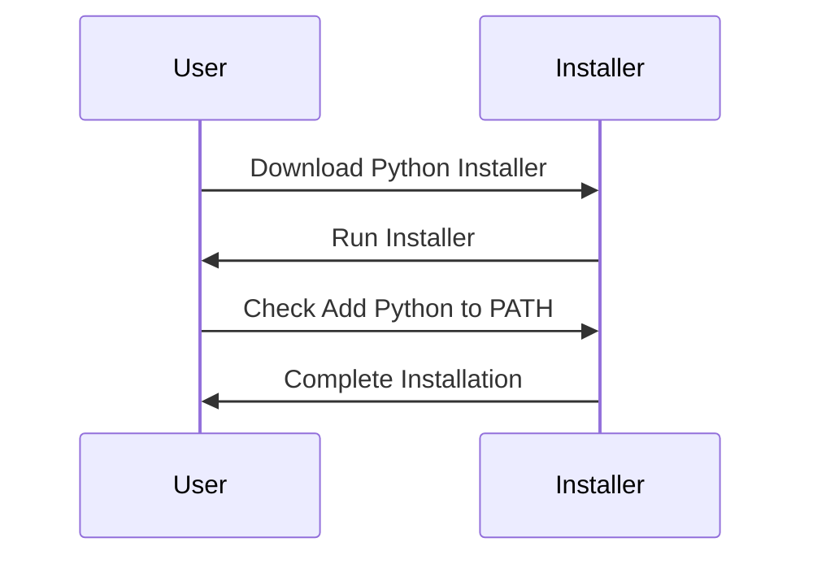

## Configuring Local Python Development Environment

### Introduction

In this section, we will delve into the process of setting up a local Python development environment. This is a crucial step for any developer looking to work with Python on their personal machine. We will cover the installation of Python, the importance of setting up the environment correctly, and some common pitfalls to avoid. Additionally, we will discuss how to ensure your environment is secure and provide practical examples and configurations.

### Installing Python

The first step in configuring your local Python development environment is to install Python on your machine. Python can be downloaded from the official Python website, [python.org](https://www.python.org/downloads/). The installation process varies slightly depending on your operating system (Windows, macOS, Linux).

#### Windows Installation

For Windows users, the installation process involves downloading the Python installer from the official website. Once downloaded, run the installer and follow the prompts. A critical step during the installation process is to check the **Add Python to PATH** option. This ensures that Python commands can be executed from the command line.



If you forget to check this option, you can manually add Python to your PATH later. To do this, navigate to the Python installation directory (usually `C:\PythonXX` where XX is the version number) and add it to the system PATH variable.

#### macOS Installation

On macOS, Python is often pre-installed, but it may be an older version (e.g., Python 2.7). For development purposes, it is recommended to use the latest version of Python (currently Python 3.x). You can install Python 3 using Homebrew, a popular package manager for macOS.

```bash
/bin/bash -c "$(curl -fsSL https://raw.githubusercontent.com/Homebrew/install/HEAD/install.sh)"
brew install python
```

This will install Python 3 alongside the existing Python 2.7. To verify the installation, you can check the version:

```bash
python3 --version
```

#### Linux Installation

On Linux distributions, Python can typically be installed via the package manager. For example, on Ubuntu, you can use `apt-get`:

```bash
sudo apt update
sudo apt install python3
```

To check the installed version:

```bash
python3 --version
```

### Setting Up the Environment

Once Python is installed, you need to set up your development environment. This includes configuring your shell, setting up virtual environments, and installing necessary packages.

#### Configuring Your Shell

Ensure that your shell is configured to recognize Python commands. On macOS and Linux, you can add the following lines to your `.bashrc` or `.zshrc` file:

```bash
export PATH="/usr/local/opt/python/libexec/bin:$PATH"
alias python=python3
alias pip=pip3
```

This sets up aliases to ensure that `python` and `pip` commands refer to Python 3 and pip3 respectively.

#### Virtual Environments

Virtual environments allow you to manage project-specific dependencies without affecting the global Python installation. This is particularly useful when working on multiple projects with different requirements.

To create a virtual environment, use the `venv` module:

```bash
python3 -m venv myenv
```

Activate the virtual environment:

- On macOS/Linux:

  ```bash
  source myenv/bin/activate
  ```

- On Windows:

  ```cmd
  myenv\Scripts\activate
  ```

Once activated, you can install packages using pip:

```bash
pip install requests
```

### Common Pitfalls and How to Avoid Them

#### Mixing Python Versions

One common pitfall is mixing different versions of Python. Ensure that you are using the correct version for your project. You can check the active Python version with:

```bash
which python
```

or

```bash
which python3
```

#### Missing Dependencies

Another issue is missing dependencies. Always ensure that all required packages are installed in your virtual environment. You can manage dependencies using a `requirements.txt` file:

```plaintext
# requirements.txt
requests==2.25.1
numpy==1.21.0
```

Install dependencies with:

```bash
pip install -r requirements.txt
```

### Security Considerations

#### Secure Coding Practices

When working with Python, it is essential to follow secure coding practices. This includes validating user input, sanitizing data, and avoiding common vulnerabilities such as SQL injection and cross-site scripting (XSS).

##### Example: SQL Injection

Consider a simple web application that interacts with a database:

```python
import sqlite3

def get_user(username):
    conn = sqlite3.connect('users.db')
    cursor = conn.cursor()
    query = f"SELECT * FROM users WHERE username = '{username}'"
    cursor.execute(query)
    result = cursor.fetchone()
    conn.close()
    return result
```

This code is vulnerable to SQL injection. An attacker could inject malicious SQL code by providing a specially crafted username. To prevent this, use parameterized queries:

```python
def get_user_secure(username):
    conn = sqlite3.connect('users.db')
    cursor = conn.cursor()
    query = "SELECT * FROM users WHERE username = ?"
    cursor.execute(query, (username,))
    result = cursor.fetchone()
    conn.close()
    return result
```

#### Hardening the Environment

To further secure your development environment, consider the following steps:

- **Use a firewall**: Ensure that your machine is protected by a firewall.
- **Keep software up-to-date**: Regularly update Python and all installed packages to the latest versions.
- **Use secure coding tools**: Utilize tools like `bandit` for static code analysis and `pylint` for linting.

##### Example: Using Bandit

Bandit is a security linter for Python code. Install it using pip:

```bash
pip install bandit
```

Run Bandit on your codebase:

```bash
bandit -r /path/to/your/code
```

### Real-World Examples and Recent CVEs

#### CVE-2021-3177: PyPI Package Tampering

In 2021, a security researcher discovered that attackers could tamper with PyPI packages, leading to potential code execution vulnerabilities. This highlights the importance of verifying package sources and using secure coding practices.

##### Example: Verifying Package Sources

Always verify the source of packages you install. Use trusted repositories and check the package documentation for any security advisories.

#### CVE-2022-23277: Flask Debug Mode

Flask, a popular web framework for Python, had a vulnerability where enabling debug mode could expose sensitive information. Ensure that debug mode is disabled in production environments.

##### Example: Disabling Debug Mode

In a Flask application, disable debug mode by setting the `DEBUG` environment variable to `False`:

```python
from flask import Flask

app = Flask(__name__)

if __name__ == "__main__":
    app.run(debug=False)
```

### Conclusion

Configuring a local Python development environment is a foundational step for any Python developer. By following the steps outlined above, you can ensure that your environment is set up correctly, secure, and ready for development. Remember to keep your environment updated, use virtual environments, and follow secure coding practices to minimize risks.

### Practice Labs

For hands-on practice, consider the following labs:

- **PortSwigger Web Security Academy**: Offers interactive labs on web security, including Python-based web applications.
- **OWASP Juice Shop**: A deliberately insecure web application for practicing web security skills.
- **DVWA (Damn Vulnerable Web Application)**: Another intentionally vulnerable web application for learning web security.

These labs provide practical experience in configuring and securing Python development environments.

---
<!-- nav -->
[[01-Introduction to Configuring a Local Python Development Environment|Introduction to Configuring a Local Python Development Environment]] | [[DevOps/DevOps Bootcamp/03-Python & Scripting/08-Configuring Local Python Development Environment/00-Overview|Overview]] | [[DevOps/DevOps Bootcamp/03-Python & Scripting/08-Configuring Local Python Development Environment/03-Practice Questions & Answers|Practice Questions & Answers]]
