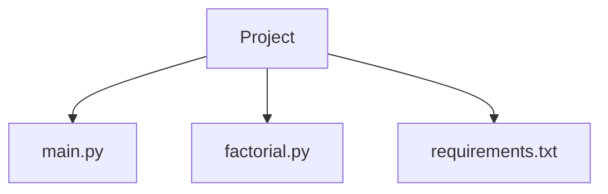
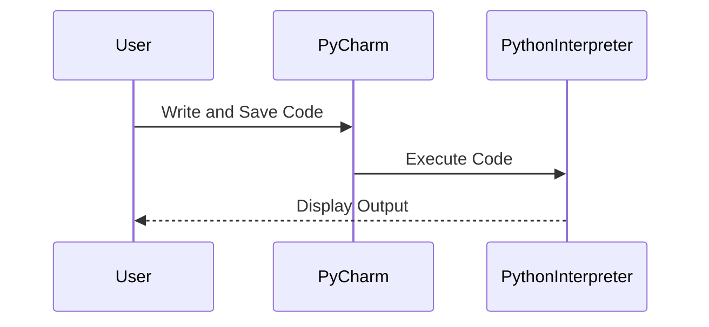

## Introduction to Integrated Development Environments (IDEs)

Integrated Development Environments (IDEs) are powerful tools designed to streamline the process of coding, debugging, testing, and deploying applications. They provide a comprehensive suite of features that make software development more efficient and less error-prone. In the context of Python development, IDEs like PyCharm offer a rich set of functionalities that enhance productivity and ease of use.

### What is an IDE?

An IDE is a software application that provides comprehensive facilities to computer programmers for software development. An IDE usually consists of a code editor, a compiler or interpreter, build automation tools, and a debugger. The primary goal of an IDE is to consolidate all the necessary tools required for software development into a single, cohesive interface.

#### Key Features of an IDE

1. **Code Editor**: A sophisticated text editor with features like syntax highlighting, code completion, and error detection.
2. **Compiler/Interpreter**: Tools to compile or interpret the code written in the editor.
3. **Build Automation Tools**: Scripts and tools to automate the build process, including tasks like compiling, linking, and packaging.
4. **Debugger**: A tool to test and debug the code, allowing developers to step through the code line by line, inspect variables, and identify issues.
5. **Version Control Integration**: Support for version control systems like Git, enabling developers to manage changes and collaborate effectively.

### Why Use an IDE?

Using an IDE offers several advantages:

1. **Productivity**: IDEs provide a wide range of features that help developers write code faster and more efficiently.
2. **Error Detection**: Real-time error detection and code suggestions reduce the likelihood of introducing bugs.
3. **Consistency**: IDEs enforce coding standards and conventions, leading to more consistent and maintainable code.
4. **Integration**: IDEs integrate various tools and services, reducing the need to switch between multiple applications.

### Example: PyCharm IDE

PyCharm is a popular IDE specifically designed for Python development. It offers a robust set of features tailored to Python programming, making it a preferred choice among developers.

#### Key Features of PyCharm

1. **Code Editor**: PyCharm’s code editor supports syntax highlighting, code folding, and code navigation.
2. **Intelligent Code Completion**: PyCharm provides intelligent code completion based on the context, suggesting appropriate functions, methods, and variables.
3. **Error Highlighting**: PyCharm highlights syntax errors and potential issues in real-time, helping developers catch and fix problems early.
4. **Debugging Tools**: PyCharm includes a powerful debugger that allows developers to step through code, inspect variables, and evaluate expressions.
5. **Version Control Integration**: PyCharm integrates with Git and other version control systems, providing a seamless experience for managing code changes.

### How to Use PyCharm

To use PyCharm effectively, follow these steps:

1. **Install PyCharm**: Download and install PyCharm from the JetBrains website.
2. **Create a New Project**: Open PyCharm and create a new project by specifying the project name and location.
3. **Add Files**: Add Python files to the project by creating new files or importing existing ones.
4. **Write Code**: Use the code editor to write Python code, taking advantage of features like syntax highlighting and code completion.
5. **Run and Debug**: Run the code using the built-in interpreter and use the debugger to identify and fix issues.

### Example Code in PyCharm

Here is a simple example of a Python script that calculates the factorial of a number:

```python
def factorial(n):
    if n == 0:
        return 1
    else:
        return n * factorial(n-1)

number = 5
result = factorial(number)
print(f"The factorial of {number} is {result}")
```

When you run this code in PyCharm, the output will be:

```
The factorial of 5 is 120
```

### Connection Between Terminal and IDE

While IDEs provide a convenient and feature-rich environment for development, it is important to understand how to execute Python code outside the IDE using the terminal. This knowledge is crucial for scenarios where an IDE is not available or when working with scripts that need to be executed directly from the command line.

#### Executing Python Code in the Terminal

To execute Python code in the terminal, follow these steps:

1. **Open Terminal**: Open the terminal application on your operating system.
2. **Navigate to Directory**: Use the `cd` command to navigate to the directory containing your Python script.
3. **Run Script**: Execute the script using the `python` or `python3` command followed by the script filename.

For example, to run the factorial script from the terminal:

```bash
$ cd /path/to/your/project
$ python3 factorial.py
```

### Full Raw HTTP Request and Response

Although this section primarily deals with local file execution, it is worth noting how similar concepts apply to web applications. Here is an example of a full HTTP request and response for a web application that calculates the factorial of a number:

**HTTP Request**

```http
POST /factorial HTTP/1.1
Host: example.com
Content-Type: application/json
Content-Length: 14

{"number": 5}
```

**HTTP Response**

```http
HTTP/1.1 200 OK
Content-Type: application/json
Content-Length: 29

{"result": 120}
```

### Mermaid Diagrams

#### File Structure in PyCharm



#### Execution Flow in PyCharm



### Pitfalls and Common Mistakes

1. **Ignoring Terminal Skills**: Relying solely on an IDE can lead to a lack of familiarity with basic command-line operations, which are essential for many development tasks.
2. **Over-reliance on Auto-completion**: While auto-completion is helpful, it should not replace understanding the underlying code and logic.
3. **Neglecting Version Control**: Not using version control systems can lead to loss of work and difficulties in collaborating with others.

### How to Prevent / Defend

#### Detection

1. **Static Code Analysis**: Use static code analysis tools to detect potential issues and ensure code quality.
2. **Automated Testing**: Implement automated tests to verify the correctness of the code and catch regressions.

#### Prevention

1. **Regular Code Reviews**: Conduct regular code reviews to ensure adherence to coding standards and identify potential issues.
2. **Continuous Integration**: Set up continuous integration pipelines to automatically build and test the code upon each commit.

#### Secure Coding Fixes

**Vulnerable Code**

```python
def factorial(n):
    if n == 0:
        return 1
    else:
        return n * factorial(n-1)

number = int(input("Enter a number: "))
result = factorial(number)
print(f"The factorial of {number} is {result}")
```

**Secure Code**

```python
def factorial(n):
    if n < 0:
        raise ValueError("Factorial is not defined for negative numbers")
    elif n == 0:
        return 1
    else:
        return n * factorial(n-1)

try:
    number = int(input("Enter a number: "))
    result = factorial(number)
    print(f"The factorial of {number} is {result}")
except ValueError as e:
    print(e)
```

### Real-World Examples

#### Recent CVEs and Breaches

While this section focuses on Python development, it is important to note that vulnerabilities can occur in any part of the software stack. For example, the Log4j vulnerability (CVE-2021-44228) affected numerous applications and demonstrated the importance of keeping dependencies up-to-date and secure.

### Practice Labs

For hands-on practice with Python development and IDEs, consider the following resources:

- **PortSwigger Web Security Academy**: Offers interactive labs for learning web security concepts.
- **OWASP Juice Shop**: A deliberately insecure web application for practicing web security skills.
- **DVWA (Damn Vulnerable Web Application)**: A PHP/MySQL web application that is riddled with vulnerabilities for educational purposes.
- **WebGoat**: A deliberately insecure Java web application maintained by OWASP for learning about web application security.

By combining the power of IDEs like PyCharm with a solid understanding of terminal-based operations, developers can significantly enhance their productivity and produce high-quality, secure code.

---
<!-- nav -->
[[DevOps/DevOps Bootcamp/03-Python & Scripting/09-Executing Python Code Outside IDE/00-Overview|Overview]] | [[02-Understanding the Execution Environment for Python Code|Understanding the Execution Environment for Python Code]]
