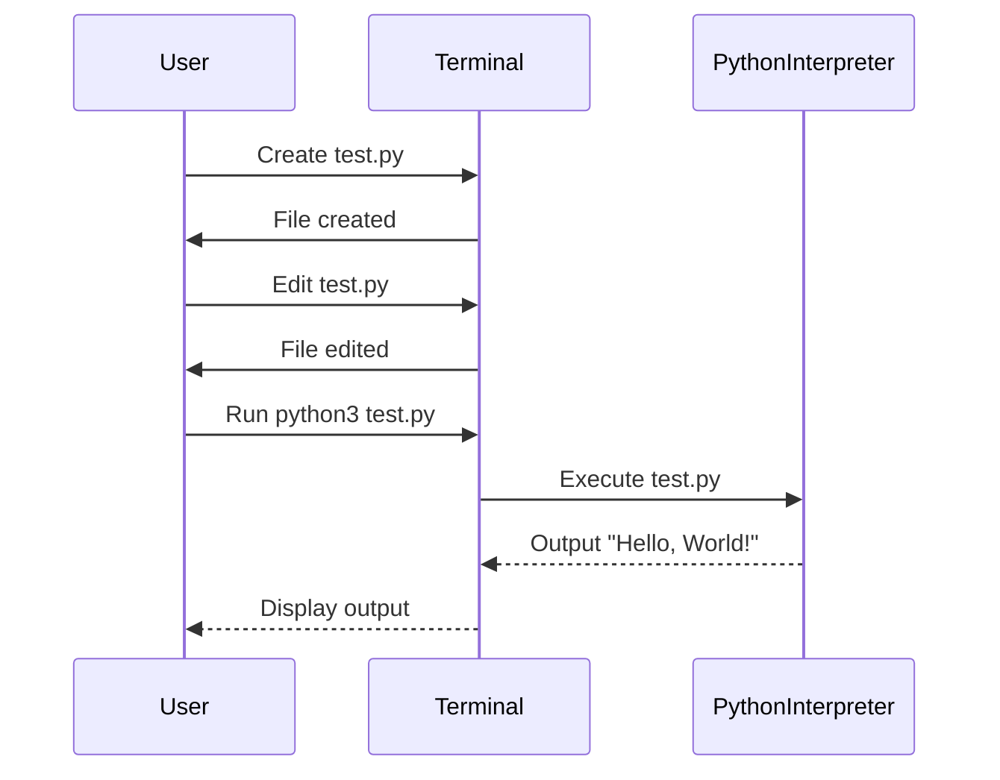

## Understanding the Execution Environment for Python Code

When developing Python applications, it is crucial to understand the different environments in which you can write and execute your code. This knowledge helps you choose the most appropriate tools and methods based on your specific needs and constraints. In this section, we will delve into the details of executing Python code both within an Integrated Development Environment (IDE) and outside of it, using a terminal or command-line interface.

### Integrated Development Environments (IDEs)

An Integrated Development Environment (IDE) is a software application that provides comprehensive facilities to computer programmers for software development. IDEs typically include code editors, debuggers, and automation tools that simplify the process of writing and testing code. Popular IDEs for Python development include PyCharm, Visual Studio Code, and Eclipse with PyDev.

#### PyCharm Example

PyCharm is a powerful IDE specifically designed for Python development. It offers features such as code completion, debugging, and integration with version control systems. Let's consider an example where we write and execute Python code within PyCharm:

```python
# main.py
print("Hello, World!")
```

In PyCharm, you can simply run this script by clicking the "Run" button or pressing `Shift + F10`. The output will be displayed in the console window within the IDE.

### Executing Python Code Outside an IDE

While IDEs provide a convenient and integrated environment for writing and executing code, there are situations where you might need to work outside of an IDE. This could be due to various reasons such as working in a remote environment, using a lightweight editor, or automating tasks through scripts.

#### Using the Terminal

To execute Python code outside an IDE, you can use a terminal or command-line interface. Here’s a step-by-step guide to creating and running a Python script using the terminal:

1. **Create a New File**:
   Open your terminal and navigate to the directory where you want to create your Python script. Then, create a new file named `test.py` using a text editor or directly in the terminal.

   ```bash
   $ touch test.py
   ```

2. **Edit the File**:
   Use a text editor to open and edit the file. Alternatively, you can use the `nano` or `vim` editor directly in the terminal.

   ```bash
   $ nano test.py
   ```

   Add the following Python code to the file:

   ```python
   print("Hello, World!")
   ```

3. **Save and Exit**:
   Save the file and exit the editor. In `nano`, you can do this by pressing `Ctrl + X`, then `Y` to confirm, and `Enter` to save.

4. **Execute the Script**:
   Run the Python script using the `python3` command followed by the filename.

   ```bash
   $ python3 test.py
   ```

   You should see the output `Hello, World!` printed in the terminal.

### Mermaid Diagram: Execution Flow

Let's visualize the execution flow using a mermaid diagram:



### Common Pitfalls and How to Avoid Them

#### Incorrect Python Version

One common issue when executing Python scripts outside an IDE is ensuring that the correct version of Python is being used. By default, the `python` command might refer to an older version of Python, while you might need to use `python3`.

**Example**:
If you try to run a script using `python test.py` and receive an error indicating that the script is incompatible with Python 2, you should use `python3 test.py` instead.

**Secure Coding Fix**:
Always specify the version explicitly to avoid compatibility issues.

```bash
$ python3 test.py
```

#### Missing Dependencies

Another common pitfall is missing dependencies required by your script. Ensure that all necessary packages are installed before running the script.

**Example**:
If your script uses the `requests` library, make sure it is installed.

```bash
$ pip install requests
```

**Secure Coding Fix**:
Use a virtual environment to manage dependencies and ensure consistency across different environments.

```bash
$ python3 -m venv myenv
$ source myenv/bin/activate
$ pip install requests
$ python3 test.py
```

### Real-World Examples and CVEs

Understanding how these concepts apply in real-world scenarios can help solidify your knowledge. Consider the following example:

#### CVE-2021-44228 (Log4Shell)

The Log4Shell vulnerability (CVE-2021-44228) affected the Apache Log4j logging utility, which is widely used in Java applications. However, this vulnerability also impacted Python applications that relied on Java-based services or libraries.

**Example**:
A Python application might use a Java-based service that logs information using Log4j. If the service is vulnerable to Log4Shell, an attacker could exploit this to execute arbitrary code on the server.

**Secure Coding Fix**:
Ensure that all dependencies, including those used indirectly, are up-to-date and patched against known vulnerabilities.

```bash
$ pip list --outdated
$ pip install --upgrade <package-name>
```

### How to Prevent / Defend

#### Detection

Regularly scan your codebase and dependencies for known vulnerabilities using tools like `pip-audit`, `snyk`, or `trivy`.

```bash
$ pip install pip-audit
$ pip-audit
```

#### Prevention

1. **Use Virtual Environments**: Always use virtual environments to isolate dependencies and avoid conflicts.

2. **Keep Dependencies Updated**: Regularly update your dependencies to the latest versions.

3. **Code Reviews**: Conduct regular code reviews to catch potential security issues early.

4. **Automated Testing**: Implement automated testing to ensure that your code behaves as expected and does not introduce new vulnerabilities.

### Complete Example: Running a Python Script

Let's walk through a complete example of creating and running a Python script using the terminal.

1. **Create a New File**:
   ```bash
   $ touch test.py
   ```

2. **Edit the File**:
   ```bash
   $ nano test.py
   ```

   Add the following code:
   ```python
   import requests

   response = requests.get('https://api.example.com/data')
   print(response.json())
   ```

3. **Install Dependencies**:
   ```bash
   $ python3 -m venv myenv
   $ source myenv/bin/activate
   $ pip install requests
   ```

4. **Run the Script**:
   ```bash
   $ python3 test.py
   ```

   You should see the JSON response from the API printed in the terminal.

### Conclusion

Executing Python code outside an IDE is a fundamental skill for developers. By understanding the steps involved and the potential pitfalls, you can ensure that your code runs smoothly in various environments. Always keep your dependencies updated, use virtual environments, and conduct regular security audits to maintain the integrity and security of your applications.

### Practice Labs

For hands-on practice, consider the following labs:

- **PortSwigger Web Security Academy**: Offers interactive labs to practice web security concepts.
- **OWASP Juice Shop**: A deliberately insecure web application for practicing web security skills.
- **DVWA (Damn Vulnerable Web Application)**: Another intentionally vulnerable web application for learning web security.

These labs provide practical experience in writing and executing Python code in various environments, helping you master the skills discussed in this chapter.

---
<!-- nav -->
[[01-Introduction to Integrated Development Environments (IDEs)|Introduction to Integrated Development Environments (IDEs)]] | [[DevOps/DevOps Bootcamp/03-Python & Scripting/09-Executing Python Code Outside IDE/00-Overview|Overview]] | [[DevOps/DevOps Bootcamp/03-Python & Scripting/09-Executing Python Code Outside IDE/03-Practice Questions & Answers|Practice Questions & Answers]]
