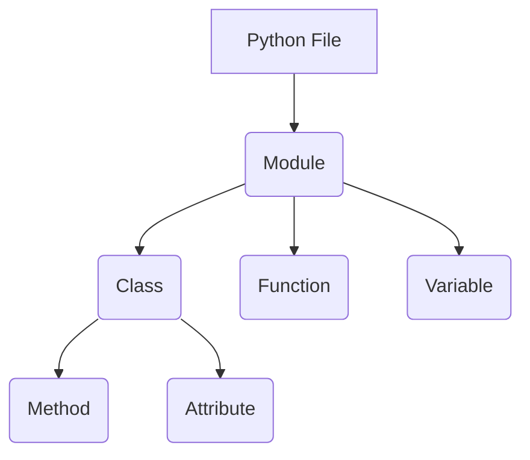

## Introduction to Modules and Classes in Python

In Python, modules and classes are fundamental building blocks that help organize and structure code. A module is simply a Python file containing definitions and statements. These files can contain functions, classes, and variables. By organizing code into modules, developers can manage large codebases more effectively and reuse code across different parts of an application.

### What is a Module?

A module in Python is a file containing Python code. This file can define functions, classes, and variables. When you import a module, Python reads the file and executes the code within it. This allows you to use the functions, classes, and variables defined in the module.

For example, consider a file named `user.py`:

```python
# user.py
class User:
    def __init__(self, username, password):
        self.username = username
        self.password = password

    def authenticate(self, password):
        return self.password == password
```

This file defines a class `User` with methods to initialize a user and authenticate a password.

### Importing Modules

To use the definitions in a module, you need to import it. There are several ways to import a module in Python:

#### Importing the Entire Module

The simplest way to import a module is to use the `import` statement followed by the module name:

```python
import user

# Create an instance of the User class
user_instance = user.User("john_doe", "password123")
print(user_instance.authenticate("password123"))  # Output: True
```

In this example, `user` is the module name, and `User` is the class defined within the module. To access the class, you need to prefix it with the module name (`user.User`).

#### Importing Specific Definitions

If you only need specific definitions from a module, you can use the `from ... import ...` statement:

```python
from user import User

# Create an instance of the User class
user_instance = User("john_doe", "password123")
print(user_instance.authenticate("password123"))  # Output: True
```

Here, we import only the `User` class from the `user` module. This allows us to use the class directly without prefixing it with the module name.

### Understanding the Concept

When you import a module, Python executes the code in the module file. This means that any top-level code in the module will run when the module is imported. For example, if `user.py` contains:

```python
# user.py
print("Module user is being imported")

class User:
    def __init__(self, username, password):
        self.username = username
        self.password = password

    def authenticate(self, password):
        return self.password == password
```

When you import the module, you will see the print statement:

```python
import user
# Output: Module user is being imported
```

### Why Use Modules?

Modules provide several benefits:

1. **Code Organization**: Modules help organize code into logical units, making it easier to manage and understand.
2. **Code Reusability**: You can reuse code across different parts of your application by importing modules.
3. **Namespace Management**: Modules allow you to avoid naming conflicts by providing a namespace for the definitions within the module.

### Real-World Examples

Consider a real-world scenario where you might use modules and classes in a web application. Suppose you have a `user.py` module that handles user authentication and a `main.py` file that uses this module:

```python
# user.py
class User:
    def __init__(self, username, password):
        self.username = username
        self.password = password

    def authenticate(self, password):
        return self.password == password

# main.py
from user import User

def login(username, password):
    user = User(username, password)
    if user.authenticate(password):
        print(f"Welcome, {username}!")
    else:
        print("Authentication failed.")

login("john_doe", "password123")  # Output: Welcome, john_d
```

In this example, the `user.py` module defines a `User` class, and the `main.py` file imports and uses this class to handle user authentication.

### Common Pitfalls

While using modules and classes, there are some common pitfalls to watch out for:

1. **Circular Imports**: Circular imports occur when two or more modules depend on each other. This can lead to errors and unexpected behavior. To avoid circular imports, refactor your code to eliminate dependencies or use import statements strategically.
2. **Top-Level Code Execution**: As mentioned earlier, any top-level code in a module will execute when the module is imported. This can lead to unintended side effects. To avoid this, wrap top-level code in a `if __name__ == "__main__":` block.

### How to Prevent / Defend

To ensure secure and effective use of modules and classes, follow these best practices:

1. **Use Secure Coding Practices**: Ensure that your code follows secure coding guidelines. For example, use strong password hashing algorithms and avoid storing passwords in plain text.
2. **Validate Inputs**: Always validate inputs to prevent injection attacks and other vulnerabilities.
3. **Use Environment Variables for Secrets**: Store sensitive information like API keys and database credentials in environment variables rather than hardcoding them in your code.
4. **Regularly Update Dependencies**: Keep your dependencies up to date to protect against known vulnerabilities.

### Example of Secure Code

Here is an example of a secure implementation of the `User` class:

```python
# user.py
import hashlib

class User:
    def __init__(self, username, password):
        self.username = username
        self.password_hash = self.hash_password(password)

    def hash_password(self, password):
        return hashlib.sha256(password.encode()).hexdigest()

    def authenticate(self, password):
        return self.hash_password(password) == self.password_hash
```

In this example, the password is hashed using SHA-256 before being stored. This ensures that even if the password hashes are exposed, the actual passwords remain secure.

### Conclusion

Understanding how to use modules and classes in Python is crucial for developing robust and maintainable applications. By following best practices and avoiding common pitfalls, you can ensure that your code is both secure and efficient.

### Practice Labs

To gain hands-on experience with modules and classes in Python, consider the following practice labs:

- **PortSwigger Web Security Academy**: Offers interactive labs to learn about web security concepts.
- **OWASP Juice Shop**: A deliberately insecure web application for practicing web hacking techniques.
- **DVWA (Damn Vulnerable Web Application)**: Another intentionally vulnerable web application for learning web security.

These labs provide practical scenarios where you can apply your knowledge of modules and classes in a real-world context.

### Summary Diagram

Below is a mermaid diagram illustrating the relationship between modules and classes in Python:



This diagram shows how a Python file can be considered a module, which can contain classes, functions, and variables. Classes can have methods and attributes.

By mastering the concepts of modules and classes in Python, you can build more organized, reusable, and secure applications.

---
<!-- nav -->
[[01-Introduction to Classes and Objects in Python|Introduction to Classes and Objects in Python]] | [[DevOps/DevOps Bootcamp/03-Python & Scripting/10-Objects and Classes in Python/00-Overview|Overview]] | [[03-Introduction to Object-Oriented Programming (OOP)|Introduction to Object-Oriented Programming (OOP)]]
