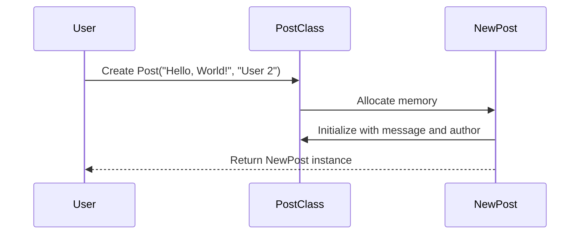

## Introduction to Object-Oriented Programming (OOP)

Object-Oriented Programming (OOP) is a programming paradigm based on the concept of "objects", which can contain data and code: data in the form of fields (often known as attributes or properties), and code, in the form of procedures (often known as methods). OOP allows developers to structure their programs in a way that closely mirrors real-world entities and their interactions.

### What is an Object?

An **object** is an instance of a class. A class is a blueprint that defines the properties and behaviors of an object. An object is created from a class and contains both data (attributes) and functions (methods).

#### Example: Creating an Object

Let's consider a simple example of a `Post` class:

```python
class Post:
    def __init__(self, message, author):
        self.message = message
        self.author = author

    def get_post_info(self):
        return f"Message: {self.message}, Author: {self.author}"

# Create an instance of the Post class
new_post = Post("Hello, World!", "User 2")

# Print the information of the post
print(new_post.get_post_info())
```

In this example:
- `Post` is the class.
- `new_post` is an instance (or object) of the `Post` class.
- `message` and `author` are attributes of the `Post` class.
- `get_post_info` is a method of the `Post` class.

### What is a Class?

A **class** is a template or blueprint that describes the characteristics and behaviors of an object. It defines the structure and behavior of objects that belong to it.

#### Example: Defining a Class

```python
class Post:
    def __init__(self, message, author):
        self.message = message
        self.author = author

    def get_post_info(self):
        return f"Message: {self.message}, Author: {self.author}"
```

In this example:
- `__init__` is a special method called the constructor. It initializes the object with the provided data.
- `self` is a reference to the current instance of the class and is used to access variables that belong to the class.

### How Does OOP Work Under the Hood?

When you create an object from a class, the following steps occur:
1. **Memory Allocation**: Memory is allocated for the object.
2. **Constructor Call**: The constructor (`__init__`) is called to initialize the object with the provided data.
3. **Method Binding**: Methods defined in the class are bound to the object.

#### Mermaid Diagram: Object Creation Process



### Why Use OOP?

OOP provides several benefits:
- **Encapsulation**: Encapsulates data and methods within objects, preventing direct access to internal data.
- **Abstraction**: Hides complex implementation details and exposes only necessary features.
- **Inheritance**: Allows classes to inherit properties and methods from other classes.
- **Polymorphism**: Enables methods to behave differently based on the context.

### Real-World Examples of OOP

#### Example: Web Application Security

Consider a web application where posts are managed using OOP principles. Each post is an object with attributes like `message`, `author`, and methods to retrieve and update post information.

```python
class Post:
    def __init__(self, message, author):
        self.message = message
        self.author = author

    def get_post_info(self):
        return f"Message: {self.message}, Author:  {self.author}"

    def update_message(self, new_message):
        self.message = new_message

# Create a post
post = Post("Hello, World!", "User 2")

# Get post information
print(post.get_post_info())

# Update post message
post.update_message("Updated message")
print(post.get_post_info())
```

### Common Pitfalls in OOP

#### Pitfall: Inconsistent State

One common pitfall is maintaining inconsistent state within an object. For example, if a method updates one attribute but forgets to update another related attribute, the object may end up in an inconsistent state.

#### How to Prevent / Defend

To prevent inconsistent state:
- Ensure that all related attributes are updated together.
- Use methods to encapsulate changes to the object's state.

#### Example: Secure Coding Practices

```python
class Post:
    def __init__(self, message, author):
        self.message = message
        self.author = author

    def get_post_info(self):
        return f"Message: {self.message}, Author: {self.author}"

    def update_message(self, new_message):
        self.message = new_message
        # Additional logic to ensure consistency
        self.validate_author()

    def validate_author(self):
        if not isinstance(self.author, str):
            raise ValueError("Author must be a string")

# Create a post
post = Post("Hello, World!", "User 2")

# Get post information
print(post.get_post_info())

# Update post message
post.update_message("Updated message")
print(post.get_post_info())
```

### Conclusion

Object-Oriented Programming (OOP) is a powerful paradigm that enables developers to structure their code in a way that closely mirrors real-world entities and their interactions. By understanding the concepts of objects, classes, constructors, and methods, developers can create more maintainable, scalable, and secure applications.

### Practice Labs

For hands-on practice with OOP in Python, consider the following resources:
- **PortSwigger Web Security Academy**: Offers interactive labs to learn about web security.
- **OWASP Juice Shop**: A deliberately insecure web application for learning about web security.
- **DVWA (Damn Vulnerable Web Application)**: Another intentionally vulnerable web application for learning web security.

These resources provide practical experience in applying OOP principles to real-world scenarios, helping to solidify your understanding and skills.

---
<!-- nav -->
[[02-Introduction to Modules and Classes in Python|Introduction to Modules and Classes in Python]] | [[DevOps/DevOps Bootcamp/03-Python & Scripting/10-Objects and Classes in Python/00-Overview|Overview]] | [[04-Introduction to Objects and Classes in Python|Introduction to Objects and Classes in Python]]
