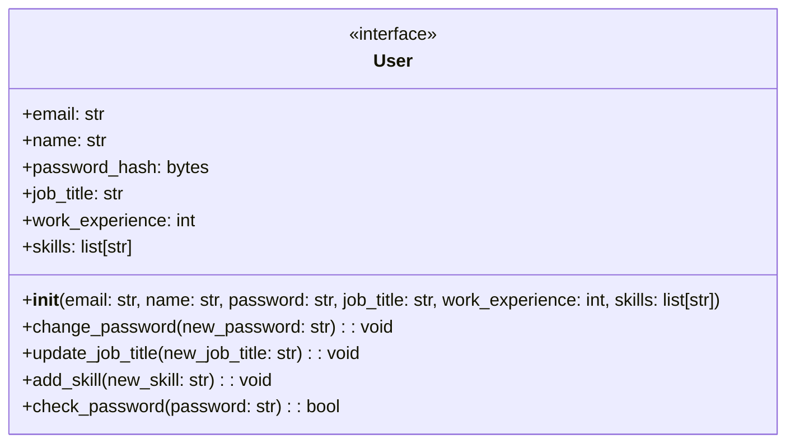

## Introduction to Objects and Classes in Python

### Background Theory

Object-Oriented Programming (OOP) is a programming paradigm based on the concept of "objects", which can contain data and code: data in the form of fields (often known as attributes or properties), and code, in the form of procedures (often known as methods). OOP aims to implement real-world entities like inheritance, hiding, polymorphism, etc. in programming. The main goal of OOP is to bind together the data and the functions that operate on them so that no other part of the code can access this data except that function.

In Python, everything is an object. This includes basic data types like integers, strings, lists, dictionaries, and more complex structures like classes and instances. Understanding how to create and manipulate objects is crucial for building robust and maintainable applications.

### Example: Users in a Social Network Application

Let's consider a social networking application like LinkedIn. Each user in the application has specific information such as:

- Email address
- Name
- Password
- Current job title
- Work experience
- Set of skills

Each user's data is unique, and users can interact with their own information by performing actions such as:

- Changing their password
- Updating their job title
- Adding new skills

To manage this complexity, we need a structured approach. This is where **classes** and **objects** come into play.

### Classes and Objects

A **class** is a blueprint for creating objects. It defines the initial state of an object and the methods that can be used to modify that state. An **object** is an instance of a class. Each object has its own attributes and methods.

#### Defining a Class

Let's define a `User` class in Python:

```python
class User:
    def __init__(self, email, name, password, job_title, work_experience, skills):
        self.email = email
        self.name = name
        self.password = password
        self.job_title = job_title
        self.work_experience = work_experience
        self.skills = skills

    def change_password(self, new_password):
        self.password = new_password

    def update_job_title(self, new_job_title):
        self.job_title = new_job_title

    def add_skill(self, new_skill):
        self.skills.append(new_skill)
```

#### Creating Objects

Now, let's create instances of the `User` class:

```python
user1 = User("john@example.com", "John Doe", "password123", "Software Engineer", 5, ["Python", "JavaScript"])
user2 = User("jane@example.com", "Jane Smith", "securepass", "Data Scientist", 3, ["R", "SQL"])
```

### Methods and Attributes

Methods are functions defined within a class. They operate on the data contained within the object. Attributes are variables that belong to an object.

#### Initializing Objects

The `__init__` method is a special method called a constructor. It initializes the attributes of an object when it is created.

```python
class User:
    def __init__(self, email, name, password, job_title, work_experience, skills):
        self.email = email
        self.name = name
        self.password = password
        self.job_title = job_title
        self.work_experience = work_experience
        self.skills = skills
```

#### Accessing Attributes

We can access the attributes of an object using dot notation:

```python
print(user1.email)  # Output: john@example.com
print(user1.name)   # Output: John Doe
```

#### Modifying Attributes

We can modify the attributes of an object using methods:

```python
user1.change_password("newpassword")
user1.update_job_title("Senior Software Engineer")
user1.add_skill("Docker")

print(user1.password)       # Output: newpassword
print(user1.job_title)      # Output: Senior Software Engineer
print(user1.skills)         # Output: ['Python', 'JavaScript', 'Docker']
```

### Real-World Examples

#### LinkedIn User Management

LinkedIn uses a similar approach to manage user profiles. Each user profile is an object with various attributes and methods to update the profile.

#### Recent CVEs and Breaches

One notable breach involving user management was the LinkedIn data breach in 2012. Hackers stole user data including names, email addresses, and hashed passwords. This highlights the importance of securing user data and implementing proper authentication mechanisms.

### Pitfalls and Best Practices

#### Common Mistakes

1. **Hardcoding sensitive data**: Storing passwords or other sensitive data in plain text.
2. **Inconsistent naming conventions**: Using inconsistent naming conventions for attributes and methods.
3. **Overusing global variables**: Relying too heavily on global variables instead of encapsulating data within objects.

#### Secure Coding Practices

1. **Use strong encryption**: Store passwords securely using hashing algorithms like bcrypt.
2. **Validate input**: Ensure that user inputs are validated to prevent injection attacks.
3. **Implement access control**: Restrict access to sensitive data using role-based access control (RBAC).

### How to Prevent / Defend

#### Detection

Regularly audit your codebase for security vulnerabilities using tools like SonarQube or Bandit.

#### Prevention

1. **Secure password storage**: Use libraries like `bcrypt` to hash passwords.
2. **Input validation**: Validate user inputs to prevent SQL injection and cross-site scripting (XSS) attacks.
3. **Access control**: Implement RBAC to restrict access to sensitive data.

#### Secure Code Fix

Here’s an example of how to securely store passwords using `bcrypt`:

```python
import bcrypt

class User:
    def __init__(self, email, name, password, job_title, work_experience, skills):
        self.email = email
        self.name = name
        self.password_hash = bcrypt.hashpw(password.encode('utf-8'), bcrypt.gensalt())
        self.job_title = job_title
        self.work_experience = work_experience
        self.skills = skills

    def check_password(self, password):
        return bcrypt.checkpw(password.encode('utf-8'), self.password_hash)

# Usage
user1 = User("john@example.com", "John Doe", "password123", "Software Engineer", 5, ["Python", "JavaScript"])
print(user1.check_password("password123"))  # Output: True
print(user1.check_password("wrongpassword"))  # Output: False
```

### Mermaid Diagrams

#### User Object Structure



### Conclusion

Understanding objects and classes in Python is fundamental to building robust and maintainable applications. By following best practices and secure coding techniques, you can ensure that your application is both functional and secure.

---
<!-- nav -->
[[03-Introduction to Object-Oriented Programming (OOP)|Introduction to Object-Oriented Programming (OOP)]] | [[DevOps/DevOps Bootcamp/03-Python & Scripting/10-Objects and Classes in Python/00-Overview|Overview]] | [[05-Objects and Classes in Python|Objects and Classes in Python]]
