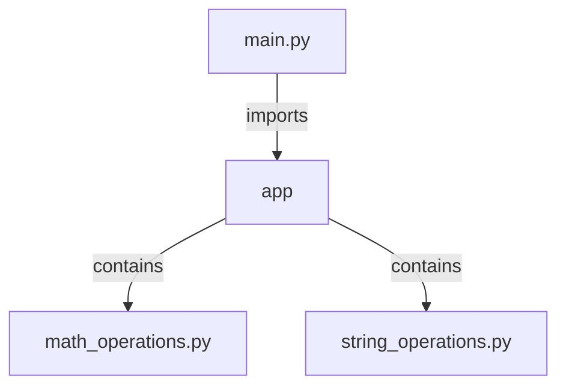

## Introduction to Python Modules

When developing software, especially large-scale applications, managing code becomes increasingly challenging as the complexity and size of the project grow. In Python, one of the primary ways to organize and manage code is through the use of **modules**. A module is simply a Python file containing definitions and statements. These modules allow developers to break down their code into smaller, more manageable pieces, making it easier to understand, maintain, and reuse.

### What Are Modules?

A module is a file containing Python definitions and statements. The file name is the module name with the suffix `.py` appended. Within a module, you can define functions, classes, and variables. By organizing code into modules, you can:

- **Improve readability**: Smaller, focused files are easier to read and understand.
- **Enhance reusability**: Functions and classes defined in one module can be reused in other parts of the project.
- **Facilitate maintenance**: Changes to a specific functionality can be made in one place without affecting other parts of the codebase.

### Why Use Modules?

Imagine a web application like Facebook, which has numerous features such as user profiles, messaging, news feed, and more. If all the logic for these features were written in a single Python file, the file would become extremely large and difficult to manage. This is where modules come into play. By dividing the code into multiple modules, each handling a specific feature or set of related functionalities, the code becomes more modular and maintainable.

### How Modules Work

In Python, you can import and use the contents of one module in another. This allows you to reuse code across different parts of your project. Let’s take a look at how this works with some examples.

#### Example: Basic Module Usage

Consider a simple project with two modules: `math_operations.py` and `main.py`.

```python
# math_operations.py
def add(a, b):
    return a + b

def subtract(a, b):
    return a - b
```

```python
# main.py
import math_operations

result_add = math_operations.add(5, 3)
result_subtract = math_operations.subtract(10, 4)

print(f"Addition Result: {result_add}")
print(f"Subtraction Result: {result_subtract}")
```

Here, `math_operations.py` contains two functions: `add` and `subtract`. In `main.py`, we import the `math_operations` module and use its functions to perform arithmetic operations.

### Directory Structure and Packages

As projects grow, it's common to have multiple modules. To further organize these modules, Python supports the concept of **packages**. A package is a directory that contains multiple modules and an additional file named `__init__.py`. This file can be empty but is necessary to indicate that the directory should be treated as a package.

#### Example: Package Structure

Let’s extend our previous example to include a package structure.

```
project/
├── main.py
└── app/
    ├── __init__.py
    ├── math_operations.py
    └── string_operations.py
```

Here, `app` is a package containing two modules: `math_operations.py` and `string_operations.py`.

```python
# app/math_operations.py
def add(a, b):
    return a + b

def subtract(a, b):
    return a - b
```

```python
# app/string_operations.py
def concatenate(str1, str2):
    return str1 + str2

def reverse_string(s):
    return s[::-1]
```

```python
# main.py
from app import math_operations, string_operations

result_add = math_operations.add(5, 3)
result_concatenate = string_operations.concatenate("Hello", "World")

print(f"Addition Result: {result_add}")
print(f"Concatenation Result: {result_concatenate}")
```

In this example, `main.py` imports both `math_operations` and `string_operations` from the `app` package and uses their functions.

### Mermaid Diagram: Project Structure

To visualize the project structure, we can use a mermaid diagram:



### Real-World Examples and Recent CVEs

Modules and packages are widely used in real-world applications. For instance, consider the popular web framework Django. Django is organized into multiple packages, each handling different aspects of web development such as authentication, database interactions, and URL routing.

#### Example: Django Package Structure

Django’s core package structure looks something like this:

```
django/
├── __init__.py
├── auth/
│   ├── __init__.py
│   ├── backends.py
│   ├── decorators.py
│   └── views.py
├── db/
│   ├── __init__.py
│   ├── models.py
│   └── utils.py
├── forms/
│   ├── __init__.py
│   ├── form.py
│   └── widgets.py
└── urls/
    ├── __init__.py
    └── urlresolvers.py
```

Each subdirectory (like `auth`, `db`, `forms`, etc.) is a package containing multiple modules that handle specific functionalities.

### Pitfalls and Best Practices

While modules and packages provide significant benefits, there are several pitfalls to avoid:

1. **Circular Imports**: Avoid importing modules in a way that creates circular dependencies. For example, if `module_a` imports `module_b` and `module_b` imports `module_a`, it can lead to issues.
   
2. **Overuse of Global Variables**: While modules can share global variables, overusing them can make the code harder to understand and maintain.

3. **Complex Directory Structures**: Overly complex directory structures can make it difficult to navigate and find specific modules. Keep the structure simple and intuitive.

### How to Prevent / Defend

#### Detection

- **Static Analysis Tools**: Use tools like PyLint, Flake8, or Bandit to detect potential issues in your codebase.
  
- **Code Reviews**: Regular code reviews can help catch issues related to module usage and organization.

#### Prevention

- **Follow Conventions**: Adhere to Python conventions for naming modules and packages (e.g., lowercase with underscores).

- **Document Your Code**: Include docstrings in your modules to describe their purpose and usage.

- **Use Virtual Environments**: Isolate your project dependencies using virtual environments to avoid conflicts.

### Secure Coding Fixes

#### Vulnerable Code Example

Consider a scenario where a module is imported incorrectly, leading to a circular import issue.

```python
# module_a.py
import module_b

def func_a():
    print(module_b.func_b())

# module_b.py
import module_a

def func_b():
    print(module_a.func_a())
```

#### Fixed Code Example

To resolve this, refactor the code to avoid circular imports.

```python
# module_a.py
def func_a():
    print(func_b())

# module_b.py
def func_b():
    print(func_a())

# main.py
from module_a import func_a
from module_b import func_b

func_a()
func_b()
```

### Conclusion

Organizing code with Python modules and packages is essential for managing large-scale projects. By breaking down code into smaller, reusable pieces, you improve readability, maintainability, and reusability. Understanding how to effectively use modules and packages is crucial for any Python developer working on complex applications.

### Practice Labs

For hands-on practice with Python modules and packages, consider the following resources:

- **PortSwigger Web Security Academy**: Offers labs on web application security, including Python-based exercises.
- **OWASP Juice Shop**: A deliberately insecure web application for practicing web security skills.
- **DVWA (Damn Vulnerable Web Application)**: Another web application for learning web security.

These resources provide practical experience in applying the concepts learned about Python modules and packages in real-world scenarios.

---
<!-- nav -->
[[DevOps/DevOps Bootcamp/03-Python & Scripting/11-Organizing Code with Python Modules/00-Overview|Overview]] | [[02-Organizing Code with Python Modules|Organizing Code with Python Modules]]
