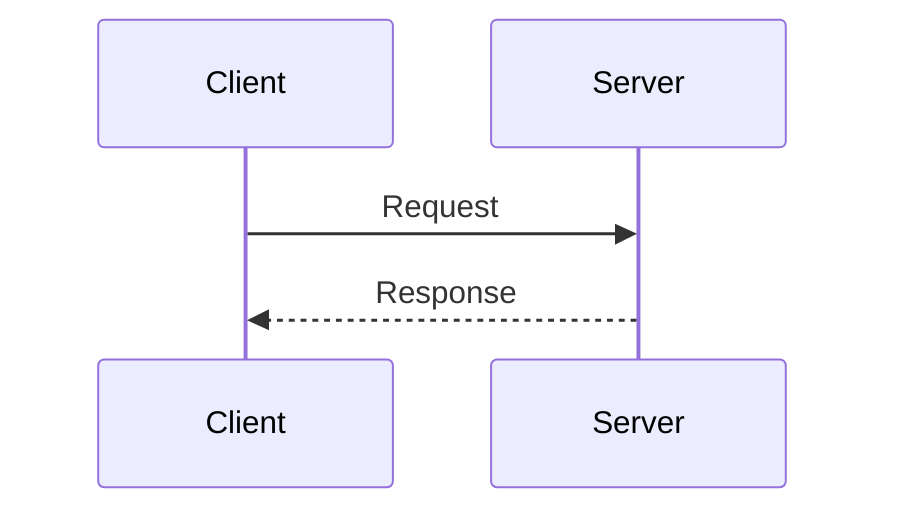

## Introduction to API Requests and Communication Protocols

In the realm of modern software development, especially within the context of DevOps practices, communication between different applications is a fundamental aspect. This communication often occurs through Application Programming Interfaces (APIs), which allow different software components to interact with each other seamlessly. One such interaction is between a Python application and a GitLab server, which we will explore in detail.

### What is an API?

An **Application Programming Interface (API)** is a set of rules and protocols for building and interacting with software applications. APIs define how software components should interact, allowing different programs to communicate and exchange data. Essentially, an API acts as a mediator between two different software systems, enabling them to work together.

#### Why Use APIs?

APIs are crucial because they provide a standardized way for different software systems to communicate. They abstract away the complexities of the underlying system, making it easier for developers to integrate functionalities without needing to understand the entire internal architecture. This leads to more modular, flexible, and maintainable software systems.

### Communication Protocols: HTTP

The most commonly used protocol for communication between applications is **HTTP (Hypertext Transfer Protocol)**. HTTP is a stateless protocol that defines how messages are formatted and transmitted, and what actions web servers and browsers should take in response to various commands.

#### How HTTP Works

HTTP operates on a client-server model. A client (such as a web browser or a Python application) sends a request to a server (such as a web server hosting a website or an API endpoint). The server processes the request and sends back a response. This request-response cycle is the foundation of how data is exchanged over the internet.



### Example: Python Application Communicating with GitLab

Let's consider a scenario where a Python application needs to fetch a list of projects from a GitLab server. We will walk through the steps involved in making an API request from the Python application to the GitLab server.

#### Step-by-Step Process

1. **Formulate the Request**: The Python application constructs an HTTP request to the GitLab API endpoint.
2. **Send the Request**: The request is sent over the network to the GitLab server.
3. **Process the Request**: The GitLab server processes the request and retrieves the necessary data.
4. **Generate the Response**: The GitLab server generates an HTTP response containing the requested data.
5. **Receive the Response**: The Python application receives the response and processes the data.

### Real-World Example: CVEs and Breaches

Understanding the importance of secure communication is crucial. Let's look at a real-world example involving a breach due to insecure API usage.

#### CVE-2021-21287: GitLab API Token Exposure

In 2021, a critical vulnerability was discovered in GitLab where API tokens could be exposed due to improper handling. This allowed attackers to gain unauthorized access to GitLab instances, potentially leading to data theft or manipulation.

**Impact**: The exposure of API tokens could lead to unauthorized access to sensitive data, including project details, user information, and more.

**Prevention**:
- **Secure Token Handling**: Ensure that API tokens are securely stored and transmitted.
- **Least Privilege Principle**: Use tokens with the minimum required permissions.
- **Regular Audits**: Regularly audit API token usage and revoke any compromised tokens.

### Complete Code Example: Fetching Projects from GitLab

Let's implement a Python application that fetches a list of projects from a GitLab server using the GitLab API.

#### Prerequisites

Before proceeding, ensure you have the following:
- Python installed on your machine.
- `requests` library installed (`pip install requests`).

#### Step 1: Set Up the Environment

First, import the necessary libraries and set up the environment.

```python
import requests

# Replace with your actual GitLab URL and private token
gitlab_url = "https://gitlab.example.com"
private_token = "your_private_token_here"
```

#### Step 2: Construct the API Request

Next, construct the API request to fetch the list of projects.

```python
def fetch_projects():
    url = f"{gitlab_url}/api/v4/projects"
    headers = {
        "PRIVATE-TOKEN": private_token,
        "Content-Type": "application/json"
    }
    
    response = requests.get(url, headers=headers)
    return response.json()
```

#### Step 3: Send the Request and Process the Response

Now, send the request and process the response.

```python
projects = fetch_projects()
for project in projects:
    print(f"Project Name: {project['name']}, ID: {project['id']}")
```

#### Full HTTP Request and Response

Here is the full HTTP request and response for fetching projects:

```http
GET /api/v4/projects HTTP/1.1
Host: gitlab.example.com
PRIVATE-TOKEN: your_private_token_here
Content-Type: application/json
```

```http
HTTP/1.1 200 OK
Content-Type: application/json

[
    {
        "id": 1,
        "description": "",
        "default_branch": "master",
        "visibility": "public",
        "ssh_url_to_repo": "git@example.com:diaspora.git",
        "http_url_to_repo": "http://example.com/diaspora.git",
        "web_url": "http://example.com/diaspora",
        "name": "Diaspora",
        "name_with_namespace": "Diaspora / Diaspora",
        "path": "diaspora",
        "path_with_namespace": "diaspora/diaspora",
        "created_at": "2013-09-30T13:46:08Z",
        "last_activity_at": "2013-09-30T13:46:08Z",
        "namespace": {
            "id": 1,
            "name": "Diaspora",
            "path": "diaspora",
            "kind": "group",
            "full_path": "diaspora",
            "parent_id": null,
            "avatar_url": null,
            "web_url": "http://example.com/groups/diaspora"
        },
        "star_count": 0,
        "forks_count": 0,
        "open_issues_count": 0,
        "topics": [],
        "archived": false,
        "empty_repo": false,
        "public_jobs": true,
        "shared_runners_enabled": true,
        "permissions": {
            "project_access": {
                "access_level": 30,
                "notification_level": 3
            },
            "group_access": {
                "access_level": 30,
                "notification_level": 3
            }
        },
        "container_registry_enabled": true,
        "issues_enabled": true,
        "merge_requests_enabled": true,
        "jobs_enabled": true,
        "wiki_enabled": true,
        "snippets_enabled": true,
        "can_create_merge_request_in": true,
        "resolve_outdated_diff_discussions": false,
        "remove_source_branch_after_merge": false,
        "only_allow_merge_if_pipeline_succeeds": false,
        "only_allow_merge_if_all_discussions_are_resolved": false,
        "request_access_enabled": false,
        "merge_method": "fast_forward",
        "auto_devops_enabled": false,
        "auto_devops_deploy_strategy": "continuous",
        "repository_storage": "default",
        "lfs_enabled": true,
        "shared_with_groups": []
    }
]
```

### Common Pitfalls and Best Practices

#### Pitfall: Exposing API Tokens

One common pitfall is exposing API tokens in the code or logs. This can lead to unauthorized access to the GitLab instance.

**Best Practice**: Store API tokens securely using environment variables or a secrets management tool.

#### Pitfall: Insecure HTTP Requests

Using plain HTTP instead of HTTPS can expose sensitive data during transmission.

**Best Practice**: Always use HTTPS for secure communication.

### How to Prevent / Defend

#### Detection

- **Logging and Monitoring**: Implement logging and monitoring to detect unauthorized access attempts.
- **Audit Logs**: Regularly review audit logs to identify any suspicious activity.

#### Prevention

- **Secure Token Management**: Use environment variables or secrets management tools to store API tokens securely.
- **Least Privilege Principle**: Use tokens with the minimum required permissions.
- **HTTPS**: Always use HTTPS for secure communication.

#### Secure Coding Fixes

**Vulnerable Code**:

```python
import requests

url = "http://gitlab.example.com/api/v4/projects"
headers = {
    "PRIVATE-TOKEN": "your_private_token_here",
    "Content-Type": "application/json"
}

response = requests.get(url, headers=headers)
print(response.json())
```

**Fixed Code**:

```python
import os
import requests

gitlab_url = "https://gitlab.example.com"
private_token = os.getenv("GITLAB_PRIVATE_TOKEN")

url = f"{gitlab_url}/api/v4/projects"
headers = {
    "PRIVATE-TOKEN": private_token,
    "Content-Type": "application/json"
}

response = requests.get(url, headers=headers)
print(response.json())
```

### Hands-On Labs

To practice and reinforce the concepts learned, consider the following hands-on labs:

- **PortSwigger Web Security Academy**: Offers interactive labs to practice web security concepts.
- **OWASP Juice Shop**: A deliberately insecure web application for practicing web security.
- **DVWA (Damn Vulnerable Web Application)**: A PHP/MySQL web application that is riddled with vulnerabilities for educational purposes.
- **WebGoat**: An interactive, gamified training application for learning about web application security.

These labs provide practical experience in working with APIs and securing communication between applications.

### Conclusion

In this chapter, we explored the fundamentals of API requests and communication protocols, specifically focusing on how a Python application can interact with a GitLab server using HTTP. We covered the theoretical aspects, provided real-world examples, and included detailed code implementations. By understanding these concepts and following best practices, you can ensure secure and efficient communication between different software systems.

---
<!-- nav -->
[[DevOps/DevOps Bootcamp/03-Python & Scripting/12-Python API Requests to GitLab/00-Overview|Overview]] | [[02-Introduction to API Requests in Python|Introduction to API Requests in Python]]
