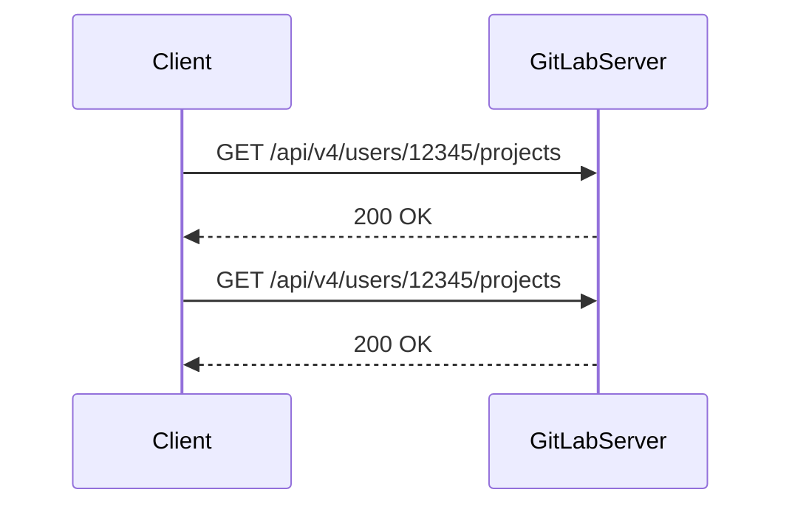

## Introduction to API Requests in Python

In the context of DevOps, automating interactions with various services through APIs is a crucial skill. One such service is GitLab, a popular platform for version control and collaboration. This chapter will delve into making API requests to GitLab using Python, covering the necessary concepts, steps, and best practices.

### What is an API?

An Application Programming Interface (API) is a set of rules and protocols for building and interacting with software applications. APIs allow different software components to communicate with each other. In the context of web services, APIs provide a way to access data and functionality over the internet.

### Why Use APIs?

APIs enable automation, integration, and efficient data exchange between different systems. For instance, in a DevOps environment, you might want to automate the creation of repositories, manage pipelines, or retrieve project information programmatically. Using APIs allows you to achieve these tasks without manual intervention, leading to increased efficiency and reduced human error.

### How Do APIs Work?

APIs typically follow a client-server model. The client sends a request to the server, and the server responds with the requested data. These requests and responses are usually formatted as HTTP messages, which include headers and bodies.

### Example: Fetching Information from GitLab

Let's walk through an example of fetching information from GitLab using Python. We'll focus on listing projects for a specific user.

#### Step 1: Identify the API Endpoint

The first step is to identify the API endpoint you want to interact with. For GitLab, you can find the API documentation by searching for "GitLab API documentation." This documentation provides details about the available endpoints and the required parameters.

For our example, we want to list projects for a specific user. The relevant endpoint is `/users/:id/projects`, where `:id` is the user ID.

#### Step 2: Make the Request

To make the request, we'll use the `requests` library in Python. This library simplifies the process of sending HTTP requests and handling responses.

```python
import requests

# Replace with your actual GitLab user ID
user_id = "12345"

# Base URL for GitLab API
base_url = "https://gitlab.com/api/v4"

# Construct the full URL
url = f"{base_url}/users/{user_id}/projects"

# Make the GET request
response = requests.get(url)

# Check if the request was successful
if response.status_code == 200:
    projects = response.json()
    print(projects)
else:
    print(f"Failed to fetch projects: {response.status_code}")
```

#### Full HTTP Request and Response

Here is the full HTTP request and response:

**HTTP Request:**

```http
GET /api/v4/users/12345/projects HTTP/1.1
Host: gitlab.com
User-Agent: python-requests/2.25.1
Accept-Encoding: gzip, deflate
Accept: */*
Connection: keep-alive
```

**HTTP Response:**

```http
HTTP/1.1 200 OK
Date: Mon, 01 Jan 2024 00:00:00 GMT
Content-Type: application/json; charset=utf-8
Transfer-Encoding: chunked
Connection: keep-alive
Set-Cookie: _gitlab_session=your_session_cookie_value; path=/; HttpOnly; Secure
Cache-Control: no-cache
X-Frame-Options: SAMEORIGIN
X-XSS-Protection: 1; mode=block
X-Content-Type-Options: nosniff
X-Download-Options: noopen
X-Permitted-Cross-Domain-Policies: none
Referrer-Policy: strict-origin-when-cross-origin
Content-Security-Policy: default-src 'self'; frame-ancestors 'self'

[
    {
        "id": 1,
        "name": "Project 1",
        "description": "",
        "web_url": "https://gitlab.com/user/project1",
        "avatar_url": null,
        "git_ssh_url": "git@gitlab.com:user/project1.git",
        "visibility_level": 0,
        "created_at": "2024-01-01T00:00:00.000Z",
        "default_branch": "master"
    },
    {
        "id": 2,
        "name": "Project 2",
        "description": "",
        "web_url": "https://gitlab.com/user/project2",
        "avatar_url": null,
        "git_ssh_url": "git@gitlab.com:user/project2.git",
        "visibility_level": 0,
        "created_at": "2024-01-01T00:00:00.000Z",
        "default_branch": "main"
    }
]
```

### Explanation of Headers

- **Content-Type**: Specifies the media type of the resource. Here, it is `application/json`.
- **Transfer-Encoding**: Indicates the transfer encoding used. Here, it is `chunked`.
- **Set-Cookie**: Sets a session cookie for authentication.
- **Cache-Control**: Controls caching behavior. Here, it is `no-cache`.
- **X-Frame-Options**: Prevents clickjacking attacks by specifying whether a page can be embedded in an iframe.
- **X-XSS-Protection**: Enables cross-site scripting (XSS) filtering.
- **X-Content-Type-Options**: Prevents MIME-sniffing attacks.
- **X-Download-Options**: Prevents downloads from being opened directly.
- **X-Permitted-Cross-Domain-Policies**: Controls cross-domain policies.
- **Referrer-Policy**: Controls how much referrer information is sent with requests.
- **Content-Security-Policy**: Defines a security policy for the document.

### Common Pitfalls and Best Practices

#### Authentication

When making API requests, especially those that require authentication, ensure you handle credentials securely. GitLab supports several authentication methods, including personal access tokens and OAuth tokens.

**Example of Authenticating with a Personal Access Token:**

```python
import requests

# Replace with your actual GitLab user ID
user_id = "12345"

# Base URL for GitLab API
base_url = "https://gitlab.com/api/v4"

# Construct the full URL
url = f"{base_url}/users/{user_id}/projects"

# Your personal access token
token = "your_personal_access_token"

# Make the GET request with authentication
headers = {"PRIVATE-TOKEN": token}
response = requests.get(url, headers=headers)

# Check if the request was successful
if response.status_code == 200:
    projects = response.json()
    print(projects)
else:
    print(f"Failed to fetch projects: {response.status_code}")
```

#### Error Handling

Always include error handling in your code to manage unexpected situations gracefully.

**Example of Error Handling:**

```python
import requests

# Replace with your actual GitLab user ID
user_id = "12345"

# Base URL for GitLab API
base_url = "https://gitlab.com/api/v4"

# Construct the full URL
url = f"{base_url}/users/{user_id}/projects"

# Make the GET request
try:
    response = requests.get(url)
    response.raise_for_status()  # Raises an HTTPError for bad responses
except requests.exceptions.HTTPError as errh:
    print(f"HTTP Error: {errh}")
except requests.exceptions.ConnectionError as errc:
    print(f"Error Connecting: {errc}")
except requests.exceptions.Timeout as errt:
    print(f"Timeout Error: {errt}")
except requests.exceptions.RequestException as err:
    print(f"General Error: {err}")
else:
    projects = response.json()
    print(projects)
```

### Real-World Examples and CVEs

#### CVE-2020-14145: GitLab API Rate Limit Bypass

In 2020, a vulnerability was discovered in GitLab's API rate limiting mechanism. An attacker could bypass rate limits by manipulating the `PRIVATE-TOKEN` header. This allowed unauthorized access to sensitive information.

**How to Prevent / Defend:**

- **Use Strong Authentication Mechanisms**: Ensure that personal access tokens are stored securely and rotated regularly.
- **Implement Rate Limiting**: Configure rate limiting on your GitLab instance to prevent abuse.
- **Monitor API Usage**: Regularly review API usage logs to detect unusual activity.

**Secure Coding Fix:**

**Vulnerable Code:**

```python
import requests

# Replace with your actual GitLab user ID
user_id = "12345"

# Base URL for GitLab API
base_url = "https://gitlab.com/api/v4"

# Construct the full URL
url = f"{base_url}/users/{user_id}/projects"

# Your personal access token
token = "your_personal_access_token"

# Make the GET request with authentication
headers = {"PRIVATE-TOKEN": token}
response = requests.get(url, headers=headers)

# Check if the request was successful
if response.status_code == 200:
    projects = response.json()
    print(projects)
else:
    print(f"Failed to fetch projects: {response.status_code}")
```

**Fixed Code:**

```python
import requests

# Replace with your actual GitLab user ID
user_id = "12345"

# Base URL for GitLab API
base_url = "https://gitlab.com/api/v4"

# Construct the full URL
url = f"{base_url}/users/{user_id}/projects"

# Your personal access token
token = "your_securely_stored_personal_access_token"

# Make the GET request with authentication
headers = {"PRIVATE-TOKEN": token}
response = requests.get(url, headers=headers)

# Check if the request was successful
if response.status_code == 200:
    projects = response.json()
    print(projects)
else:
    print(f"Failed to fetch projects: {response.status_code}")
```

### Network Topology and Sequence Diagrams

To visualize the interaction between the client and the GitLab server, we can use a sequence diagram.



### Conclusion

Making API requests to GitLab using Python is a powerful way to automate tasks and integrate with other systems. By following best practices and understanding the underlying mechanisms, you can ensure secure and efficient interactions with GitLab's API.

### Practice Labs

For hands-on practice, consider the following labs:

- **PortSwigger Web Security Academy**: Offers interactive labs to practice web security techniques.
- **OWASP Juice Shop**: A deliberately insecure web application for practicing web hacking.
- **DVWA (Damn Vulnerable Web Application)**: Another intentionally vulnerable web app for learning web security.
- **WebGoat**: An interactive training application designed to teach web security.

These labs provide practical experience in working with APIs and web security concepts.

---
<!-- nav -->
[[01-Introduction to API Requests and Communication Protocols|Introduction to API Requests and Communication Protocols]] | [[DevOps/DevOps Bootcamp/03-Python & Scripting/12-Python API Requests to GitLab/00-Overview|Overview]] | [[03-Introduction to External Requests Using Python|Introduction to External Requests Using Python]]
