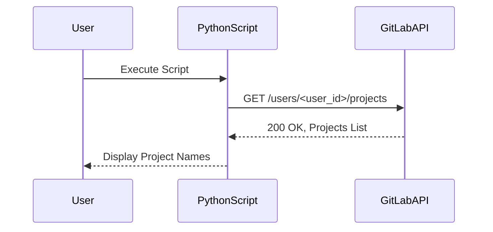

## Introduction to GitLab API and Python Requests

In this section, we will delve into the intricacies of interacting with the GitLab API using Python. Specifically, we will focus on retrieving a list of projects associated with a GitLab user. This interaction involves making HTTP requests to the GitLab API, parsing the response, and handling the data appropriately. Understanding these concepts is crucial for developers working with GitLab's API, as it enables automation, integration, and efficient management of repositories and projects.

### Background Theory

#### What is GitLab?

GitLab is a web-based DevOps lifecycle tool that provides a Git-repository manager providing wiki, issue-tracking, and continuous integration/continuous deployment pipeline features. It is widely used for version control, collaboration, and project management in software development teams.

#### What is the GitLab API?

The GitLab API is a RESTful interface that allows users to interact programmatically with GitLab. It provides endpoints to perform various operations such as creating, reading, updating, and deleting resources like projects, issues, merge requests, and more. The API is versioned, and the current stable version is v4.

#### What is Python `requests`?

The `requests` library in Python is a popular HTTP client that simplifies making HTTP requests. It abstracts away many complexities involved in sending HTTP requests, such as handling headers, cookies, and SSL certificates. With `requests`, you can easily send GET, POST, PUT, DELETE, and other types of HTTP requests.

### Setting Up the Environment

Before diving into the code, ensure you have Python installed along with the `requests` library. You can install `requests` using pip:

```bash
pip install requests
```

### Making a Request to the GitLab API

To retrieve a list of projects associated with a GitLab user, we need to construct an appropriate HTTP request. The base URL for the GitLab API is `https://gitlab.com/api/v4/`. To fetch the projects belonging to a specific user, we append `/users/<user_id>/projects` to the base URL.

#### Constructing the API URL

Let's break down the construction of the API URL:

1. **Base URL**: `https://gitlab.com/api/v4/`
2. **User-specific Endpoint**: `/users/<user_id>/projects`

Here, `<user_id>` is the unique identifier for the GitLab user. You can find your user ID by navigating to your profile settings in GitLab.

#### Example Code

Below is a complete Python script to make a request to the GitLab API and retrieve the list of projects:

```python
import requests

# Replace <user_id> with your actual GitLab user ID
user_id = "<user_id>"
base_url = "https://gitlab.com/api/v4/"
api_url = f"{base_url}users/{user_id}/projects"

response = requests.get(api_url)

if response.status_code == 200:
    projects = response.json()
    for project in projects:
        print(f"Project Name: {project['name']}")
else:
    print(f"Failed to retrieve projects. Status code: {response.status_code}")
```

### Understanding the HTTP Request and Response

When making an HTTP request, it's essential to understand the structure of both the request and the response. Below is a detailed breakdown of the HTTP request and response process.

#### HTTP Request

The HTTP request sent to the GitLab API looks like this:

```http
GET /api/v4/users/<user_id>/projects HTTP/1.1
Host: gitlab.com
Accept: application/json
```

- **Method**: `GET` is used to retrieve data from the server.
- **Path**: `/api/v4/users/<user_id>/projects` specifies the endpoint to fetch the projects associated with the user.
- **Headers**:
  - `Host`: Specifies the host to which the request is being made.
  - `Accept`: Indicates the preferred format of the response. In this case, `application/json` is requested.

#### HTTP Response

The HTTP response from the GitLab API might look like this:

```http
HTTP/1.1 200 OK
Content-Type: application/json
Content-Length: <length>

[
    {
        "id": 1,
        "name": "Project 1",
        "description": "Description of Project 1",
        "web_url": "https://gitlab.com/user/project1"
    },
    {
        "id": 2,
        "name": "Project 2",
        "description": "Description of Project 2",
        "web_url": "https://gitlab.com/user/project2"
    }
]
```

- **Status Code**: `200 OK` indicates a successful request.
- **Headers**:
  - `Content-Type`: Specifies the type of content returned. Here, `application/json` indicates that the response is in JSON format.
  - `Content-Length`: Specifies the length of the response body.
- **Body**: Contains the list of projects in JSON format.

### Parsing the Response

Once the request is made and the response is received, we need to parse the JSON data to extract the relevant information. The `requests.get()` method returns a `Response` object, which contains the status code, headers, and the response body.

#### Example Code

Here’s how to parse the response and extract the project names:

```python
import requests

user_id = "<user_id>"
base_url = "https://gitlab.com/api/v4/"
api_url = f"{base_url}users/{user_id}/projects"

response = requests.get(api_url)

if response.status_code == 200:
    projects = response.json()
    for project in projects:
        print(f"Project Name: {project['name']}")
else:
    print(f"Failed to retrieve projects. Status code: {response.status_code}")
```

### Handling Errors and Edge Cases

It's important to handle potential errors and edge cases gracefully. For instance, the user might not exist, or the API might be temporarily unavailable. Proper error handling ensures that the application behaves predictably and provides useful feedback to the user.

#### Example Code

Here’s how to handle errors and edge cases:

```python
import requests

user_id = "<user_id>"
base_url = "https://gitlab.com/api/v4/"
api_url = f"{base_url}users/{user_id}/projects"

try:
    response = requests.get(api_url)
    response.raise_for_status()  # Raises an HTTPError for bad responses
except requests.exceptions.HTTPError as errh:
    print(f"HTTP Error: {errh}")
except requests.exceptions.ConnectionError as errc:
    print(f"Error Connecting: {errc}")
except requests.exceptions.Timeout as errt:
    print(f"Timeout Error: {errt}")
except requests.exceptions.RequestException as err:
    print(f"Something went wrong: {err}")
else:
    if response.status_code == 200:
        projects = response.json()
        for project in projects:
            print(f"Project Name: {project['name']}")
    else:
        print(f"Failed to retrieve projects. Status code: {response.status_code}")
```

### Security Considerations

Interacting with APIs often involves sensitive data and authentication. It's crucial to handle authentication securely and protect against common vulnerabilities.

#### Authentication

To authenticate with the GitLab API, you typically need to provide an access token. This token should be kept confidential and not exposed in the code or logs.

#### Example Code

Here’s how to include an access token in the request:

```python
import requests

user_id = "<user_id>"
access_token = "<your_access_token>"
base_url = "https://gitlab.com/api/v4/"
api_url = f"{base_url}users/{user_id}/projects"

headers = {
    "PRIVATE-TOKEN": access_token
}

response = requests.get(api_url, headers=headers)

if response.status_code == 200:
    projects = response.json()
    for project in projects:
        print(f"Project Name: {project['name']}")
else:
    print(f"Failed to retrieve projects. Status code: {response.status_code}")
```

### How to Prevent / Defend

#### Detection

To detect unauthorized access or misuse of the GitLab API, monitor API usage patterns and set up alerts for unusual activity. Tools like GitLab's built-in audit logs can help track API usage.

#### Prevention

1. **Secure Access Tokens**: Store access tokens securely and rotate them regularly.
2. **Rate Limiting**: Implement rate limiting to prevent abuse.
3. **IP Whitelisting**: Restrict API access to trusted IP addresses.
4. **Least Privilege Principle**: Grant the minimum necessary permissions to API users.

#### Secure Coding Fixes

Here’s how to implement secure coding practices:

```python
import requests

user_id = "<user_id>"
access_token = "<your_access_token>"
base_url = "https://gitlab.com/api/v4/"
api_url = f"{base_url}users/{user_id}/projects"

headers = {
    "PRIVATE-TOKEN": access_token
}

response = requests.get(api_url, headers=headers)

if response.status_code == 200:
    projects = response.json()
    for project in projects:
        print(f"Project Name: {project['name']}")
else:
    print(f"Failed to retrieve projects. Status code: {response.status_code}")
```

### Conclusion

In this section, we explored how to interact with the GitLab API using Python's `requests` library. We covered constructing the API URL, making HTTP requests, parsing the response, handling errors, and implementing security measures. By following these steps, you can efficiently manage and automate interactions with GitLab's API.

### Practice Labs

For hands-on practice, consider the following labs:

- **PortSwigger Web Security Academy**: Offers interactive labs to practice web security concepts.
- **OWASP Juice Shop**: A deliberately insecure web application for practicing web security skills.
- **DVWA (Damn Vulnerable Web Application)**: A PHP/MySQL web application that is riddled with vulnerabilities.

These labs provide practical experience in interacting with APIs and handling security concerns.

### Diagrams

#### Mermaid Diagram: API Request Flow



This diagram illustrates the flow of the API request and response process, showing the interaction between the user, the Python script, and the GitLab API.

### Summary

By understanding and implementing the concepts covered in this section, you can effectively interact with the GitLab API using Python. This knowledge is invaluable for automating tasks, integrating systems, and managing projects efficiently.

---
<!-- nav -->
[[03-Introduction to External Requests Using Python|Introduction to External Requests Using Python]] | [[DevOps/DevOps Bootcamp/03-Python & Scripting/12-Python API Requests to GitLab/00-Overview|Overview]] | [[05-Introduction to Python API Requests to GitLab|Introduction to Python API Requests to GitLab]]
