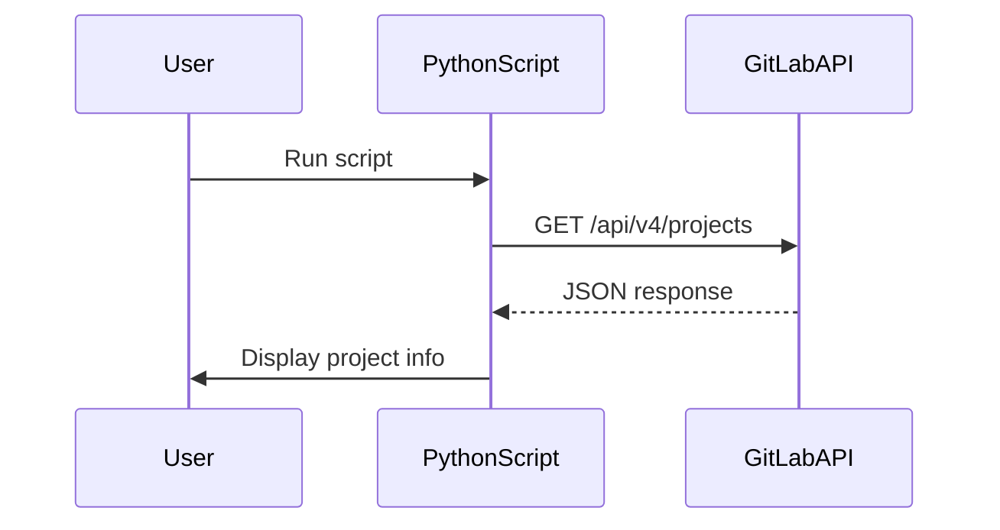

## Introduction to Python API Requests to GitLab

In this section, we will delve into the process of making API requests to GitLab using Python. This is a fundamental skill in DevOps, as it allows you to interact programmatically with GitLab repositories and manage them efficiently. We will cover the basics of making API requests, parsing the response, and handling the data effectively.

### Background Theory

Before diving into the practical aspects, it's essential to understand the underlying concepts:

#### What is an API?

An Application Programming Interface (API) is a set of rules and protocols for building and interacting with software applications. APIs allow different software components to communicate with each other. In the context of GitLab, the API provides a way to interact with GitLab repositories, users, groups, and other resources programmatically.

#### Why Use APIs?

Using APIs offers several advantages:

1. **Automation**: Automate repetitive tasks such as creating repositories, managing users, and updating configurations.
2. **Integration**: Integrate GitLab with other tools and services, such as CI/CD pipelines, monitoring systems, and issue trackers.
3. **Customization**: Customize workflows and processes according to specific requirements.

### Setting Up the Environment

To work with GitLab APIs using Python, you need to install the `requests` library, which simplifies HTTP requests. You can install it using pip:

```bash
pip install requests
```

### Making API Requests to GitLab

Let's start by making a basic API request to GitLab to fetch information about projects.

#### Step 1: Authenticate with GitLab

To authenticate with GitLab, you need to obtain a personal access token. Here’s how to create one:

1. Log in to your GitLab account.
2. Go to your profile settings.
3. Navigate to the "Access Tokens" section.
4. Generate a new token with appropriate scopes (e.g., read_user, read_repository).

Once you have the token, you can use it to authenticate your API requests.

#### Step 2: Fetch Project Information

We will use the `requests` library to make an HTTP GET request to the GitLab API endpoint for fetching projects.

```python
import requests

# Replace with your GitLab instance URL
gitlab_url = "https://gitlab.com/api/v4/projects"

# Replace with your personal access token
token = "your_personal_access_token"

headers = {
    "PRIVATE-TOKEN": token,
}

response = requests.get(gitlab_url, headers=headers)

if response.status_code == 200:
    projects = response.json()
else:
    print(f"Failed to fetch projects: {response.status_code}")
    projects = []

print(projects)
```

### Parsing the Response

The response from the GitLab API is in JSON format. We can parse this JSON data to extract the necessary information.

#### Understanding the Response Structure

The response is a list of dictionaries, where each dictionary represents a project. Each project dictionary contains various keys, including `name` and `web_url`.

```json
[
    {
        "id": 12345,
        "name": "Project Name",
        "web_url": "https://gitlab.com/user/project-name",
        ...
    },
    ...
]
```

#### Accessing Project Information

To access the project name and URL, we can iterate through the list of projects and extract the required information.

```python
for project in projects:
    project_name = project["name"]
    project_url = project["web_url"]
    print(f"Project Name: {project_name}")
    print(f"Project URL: {project_url}")
```

### Example Code

Here is the complete code to fetch and display project information:

```python
import requests

# Replace with your GitLab instance URL
gitlab_url = "https://gitlab.com/api/v4/projects"

# Replace with your personal access token
token = "your_personal_access_token"

headers = {
    "PRIVATE-TOKEN": token,
}

response = requests.get(gitlab_url, headers=headers)

if response.status_code == 200:
    projects = response.json()
else:
    print(f"Failed to fetch projects: {response.status_code}")
    projects = []

for project in projects:
    project_name = project["name"]
    project_url = project["web_url"]
    print(f"Project Name: {project_name}")
    print(f"Project URL: {project_url}")
```

### Handling Errors and Edge Cases

It's important to handle potential errors and edge cases gracefully. For example, if the API request fails due to network issues or invalid credentials, the code should provide meaningful feedback.

#### Error Handling

```python
try:
    response = requests.get(gitlab_url, headers=headers)
    response.raise_for_status()  # Raises an HTTPError for bad responses
except requests.exceptions.RequestException as e:
    print(f"Request failed: {e}")
    projects = []
else:
    projects = response.json()
```

### Real-World Examples and Recent Breaches

Recent breaches and vulnerabilities related to API usage include:

- **CVE-2021-22205**: A vulnerability in GitLab allowed unauthorized access to sensitive data via API endpoints.
- **CVE-2022-3925**: An issue in GitLab's API allowed attackers to bypass authentication mechanisms.

These examples highlight the importance of securing API interactions and implementing proper authentication and authorization mechanisms.

### How to Prevent / Defend

#### Secure Coding Practices

1. **Use Strong Authentication**: Always use strong authentication mechanisms like OAuth or personal access tokens.
2. **Validate Inputs**: Validate all inputs to prevent injection attacks.
3. **Rate Limiting**: Implement rate limiting to prevent abuse of API endpoints.

#### Secure Configuration

1. **Limit Scope**: Ensure that personal access tokens have the minimum necessary scope.
2. **Rotate Tokens**: Regularly rotate personal access tokens to minimize exposure.
3. **Monitor Usage**: Monitor API usage logs to detect and respond to suspicious activity.

#### Example of Secure Code

Here is an example of secure code that includes error handling and validation:

```python
import requests

# Replace with your GitLab instance URL
gitlab_url = "https://gitlab.com/api/v4/projects"

# Replace with your personal access token
token = "your_personal_access_token"

headers = {
    "PRIVATE-TOKEN": token,
}

try:
    response = requests.get(gitlab_url, headers=headers)
    response.raise_for_status()  # Raises an HTTPError for bad responses
except requests.exceptions.RequestException as e:
    print(f"Request failed: {e}")
    projects = []
else:
    projects = response.json()

for project in projects:
    project_name = project.get("name")
    project_url = project.get("web_url")
    if project_name and project_url:
        print(f"Project Name: {project_name}")
        print(f"Project URL: {project_url}")
```

### Diagrams and Topologies

#### Mermaid Diagram: API Request Flow



### Conclusion

In this section, we covered the fundamentals of making API requests to GitLab using Python. We explored the concepts of APIs, authentication, and error handling. We also provided real-world examples and secure coding practices to ensure robust and secure interactions with GitLab.

### Practice Labs

For hands-on practice, consider the following labs:

- **PortSwigger Web Security Academy**: Offers interactive labs to practice API security.
- **OWASP Juice Shop**: Provides a vulnerable web application to practice various security techniques.

By completing these labs, you can gain practical experience in working with GitLab APIs and enhance your DevOps skills.

---
<!-- nav -->
[[04-Introduction to GitLab API and Python Requests|Introduction to GitLab API and Python Requests]] | [[DevOps/DevOps Bootcamp/03-Python & Scripting/12-Python API Requests to GitLab/00-Overview|Overview]] | [[06-Accessing Dictionary Values in Python|Accessing Dictionary Values in Python]]
