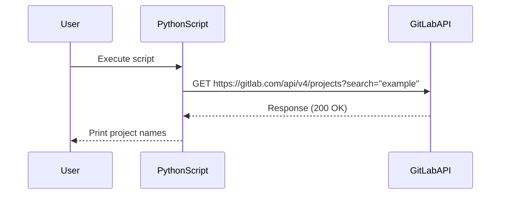

## Accessing Dictionary Values in Python

In this section, we will delve into the process of accessing values within a dictionary in Python, particularly in the context of handling API responses from GitLab. This is crucial for anyone working with APIs and JSON data structures, which are prevalent in modern web development and DevOps practices.

### Background Theory

A dictionary in Python is a collection of key-value pairs. Each key is unique and maps to a specific value. Dictionaries are implemented as hash tables, which allow for efficient retrieval of values based on their keys. The syntax for creating a dictionary is straightforward:

```python
my_dict = {
    "key1": "value1",
    "key2": "value2"
}
```

To access a value in a dictionary, you simply use the key associated with that value. For example:

```python
print(my_dict["key1"])  # Output: value1
```

### Context in GitLab API Responses

When interacting with GitLab's API, you often receive responses in JSON format, which is essentially a dictionary in Python. For instance, a response from the GitLab API might look like this:

```json
{
    "id": 1,
    "name": "My Project",
    "description": "This is my project description."
}
```

In Python, this JSON response would be parsed into a dictionary, allowing you to access individual fields such as `name` or `description`.

### Accessing Values in a Dictionary

Let's consider a scenario where we have a list of project dictionaries returned from a GitLab API call. Each project is represented as a dictionary with various attributes, including `name`. To access the `name` attribute of each project, we would iterate through the list and extract the `name` value from each dictionary.

#### Example Code

Here is an example of how you might handle this in Python:

```python
# Sample list of project dictionaries
projects = [
    {"id": 1, "name": "Project A", "description": "Description A"},
    {"id": 2, "name": "Project B", "description": "Description B"}
]

# Iterate through the list and print the name of each project
for project in projects:
    print(project["name"])
```

### Handling String Quotes in Python

One common issue when working with strings in Python is dealing with nested quotes. In the given transcript, the instructor mentions using single quotes (`'`) instead of double quotes (`"`) to avoid conflicts when nesting strings.

#### Nested Quotes Example

Consider the following scenario where you need to construct a string that includes a URL with double quotes:

```python
url = "https://gitlab.com/api/v4/projects?search=\"example\""
print(url)
```

This will result in a syntax error due to the nested double quotes. To resolve this, you can use single quotes for the outer string and double quotes for the inner string:

```python
url = 'https://gitlab.com/api/v4/projects?search="example"'
print(url)
```

Alternatively, you can escape the double quotes using a backslash (`\`):

```python
url = "https://gitlab.com/api/v4/projects?search=\"example\""
print(url)
```

Both methods will correctly output the desired URL:

```
https://gitlab.com/api/v4/projects?search="example"
```

### Real-World Examples and CVEs

Handling nested quotes correctly is essential to avoid injection attacks, especially in web applications. For example, consider a scenario where user input is used to construct a URL without proper sanitization:

```python
user_input = "example\" OR \"1\"=\"1"
url = f"https://gitlab.com/api/v4/projects?search={user_input}"
print(url)
```

This could lead to SQL injection if the backend is not properly configured to handle such inputs. Always ensure that user input is sanitized and validated before constructing URLs or queries.

### How to Prevent / Defend

#### Secure Coding Practices

1. **Use Single Quotes for Outer Strings**: When constructing strings that contain double quotes, use single quotes for the outer string and double quotes for the inner string.
2. **Escape Double Quotes**: Alternatively, escape double quotes using a backslash (`\`).

#### Example of Vulnerable vs. Secure Code

**Vulnerable Code:**

```python
user_input = "example\" OR \"1\"=\"1"
url = f"https://gitlab.com/api/v4/projects?search={user_input}"
print(url)
```

**Secure Code:**

```python
user_input = "example\" OR \"1\"=\"1"
url = f'https://gitlab.com/api/v4/projects?search="{user_input}"'
print(url)
```

### Complete Example with GitLab API

Let's put everything together in a complete example where we fetch project information from GitLab and handle nested quotes correctly.

#### Fetching Projects from GitLab

First, we need to install the `requests` library if it's not already installed:

```bash
pip install requests
```

Then, we can write a script to fetch project information from GitLab:

```python
import requests

# Replace with your GitLab token
token = "your_gitlab_token"

# Construct the URL with proper handling of nested quotes
url = 'https://gitlab.com/api/v4/projects?search="example"'

headers = {
    "PRIVATE-TOKEN": token
}

response = requests.get(url, headers=headers)

if response.status_code == 200:
    projects = response.json()
    for project in projects:
        print(f"Project Name: {project['name']}")
else:
    print(f"Failed to fetch projects: {response.status_code}")
```

### Mermaid Diagrams

#### Sequence Diagram for API Request



### Conclusion

Understanding how to access values in dictionaries and handle nested quotes in Python is crucial for effective API interactions and web development. By following secure coding practices and validating user input, you can prevent common vulnerabilities such as injection attacks.

### Practice Labs

For hands-on practice with GitLab API interactions, consider the following labs:

- **PortSwigger Web Security Academy**: Offers interactive labs on web security, including API interactions.
- **OWASP Juice Shop**: A deliberately insecure web application for practicing web security skills.
- **DVWA (Damn Vulnerable Web Application)**: Another popular web application for learning web security.

These labs provide practical experience in handling API requests and securing web applications.

---
<!-- nav -->
[[05-Introduction to Python API Requests to GitLab|Introduction to Python API Requests to GitLab]] | [[DevOps/DevOps Bootcamp/03-Python & Scripting/12-Python API Requests to GitLab/00-Overview|Overview]] | [[07-Understanding API Requests and Responses|Understanding API Requests and Responses]]
