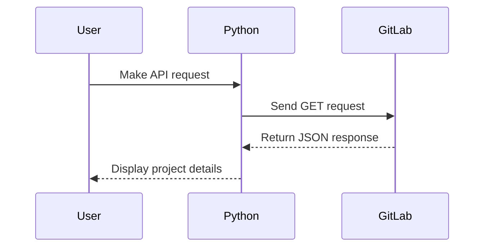

## Understanding API Requests and Responses

When working with APIs, especially in the context of DevOps, it is crucial to understand how to make requests and handle responses effectively. This chapter delves into making Python API requests to GitLab, explaining the underlying concepts, potential pitfalls, and best practices for handling responses.

### What is an API?

An **API (Application Programming Interface)** is a set of rules and protocols for building and interacting with software applications. APIs allow different software components to communicate with each other. In the context of web services, APIs often involve sending HTTP requests to a server and receiving HTTP responses.

### Making API Requests with Python

To interact with GitLab's API using Python, we typically use libraries such as `requests`. Let's start by importing the necessary library:

```python
import requests
```

#### Setting Up the Request

Before making the request, we need to define the URL and any required headers or parameters. For example, to fetch a list of projects from GitLab, we might use the following setup:

```python
url = "https://gitlab.com/api/v4/projects"
headers = {
    "PRIVATE-TOKEN": "your_private_token_here"
}
response = requests.get(url, headers=headers)
```

Here, `PRIVATE-TOKEN` is used for authentication. This token should be kept secret and not exposed in your codebase.

### Handling the Response

Once the request is made, we receive a response object. This object contains various attributes, including the status code, headers, and body of the response.

#### Accessing the Response Text

The simplest way to access the response content is by using the `.text` attribute:

```python
print(response.text)
```

However, this returns the content as a string, even if the content is structured as JSON. For example, if the response is a list of dictionaries, accessing `.text` will return a string representation of that list.

```python
# Example response text
response_text = '[{"id":1,"name":"Project A"},{"id":2,"name":"Project B"}]'
print(type(response_text))  # <class 'str'>
```

### Using JSON to Parse the Response

To work with the response content more effectively, we can parse it as JSON. The `requests` library provides a convenient method called `.json()` to achieve this.

```python
response_json = response.json()
print(type(response_json))  # <class 'list'>
```

This method converts the JSON string into a Python list of dictionaries, allowing us to iterate over the elements and access their values.

```python
for project in response_json:
    print(project['id'], project['name'])
```

### Why Use JSON?

JSON (JavaScript Object Notation) is a lightweight data-interchange format that is easy for humans to read and write and easy for machines to parse and generate. It is widely used in web applications and APIs due to its simplicity and compatibility across different programming languages.

#### Real-World Example: CVE-2021-22205

In 2021, a critical vulnerability was discovered in GitLab (CVE-2021-22205). This vulnerability allowed attackers to bypass authentication and gain unauthorized access to sensitive data. Proper handling of API responses and validation of input data can help mitigate such risks.

### Pitfalls and Best Practices

#### Potential Pitfalls

1. **Incorrect Authentication**: Ensure that the authentication token is correctly set and not exposed.
2. **Handling Errors**: Always check the status code of the response to handle errors appropriately.
3. **Parsing Issues**: Incorrect parsing of JSON can lead to runtime errors.

#### Best Practices

1. **Error Handling**: Use try-except blocks to handle potential exceptions.
2. **Validation**: Validate the structure of the JSON response to ensure it matches expectations.
3. **Security**: Keep authentication tokens secure and avoid logging them.

### How to Prevent / Defend

#### Detection

To detect issues with API requests and responses, you can implement logging and monitoring. For example, log the status codes and response times of API calls.

```python
import logging

logging.basicConfig(level=logging.INFO)

try:
    response = requests.get(url, headers=headers)
    response.raise_for_status()  # Raises an HTTPError for bad responses
    logging.info(f"Response status: {response.status_code}")
except requests.exceptions.HTTPError as errh:
    logging.error(f"HTTP Error: {errh}")
except requests.exceptions.ConnectionError as errc:
    logging.error(f"Error Connecting: {errc}")
except requests.exceptions.Timeout as errt:
    logging.error(f"Timeout Error: {errt}")
except requests.exceptions.RequestException as err:
    logging.error(f"General Error: {err}")
```

#### Prevention

1. **Secure Tokens**: Store authentication tokens securely and rotate them regularly.
2. **Input Validation**: Validate the structure and content of JSON responses to prevent unexpected behavior.
3. **Rate Limiting**: Implement rate limiting to prevent abuse of API endpoints.

#### Secure Coding Fixes

Compare the insecure and secure versions of handling API responses:

**Insecure Version**

```python
response = requests.get(url, headers=headers)
data = response.json()
print(data[0]['id'])
```

**Secure Version**

```python
response = requests.get(url, headers=headers)
response.raise_for_status()

if response.status_code == 200:
    data = response.json()
    if isinstance(data, list) and len(data) > 0:
        print(data[0]['id'])
else:
    print("Failed to retrieve data")
```

### Complete Example

Let's put everything together in a complete example:

```python
import requests
import logging

logging.basicConfig(level=logging.INFO)

def fetch_projects():
    url = "https://gitlab.com/api/v4/projects"
    headers = {
        "PRIVATE-TOKEN": "your_private_token_here"
    }
    
    try:
        response = requests.get(url, headers=headers)
        response.raise_for_status()
        
        if response.status_code == 200:
            data = response.json()
            if isinstance(data, list) and len(data) > 0:
                for project in data:
                    print(project['id'], project['name'])
            else:
                print("No projects found")
        else:
            print("Failed to retrieve data")
    except requests.exceptions.HTTPError as errh:
        logging.error(f"HTTP Error: {errh}")
    except requests.exceptions.ConnectionError as errc:
        logging.error(f"Error Connecting: {errc}")
    except requests.exceptions.Timeout as errt:
        logging.error(f"Timeout Error:  {errt}")
    except requests.exceptions.RequestException as err:
        logging.error(f"General Error: {err}")

fetch_projects()
```

### Mermaid Diagrams

#### Sequence Diagram for API Request



### Hands-On Labs

For practical experience with Python API requests, consider the following labs:

- **PortSwigger Web Security Academy**: Offers interactive labs on web security, including API interactions.
- **OWASP Juice Shop**: A deliberately vulnerable web application for practicing web security skills.
- **DVWA (Damn Vulnerable Web Application)**: Another vulnerable web app for learning security concepts.

These labs provide real-world scenarios and challenges to enhance your understanding and skills in handling API requests and responses.

By thoroughly understanding and implementing these concepts, you can effectively manage API interactions in your DevOps workflows, ensuring robust and secure operations.

---
<!-- nav -->
[[06-Accessing Dictionary Values in Python|Accessing Dictionary Values in Python]] | [[DevOps/DevOps Bootcamp/03-Python & Scripting/12-Python API Requests to GitLab/00-Overview|Overview]] | [[08-Understanding API Responses in Python|Understanding API Responses in Python]]
