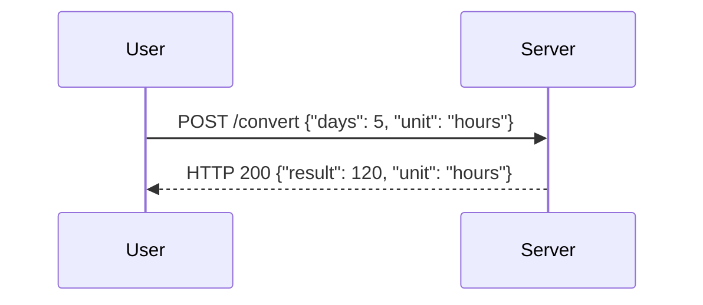

## Introduction to Python Dictionaries

In this section, we delve into the concept of dictionaries in Python, which is a powerful data structure used to store key-value pairs. This data structure allows us to map unique keys to their corresponding values, making it highly useful for various applications, including handling user inputs in a more sophisticated manner.

### What is a Dictionary?

A dictionary in Python is a collection of key-value pairs, where each key is unique and associated with a value. The general syntax for creating a dictionary is:

```python
my_dict = {
    "key1": "value1",
    "key2": "value2",
    "key3": "value3"
}
```

Here, `"key1"`, `"key2"`, and `"key3"` are the keys, and `"value1"`, `"value2"`, and `"value3"` are the corresponding values.

#### Why Use Dictionaries?

Dictionaries provide several advantages:
1. **Efficiency**: Accessing elements by key is very fast, typically O(1) time complexity.
2. **Flexibility**: Keys can be of any immutable data type (strings, numbers, tuples), and values can be of any data type.
3. **Readability**: They make code more readable and maintainable, especially when dealing with structured data.

### Modifying the Application with Dictionaries

Let's consider a simple application that converts days into hours. We will enhance this application to allow users to specify the conversion unit (hours or minutes).

#### Current Implementation

The current implementation might look something like this:

```python
def days_to_hours(days):
    return days * 24

days = int(input("Enter the number of days: "))
print(f"{days} days is {days_to_hours(days)} hours.")
```

This code simply takes the number of days as input and converts it to hours. However, we want to make it more flexible by allowing the user to specify the conversion unit.

#### Enhanced Implementation Using Dictionaries

To achieve this, we will modify the input process to accept both the number of days and the conversion unit. We will use a dictionary to map the conversion units to their respective functions.

```python
def days_to_hours(days):
    return days * 24

def days_to_minutes(days):
    return days * 24 * 60

conversion_units = {
    "hours": days_to_hours,
    "minutes": days_to_minutes
}

# Example input: "5:hours"
input_str = input("Enter a number of days and conversion unit (e.g., 5:hours): ")
days, unit = input_str.split(":")
days = int(days)

if unit in conversion_units:
    result = conversion_units[unit](days)
    print(f"{days} days is {result} {unit}.")
else:
    print("Invalid conversion unit.")
```

### Explanation of the Code

1. **Function Definitions**:
   - `days_to_hours(days)`: Converts days to hours.
   - `days_to_minutes(days)`: Converts days to minutes.

2. **Dictionary Definition**:
   - `conversion_units`: Maps conversion units ("hours" and "minutes") to their respective functions.

3. **User Input**:
   - The user inputs a string in the format `"number_of_days:unit"`.
   - The string is split into `days` and `unit`.

4. **Conversion Logic**:
   - If the `unit` is valid (i.e., present in `conversion_units`), the corresponding function is called with `days` as the argument.
   - The result is printed.

### Handling Edge Cases and Errors

It's important to handle potential errors gracefully. For instance, if the user enters an invalid unit or a non-integer number of days, the program should provide meaningful feedback.

```python
try:
    days = int(days)
except ValueError:
    print("Invalid number of days.")
    exit()

if unit not in conversion_units:
    print("Invalid conversion unit.")
    exit()
```

### Real-World Examples and Security Implications

While this example is relatively simple, similar logic can be found in many real-world applications. For instance, a web application might allow users to specify units for displaying data (e.g., temperature in Celsius or Fahrenheit).

#### Recent CVEs and Breaches

One common vulnerability related to user input handling is **injection attacks**, such as SQL injection or command injection. These occur when untrusted input is improperly handled and executed in a context where it can cause unintended behavior.

For example, consider a web application that allows users to input a search query. If the input is not properly sanitized, an attacker could inject malicious SQL commands, leading to unauthorized access or data manipulation.

### How to Prevent / Defend

1. **Input Validation**:
   - Always validate user input to ensure it conforms to expected formats.
   - Use regular expressions or built-in validation libraries to check input.

2. **Sanitization**:
   - Sanitize user input to remove potentially harmful characters or patterns.
   - For example, strip out HTML tags or escape special characters.

3. **Parameterized Queries**:
   - Use parameterized queries or prepared statements to prevent SQL injection.
   - Example using SQLAlchemy:

   ```python
   from sqlalchemy import create_engine, Table, Column, Integer, String, MetaData

   engine = create_engine('sqlite:///example.db')
   metadata = MetaData()

   users = Table('users', metadata,
                 Column('id', Integer, primary_key=True),
                 Column('name', String),
                 Column('email', String))

   def get_user_by_name(name):
       stmt = users.select().where(users.c.name == name)
       with engine.connect() as connection:
           result = connection.execute(stmt)
           return result.fetchone()
   ```

4. **Secure Coding Practices**:
   - Follow secure coding guidelines and best practices.
   - Regularly review and test code for vulnerabilities.

### Complete Example with Full HTTP Request and Response

Consider a web application that accepts user input via an HTTP POST request and returns the converted value.

#### HTTP Request

```http
POST /convert HTTP/1.1
Host: example.com
Content-Type: application/json

{
    "days": 5,
    "unit": "hours"
}
```

#### HTTP Response

```http
HTTP/1.1 200 OK
Content-Type: application/json

{
    "result": 120,
    "unit": "hours"
}
```

### Mermaid Diagrams

#### Sequence Diagram



### Hands-On Labs

For practical experience, you can use the following labs:
- **PortSwigger Web Security Academy**: Offers interactive labs on web security, including input validation and sanitization.
- **OWASP Juice Shop**: A deliberately insecure web application for practicing web security skills.

### Conclusion

By leveraging Python dictionaries and proper input handling techniques, we can create more robust and flexible applications. Understanding the underlying principles and best practices ensures that our applications are secure and reliable.

---
<!-- nav -->
[[01-Introduction to Python Dictionaries for User Input Enhancement|Introduction to Python Dictionaries for User Input Enhancement]] | [[DevOps/DevOps Bootcamp/03-Python & Scripting/14-Python Dictionaries for User Input Enhancement/00-Overview|Overview]] | [[03-Data Types in Python|Data Types in Python]]
