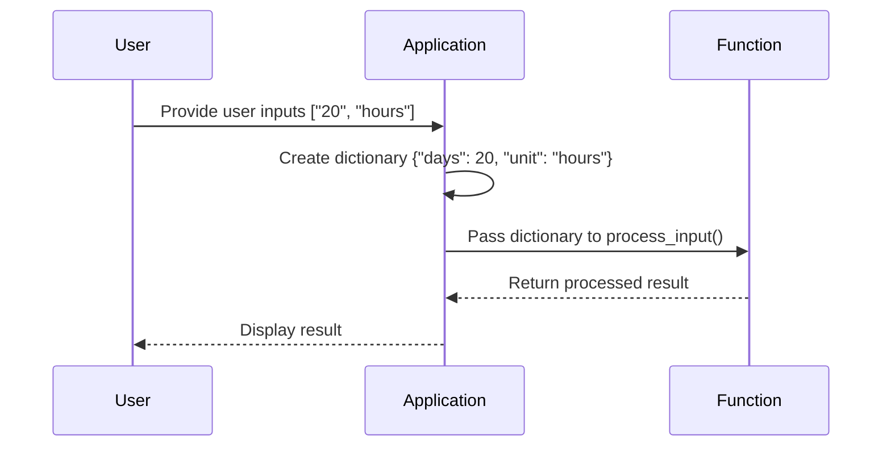

## Python Dictionaries for User Input Enhancement

In this section, we will delve into the use of Python dictionaries to enhance user input handling. Specifically, we will explore how to dynamically create dictionaries from user inputs and validate these inputs within a function. This approach is crucial for building robust applications that can handle various types of user data effectively.

### Background Theory

Python dictionaries are a fundamental data structure used to store key-value pairs. Each key is unique within the dictionary, and it maps to a specific value. Dictionaries are highly efficient for lookups, insertions, and deletions, making them ideal for scenarios where you need to associate data with unique identifiers.

#### Key Concepts

- **Key**: A unique identifier used to retrieve the associated value.
- **Value**: The data associated with a particular key.
- **Dictionary**: A collection of key-value pairs enclosed in curly braces `{}`.

### Creating Dictionaries from User Inputs

Let's start by creating a dictionary from user inputs. In the given context, we are dealing with a list of user inputs that we want to convert into a dictionary.

```python
# Example user input list
user_inputs = ["20", "hours"]

# Create a dictionary from the user inputs
days_unit_dict = {
    "days": int(user_inputs[0]),
    "unit": user_inputs[1]
}

print(days_unit_dict)
```

This code snippet takes a list `user_inputs` and creates a dictionary `days_unit_dict` with keys `"days"` and `"unit"`. The value for `"days"` is converted to an integer, and the value for `"unit"` remains a string.

### Accessing Elements in a List

To access elements in a list, we use indexing. Lists in Python are zero-indexed, meaning the first element is at index 0, the second element is at index 1, and so on.

```python
# Example list
days_unit_list = [20, "hours"]

# Accessing the first element
first_element = days_unit_list[0]

# Accessing the second element
second_element = days_unit_list[1]

print(first_element)  # Output: 2
print(second_element)  # Output: hours
```

Here, `days_unit_list[0]` retrieves the first element (`20`), and `days_unit_list[1]` retrieves the second element (`"hours"`).

### Creating a Dictionary from List Elements

Now, let's combine the concepts of creating a dictionary and accessing list elements to dynamically generate a dictionary from user inputs.

```python
# Example user input list
user_inputs = ["20", "hours"]

# Accessing elements from the list
days_value = int(user_inputs[0])
unit_value = user_inputs[1]

# Creating a dictionary
days_unit_dict = {
    "days": days_value,
    "unit": unit_value
}

print(days_unit_dict)
```

This code snippet demonstrates how to extract values from a list and use them to create a dictionary.

### Validation and Calculation Function

Once we have the dictionary, we can pass it to a function for validation and further processing. Let's define a function that validates the number and performs calculations based on the units.

```python
def process_input(input_dict):
    # Validate the number
    if not isinstance(input_dict["days"], int):
        return "Invalid input: 'days' should be an integer."
    
    # Perform calculations based on the unit
    if input_dict["unit"] == "hours":
        total_hours = input_dict["days"] * 24
        return f"Total hours: {total_hours}"
    elif input_dict["unit"] == "minutes":
        total_minutes = input_dict["days"] * 1440
        return f"Total minutes: {total_minutes}"
    else:
        return "Unsupported unit."

# Example usage
user_inputs = ["20", "hours"]
days_unit_dict = {
    "days": int(user_inputs[0]),
    "unit": user_inputs[1]
}

result = process_input(days_unit_dict)
print(result)
```

This function checks if the `"days"` value is an integer and performs calculations based on the `"unit"` value. It supports both "hours" and "minutes" units.

### Real-World Examples and Security Considerations

Handling user inputs securely is critical to prevent vulnerabilities such as injection attacks. For instance, consider a scenario where an attacker tries to inject malicious input to manipulate the application behavior.

#### Example: SQL Injection

Suppose we have a function that constructs an SQL query based on user inputs:

```python
def construct_sql_query(input_dict):
    days = input_dict["days"]
    unit = input_dict["unit"]
    query = f"SELECT * FROM table WHERE days = {days} AND unit = '{unit}'"
    return query

# Example usage
user_inputs = {"days": "20; DROP TABLE users --", "unit": "hours"}
query = construct_sql_query(user_inputs)
print(query)
```

The above code constructs an SQL query that could potentially execute a `DROP TABLE` command if the input is not properly sanitized.

#### Secure Coding Practices

To prevent such vulnerabilities, always sanitize and validate user inputs. Use parameterized queries or ORM methods to avoid direct string concatenation.

```python
import sqlite3

def safe_construct_sql_query(input_dict):
    days = input_dict["days"]
    unit = input_dict["unit"]
    
    conn = sqlite3.connect('example.db')
    cursor = conn.cursor()
    
    cursor.execute("SELECT * FROM table WHERE days = ? AND unit = ?", (days, unit))
    result = cursor.fetchall()
    
    conn.close()
    return result

# Example usage
user_inputs = {"days": "20; DROP TABLE users --", "unit": "hours"}
safe_result = safe_construct_sql_query(user_inputs)
print(safe_result)
```

This code uses parameterized queries to safely construct SQL queries, preventing SQL injection attacks.

### Mermaid Diagrams

Let's visualize the flow of creating a dictionary from user inputs and passing it to a validation function using a mermaid diagram.



This diagram illustrates the sequence of operations involved in handling user inputs and processing them through a function.

### Common Pitfalls and How to Prevent Them

#### Pitfall: Improper Input Validation

Improper validation of user inputs can lead to security vulnerabilities and incorrect application behavior.

**Example:**

```python
def unsafe_process_input(input_dict):
    days = input_dict["days"]
    unit = input_dict["unit"]
    
    if unit == "hours":
        total_hours = days * 24
        return f"Total hours: {total_hours}"
    else:
        return "Unsupported unit."

# Example usage
user_inputs = {"days": "twenty", "unit": "hours"}
result = unsafe_process_input(user_inputs)
print(result)
```

In this example, the `"days"` value is not validated, leading to potential errors or incorrect results.

**Secure Fix:**

```python
def safe_process_input(input_dict):
    days = input_dict.get("days")
    unit = input_dict.get("unit")
    
    if not isinstance(days, int):
        return "Invalid input: 'days' should be an integer."
    
    if unit == "hours":
        total_hours = days * 24
        return f"Total hours: {total_hours}"
    else:
        return "Unsupported unit."

# Example usage
user_inputs = {"days": "twenty", "unit": "hours"}
result = safe_process_input(user_inputs)
print(result)
```

This secure version ensures that the `"days"` value is an integer before performing calculations.

### Hands-On Labs

For practical experience with handling user inputs and dictionaries in Python, consider the following labs:

- **PortSwigger Web Security Academy**: Focuses on web application security, including input validation and sanitization.
- **OWASP Juice Shop**: A deliberately insecure web application for practicing security testing and exploitation techniques.
- **DVWA (Damn Vulnerable Web Application)**: Another intentionally vulnerable web app for learning about web security.

These labs provide real-world scenarios to practice and reinforce the concepts covered in this section.

### Conclusion

In this section, we explored how to dynamically create dictionaries from user inputs and validate these inputs within a function. We also discussed the importance of secure coding practices to prevent vulnerabilities such as SQL injection. By following these guidelines and practicing with real-world examples, you can build more robust and secure applications.

---
<!-- nav -->
[[03-Data Types in Python|Data Types in Python]] | [[DevOps/DevOps Bootcamp/03-Python & Scripting/14-Python Dictionaries for User Input Enhancement/00-Overview|Overview]] | [[05-Understanding Python Dictionaries for User Input Enhancement|Understanding Python Dictionaries for User Input Enhancement]]
