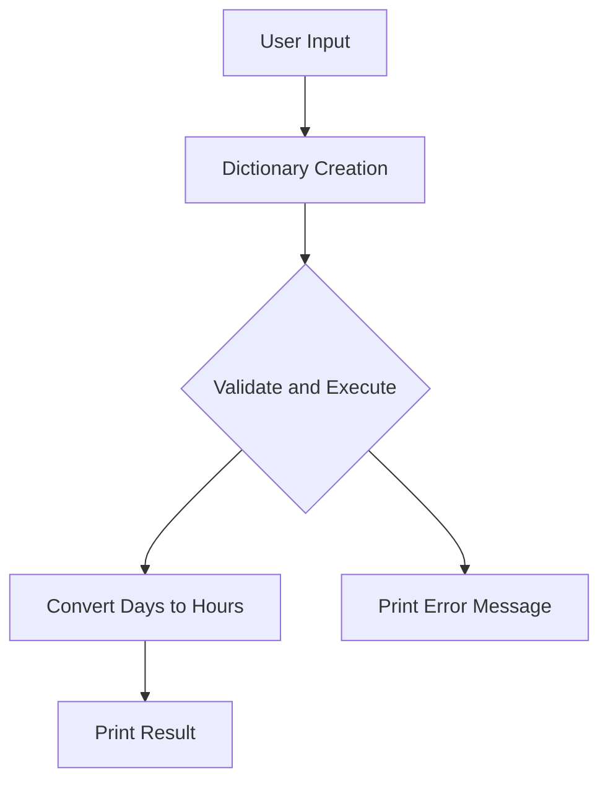

## Understanding Python Dictionaries for User Input Enhancement

In this section, we delve deep into the usage of Python dictionaries to enhance user input validation and execution. This is particularly useful in scenarios where user inputs need to be processed and validated dynamically. We'll cover the basics of dictionaries, their advantages over lists, and how to effectively use them to handle user inputs.

### What Are Python Dictionaries?

A Python dictionary is a collection of key-value pairs. Each key is unique within the dictionary, and it maps to a value. Dictionaries are mutable, meaning you can modify their contents after creation. They are defined using curly braces `{}` with keys and values separated by colons `:`.

#### Example of a Dictionary

```python
my_dict = {
    "days": 40,
    "unit": "hours"
}
```

In this example, `"days"` and `"unit"` are keys, and `40` and `"hours"` are their respective values.

### Why Use Dictionaries?

Dictionaries offer several advantages over other data structures like lists:

1. **Key-Based Access**: You can access values using keys, which makes it easier to retrieve specific information.
2. **Dynamic Data Handling**: Dictionaries are ideal for handling dynamic data where the structure might change based on user input or external factors.
3. **Efficiency**: Accessing values in a dictionary is generally faster than searching through a list, especially for large datasets.

### How to Access Values in a Dictionary

To access a value in a dictionary, you use the key associated with that value. This is done using square brackets `[]`.

#### Example: Accessing Values

```python
my_dict = {
    "days": 40,
    "unit": "hours"
}

# Accessing the value associated with the key "days"
print(my_dict["days"])  # Output: 40
```

### Validating User Input Using Dictionaries

When dealing with user inputs, it's crucial to ensure that the inputs are valid and meet certain criteria. Dictionaries can help in this process by storing the input values and their corresponding units, making it easier to validate them.

#### Example: Validating User Input

Let's consider a scenario where we need to validate user input for days and convert it to hours.

```python
def validate_and_execute(days_and_unit_dictionary):
    try:
        days = int(days_and_unit_dictionary["days"])
        unit = days_and_unit_dictionary["unit"]
        
        if unit == "hours":
            hours = days * 24
            print(f"{days} days is equal to {hours} hours.")
        else:
            print("Invalid unit. Please enter 'hours'.")
    except ValueError:
        print("Invalid input. Please enter a numeric value for days.")

# Example usage
input_data = {"days": "40", "unit": "hours"}
validate_and_execute(input_data)
```

### Explanation of the Code

1. **Function Definition**: The `validate_and_execute` function takes a dictionary `days_and_unit_dictionary` as an argument.
2. **Extracting Values**: The function extracts the `days` and `unit` values from the dictionary.
3. **Validation**:
   - The `days` value is converted to an integer using `int()`.
   - The `unit` value is checked to ensure it is `"hours"`.
4. **Conversion and Output**: If the unit is `"hours"`, the function converts the days to hours and prints the result. Otherwise, it prints an error message.
5. **Error Handling**: The `try-except` block handles potential `ValueError` exceptions that occur if the `days` value cannot be converted to an integer.

### Mermaid Diagram: Function Flow



### Common Pitfalls and How to Avoid Them

1. **Key Errors**: Ensure that the keys used to access dictionary values exist. Use `get()` method to avoid `KeyError`.

    ```python
    value = my_dict.get("key", default_value)
    ```

2. **Type Errors**: Always validate the type of input values before performing operations.

    ```python
    if isinstance(value, int):
        # Perform operations
    ```

### Real-World Examples and CVEs

Consider a scenario where a web application accepts user input for a subscription duration. If the input is not properly validated, it could lead to security vulnerabilities such as SQL injection or cross-site scripting (XSS).

#### Example: SQL Injection

Suppose a web application uses user input to construct SQL queries without proper validation.

```python
# Vulnerable code
query = f"SELECT * FROM subscriptions WHERE duration = '{duration}'"

# Secure code
import sqlite3
conn = sqlite3.connect('database.db')
cursor = conn.cursor()
cursor.execute("SELECT * FROM subscriptions WHERE duration = ?", (duration,))
```

### How to Prevent / Defend

1. **Input Validation**: Always validate user inputs to ensure they meet the required criteria.
2. **Use Prepared Statements**: When interacting with databases, use prepared statements to prevent SQL injection.
3. **Sanitize Inputs**: Sanitize user inputs to remove any potentially harmful characters or scripts.

### Complete Example with Full HTTP Request and Response

#### HTTP Request

```http
POST /api/subscription HTTP/1.1
Host: example.com
Content-Type: application/json

{
    "days": "40",
    "unit": "hours"
}
```

#### HTTP Response

```http
HTTP/1.1 200 OK
Content-Type: application/json

{
    "message": "Subscription created successfully",
    "details": {
        "days": 40,
        "unit": "hours",
        "total_hours": 960
    }
}
```

### Practice Labs

For hands-on practice with Python dictionaries and user input validation, consider the following labs:

- **PortSwigger Web Security Academy**: Offers interactive labs on web security, including input validation.
- **OWASP Juice Shop**: A deliberately insecure web app for practicing web security skills.

By mastering the use of Python dictionaries for user input enhancement, you can build more robust and secure applications.

---
<!-- nav -->
[[04-Python Dictionaries for User Input Enhancement|Python Dictionaries for User Input Enhancement]] | [[DevOps/DevOps Bootcamp/03-Python & Scripting/14-Python Dictionaries for User Input Enhancement/00-Overview|Overview]] | [[DevOps/DevOps Bootcamp/03-Python & Scripting/14-Python Dictionaries for User Input Enhancement/06-Practice Questions & Answers|Practice Questions & Answers]]
