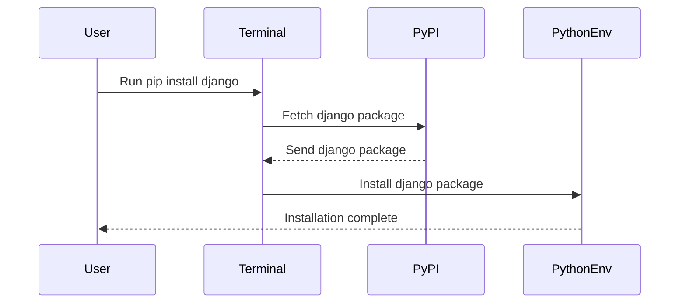
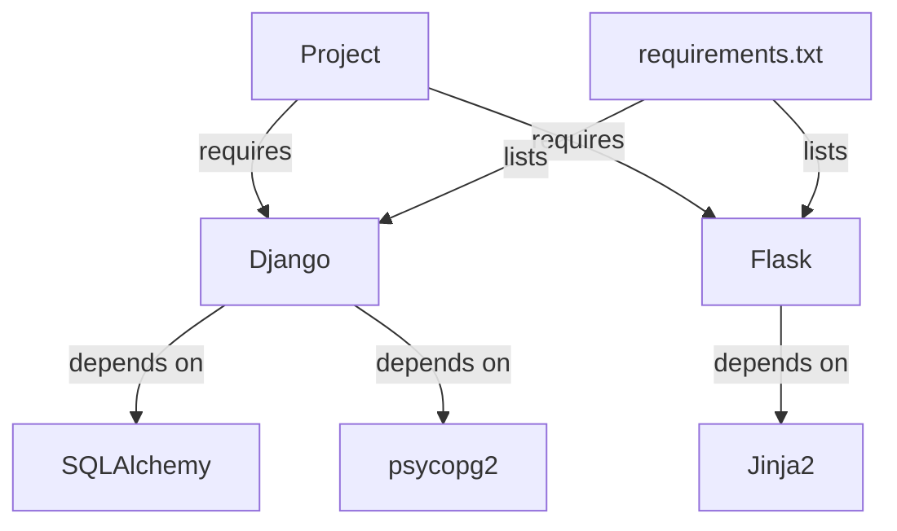

## Introduction to Python External Modules Installation Using Pip

In this section, we will delve into the process of installing, managing, and uninstalling Python external modules using `pip`, the Python Package Index. This is a fundamental skill for any Python developer, as it enables the integration of third-party libraries and frameworks into your projects. We'll cover the installation of the popular web framework `Django` as an example, and explore the entire workflow from installation to usage within an IDE like PyCharm.

### What is `pip`?

`pip` is the standard package manager for Python. It allows you to install and manage additional libraries that are not distributed as part of the standard library. These libraries are hosted on the Python Package Index (PyPI), which is a repository of software for the Python programming language.

#### Why Use `pip`?

Using `pip` simplifies the process of installing and managing Python packages. It ensures that you have the correct versions of dependencies and that they are properly configured. This is crucial for maintaining a stable and consistent development environment.

#### How Does `pip` Work?

When you run a `pip install` command, `pip` connects to the PyPI server and downloads the specified package along with its dependencies. It then installs these packages in your Python environment. The installation process involves unpacking the package files and placing them in the appropriate directories.

### Installing Django Using `pip`

Let's walk through the process of installing the `Django` web framework using `pip`.

#### Step-by-Step Installation

1. **Open Terminal**: First, open the terminal within your IDE (Integrated Development Environment). In PyCharm, you can access the terminal via `View > Tool Windows > Terminal`.

2. **Run `pip install` Command**:
    ```sh
    pip install django
    ```

3. **Monitor Installation Progress**: You will see output indicating that `pip` is downloading and installing the `Django` package and its dependencies.

4. **Verify Installation**:
    - Open the `External Libraries` section in PyCharm.
    - Expand the `site-packages` directory.
    - Scroll down to find the `django` package.

#### Example Output

Here is a typical output you might see when installing `Django`:

```sh
Collecting django
  Downloading https://files.pythonhosted.org/packages/...
  Installing build dependencies ... done
  Getting requirements to build wheel ... done
  Preparing metadata (pyproject.toml) ... done
Building wheels for collected packages: django
  Building wheel for django (pyproject.toml) ... done
  Created wheel for django: ...
Successfully built django
Installing collected packages: django
Successfully installed django-3.1.6
```

### Verifying Installation in PyCharm

Once `Django` is installed, you can verify its presence in your project.

1. **Import Django in Code**:
    ```python
    import django
    ```

2. **Check IDE Recognition**:
    - PyCharm should recognize the `django` package and provide autocompletion suggestions.
    - If everything is set up correctly, you should not see any errors or red lines under the `import` statement.

### Uninstalling Packages Using `pip`

If you need to remove a package, you can use the `pip uninstall` command.

#### Step-by-Step Uninstallation

1. **Run `pip uninstall` Command**:
    ```sh
    pip uninstall django
    ```

2. **Confirm Uninstallation**:
    - You will be prompted to confirm the uninstallation.
    - After confirming, `pip` will remove the package and its dependencies.

3. **Verify Removal**:
    - Check the `site-packages` directory in PyCharm to ensure that the `django` package is no longer present.
    - Verify that the `import django` statement now shows an error in the code editor.

#### Example Output

Here is a typical output you might see when uninstalling `Django`:

```sh
Uninstalling django-3.1_6:
  Would remove:
    /path/to/python/lib/site-packages/django-3.1.6.dist-info/*
    /path/to/python/lib/site-packages/django/*
Proceed (y/n)? y
  Successfully uninstalled django-3.1.6
```

### Common Pitfalls and Best Practices

#### Virtual Environments

One common pitfall is installing packages globally, which can lead to conflicts between different projects. To avoid this, it is recommended to use virtual environments.

1. **Create Virtual Environment**:
    ```sh
    python -m venv myenv
    ```

2. **Activate Virtual Environment**:
    - On Unix or macOS:
        ```sh
        source myenv/bin/activate
        ```
    - On Windows:
        ```sh
        myenv\Scripts\activate
        ```

3. **Install Packages in Virtual Environment**:
    ```sh
    pip install django
    ```

#### Dependency Management

Another common issue is dependency management. Ensure that all required dependencies are listed in a `requirements.txt` file.

1. **Generate `requirements.txt`**:
    ```sh
    pip freeze > requirements.txt
    ```

2. **Install Dependencies from `requirements.txt`**:
    ```sh
    pip install -r requirements.txt
    ```

### Real-World Examples and Recent Breaches

#### Example: CVE-2021-33209

CVE-2021-33209 is a security vulnerability in Django that could allow attackers to bypass authentication mechanisms. This highlights the importance of keeping your packages up-to-date.

1. **Impact**:
    - Attackers could potentially gain unauthorized access to Django applications.
    - This could lead to data breaches and other security issues.

2. **Mitigation**:
    - Regularly update your Django installations to the latest version.
    - Monitor security advisories and apply patches promptly.

#### Example: PyPI Compromise

In 2021, the PyPI repository experienced a compromise where malicious packages were uploaded. This underscores the importance of verifying the authenticity of packages.

1. **Impact**:
    - Users who installed these packages could have their systems compromised.
    - This could lead to data theft, system control, and other severe consequences.

2. **Mitigation**:
    - Use trusted sources for package installation.
    - Verify the authenticity of packages using cryptographic signatures.
    - Regularly audit your installed packages for known vulnerabilities.

### Secure Coding Practices

#### Vulnerable Code Example

Consider the following insecure code snippet:

```python
# Vulnerable code
import django
from django.conf import settings

settings.configure(
    DEBUG=True,
    DATABASES={
        'default': {
            'ENGINE': 'django.db.backends.sqlite3',
            'NAME': 'mydatabase'
        }
    }
)
```

#### Secure Code Example

Here is the corrected version:

```python
# Secure code
import django
from django.conf import settings

settings.configure(
    DEBUG=False,
    DATABASES={
        'default': {
            'ENGINE': 'django.db.backends.sqlite3',
            'NAME': 'mydatabase'
        }
    },
    ALLOWED_HOSTS=['*']
)
```

### How to Prevent / Defend

#### Detection

1. **Regular Audits**:
    - Use tools like `pip-audit` to scan for known vulnerabilities.
    - Regularly review your `requirements.txt` file for outdated packages.

2. **Monitoring**:
    - Set up alerts for security advisories related to your installed packages.
    - Monitor your system for signs of compromise.

#### Prevention

1. **Keep Packages Updated**:
    - Regularly update your packages to the latest versions.
    - Use automated tools to manage updates.

2. **Use Secure Configurations**:
    - Disable unnecessary features and services.
    - Configure your application securely, e.g., disable debug mode in production.

#### Secure-Coding Fixes

1. **Secure Configuration**:
    - Ensure that sensitive information is not exposed in your configuration files.
    - Use environment variables for sensitive data.

2. **Input Validation**:
    - Validate all user inputs to prevent injection attacks.
    - Use Django's built-in validation mechanisms.

### Complete Example: Full HTTP Request and Response

#### Example HTTP Request

```http
GET /api/v1/users/ HTTP/1.1
Host: example.com
User-Agent: curl/7.64.1
Accept: */*
Authorization: Bearer <token>
```

#### Example HTTP Response

```http
HTTP/1.1 200 OK
Date: Mon, 20 Mar 2023 12:00:00 GMT
Server: Apache/2.4.41 (Ubuntu)
Content-Type: application/json
Content-Length: 1234
Connection: close

{
  "users": [
    {
      "id": 1,
      "username": "john_doe",
      "email": "john@example.com"
    },
    {
      "id": 2,
      "username": "jane_doe",
      "email": "jane@example.com"
    }
  ]
}
```

### Mermaid Diagrams

#### Package Installation Flow



#### Dependency Management



### Hands-On Labs

For practical experience with Python external modules installation using `pip`, consider the following labs:

- **PortSwigger Web Security Academy**: Offers hands-on labs for web application security.
- **OWASP Juice Shop**: A deliberately insecure web application for practicing web security skills.
- **DVWA (Damn Vulnerable Web Application)**: Another intentionally vulnerable web app for learning web security.

These labs provide a safe environment to practice and reinforce the concepts covered in this chapter.

### Conclusion

Mastering the installation and management of Python external modules using `pip` is essential for any Python developer. By following best practices and staying vigilant about security, you can ensure that your projects remain robust and secure.

---
<!-- nav -->
[[DevOps/DevOps Bootcamp/03-Python & Scripting/15-Python External Modules Installation Using PiPi/00-Overview|Overview]] | [[02-Introduction to Python External Modules and PiPi|Introduction to Python External Modules and PiPi]]
