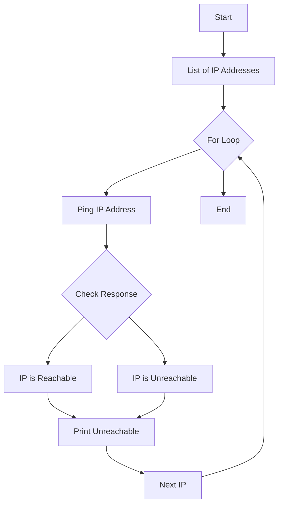

## Introduction to Python Lists and For Loops

In the context of DevOps, Python is one of the most widely used programming languages due to its simplicity and powerful features. One of the fundamental data structures in Python is the list, which allows you to store a collection of items in a single variable. Lists are versatile and can hold elements of different types, but they are often used to store elements of the same type, such as integers, strings, or even other lists.

### What is a List?

A list in Python is a mutable, ordered sequence of elements. Each element in the list is assigned an index, starting from 0. Lists are defined using square brackets `[]`, and elements are separated by commas. Here is an example of a simple list:

```python
my_list = [1, 2, 3, 4, 5]
```

#### Why Use Lists?

Lists are useful for several reasons:
1. **Data Aggregation**: They allow you to group related data together.
2. **Indexing**: You can access individual elements using their index.
3. **Mutability**: You can modify the contents of a list after it is created.
4. **Iterability**: Lists can be easily iterated over using loops.

### Using Lists in For Loops

One of the most common operations performed on lists is iterating over their elements using a `for` loop. This allows you to perform specific actions on each element in the list. The general syntax for a `for` loop in Python is as follows:

```python
for element in my_list:
    # Perform some action with element
```

Here is a complete example demonstrating how to use a `for` loop with a list:

```python
my_list = [1, 2, 3, 4, 5]

for number in my_list:
    print(number)
```

### Example: Summing Elements in a List

Let's consider a more complex example where we sum the elements in a list. We will use a `for` loop to iterate over the list and accumulate the sum.

```python
numbers = [1, 2, 3, 4, 5]
total_sum = 0

for number in numbers:
    total_sum += number

print(f"The sum of the numbers is: {total_sum}")
```

### Real-World Application: Processing User Inputs

In a DevOps context, you might need to process multiple user inputs. For instance, you could have a script that takes a list of IP addresses and checks if they are reachable. Here is an example of how you might implement this:

```python
import subprocess

ip_addresses = ["192.168.1.1", "192.168.1.2", "192.168.1.3"]

for ip in ip_addresses:
    response = subprocess.run(["ping", "-c", "1", ip], capture_output=True, text=True)
    if "1 received" in response.stdout:
        print(f"{ip} is reachable")
    else:
        print(f"{ip} is unreachable")
```

### Mermaid Diagram: Flow of Processing IP Addresses

To visualize the flow of processing IP addresses, we can use a mermaid diagram:



### Common Pitfalls and How to Avoid Them

When working with lists and loops, there are several common pitfalls to be aware of:

1. **Off-by-One Errors**: Ensure that your loop indices are correct. For example, if you are iterating over a list of length `n`, the valid indices range from `0` to `n-1`.

2. **Modifying the List During Iteration**: Modifying a list while iterating over it can lead to unexpected behavior. Instead, consider creating a new list or using a different approach.

3. **Empty Lists**: Always check if the list is empty before iterating over it to avoid unnecessary operations.

### Secure Coding Practices

When dealing with user inputs or external data, it is crucial to follow secure coding practices to prevent potential vulnerabilities. Here are some guidelines:

1. **Input Validation**: Validate all inputs to ensure they meet expected criteria. For example, if you expect an IP address, validate that the input is indeed a valid IP address.

2. **Error Handling**: Implement proper error handling to manage unexpected situations gracefully.

3. **Sanitize Inputs**: Sanitize inputs to prevent injection attacks. For example, if you are using shell commands, ensure that inputs are properly escaped.

### Example: Securely Processing User Inputs

Here is an example of securely processing user inputs:

```python
import re
import subprocess

def is_valid_ip(ip):
    """Validate if the input is a valid IP address."""
    return bool(re.match(r'^(\d{1,3}\.){3}\d{1,3}$', ip))

ip_addresses = ["192.168.1.1", "192.168.1.2", "invalid_ip"]

for ip in ip_addresses:
    if is_valid_ip(ip):
        response = subprocess.run(["ping", "-c", "1", ip], capture_output=True, text=True)
        if "1 received" in response.stdout:
            print(f"{ip} is reachable")
        else:
            print(f"{ip} is unreachable")
    else:
        print(f"{ip} is not a valid IP address")
```

### Detection and Prevention

To detect and prevent issues related to list manipulation and loop usage, consider the following steps:

1. **Static Analysis Tools**: Use static analysis tools like PyLint or Bandit to identify potential issues in your code.

2. **Unit Testing**: Write unit tests to verify the correctness of your code. For example, you can test the `is_valid_ip` function to ensure it correctly identifies valid and invalid IP addresses.

3. **Code Reviews**: Conduct regular code reviews to catch potential issues early.

### Conclusion

Understanding how to effectively use lists and `for` loops in Python is essential for any DevOps engineer. By mastering these concepts, you can write more efficient and secure scripts to automate tasks and process data. Remember to always validate inputs, handle errors gracefully, and use secure coding practices to prevent vulnerabilities.

### Practice Labs

To further practice and solidify your understanding, consider the following labs:

- **PortSwigger Web Security Academy**: Offers interactive labs to practice web application security.
- **OWASP Juice Shop**: A deliberately insecure web application for practicing web security.
- **DVWA (Damn Vulnerable Web Application)**: Another web application for practicing web security.

These labs provide hands-on experience with real-world scenarios and help you apply the concepts learned in this chapter.

---
<!-- nav -->
[[DevOps/DevOps Bootcamp/03-Python & Scripting/16-Python Lists for Multiple Input Calculations/00-Overview|Overview]] | [[02-Introduction to Python Lists and Loops|Introduction to Python Lists and Loops]]
