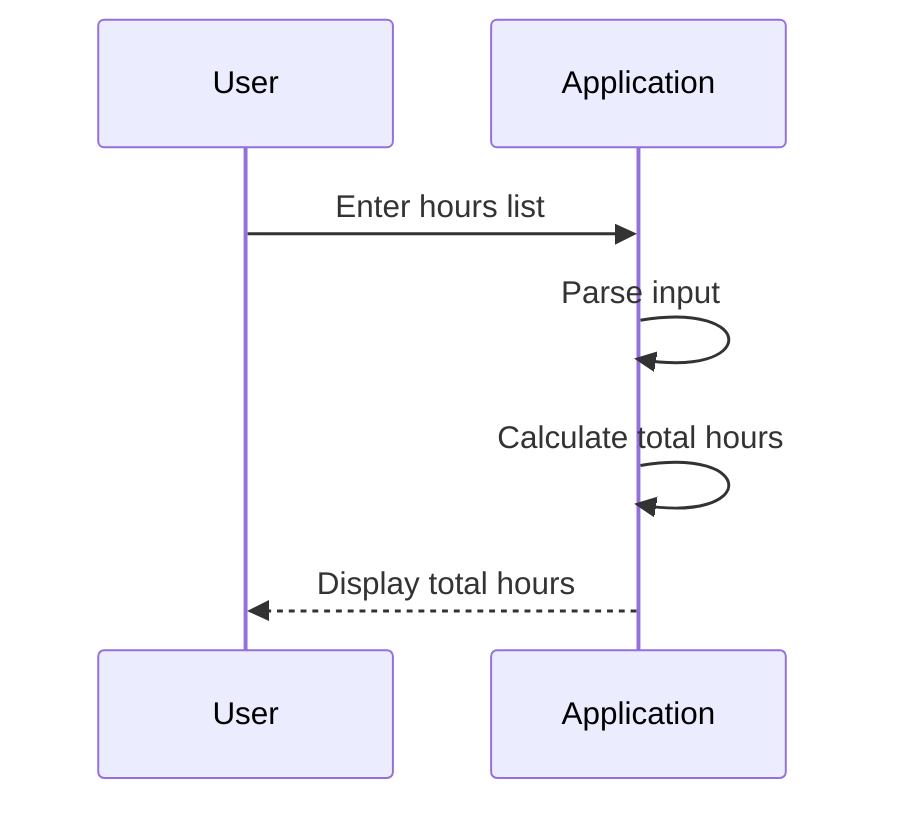

## Introduction to Python Lists

In this section, we will delve into the concept of Python lists, which is a fundamental data structure used to store collections of items. We will explore how lists can be used to simplify repetitive tasks such as calculating the number of hours for several days, and how they can be integrated into applications to handle multiple inputs efficiently.

### What is a List?

A list in Python is a collection of items that are ordered and changeable. Unlike strings, which are immutable sequences of characters, lists allow you to store a variety of data types, including integers, floats, strings, and even other lists. Lists are defined using square brackets `[]`, and the elements within the list are separated by commas.

#### Syntax of a List

The basic syntax for creating a list is as follows:

```python
my_list = [element1, element2, element3, ...]
```

For example, a list of integers could be created as:

```python
days = [1, 2, 3, 4, 5, 6, 7]
```

This list contains seven integers representing the days of the week.

### Why Use Lists?

Lists are incredibly useful because they allow you to group related data together and perform operations on the entire collection. This is particularly beneficial when dealing with repetitive tasks, such as calculating the number of hours for several days. Instead of manually entering each value, you can input them as a list and process them all at once.

#### Example: Calculating Hours for Several Days

Let's consider an application that calculates the total number of hours worked over several days. Instead of entering each day's hours individually, we can use a list to input all the hours at once.

```python
def calculate_total_hours(hours_list):
    total_hours = sum(hours_list)
    return total_hours

hours_per_day = [8, 7, 9, 6, 8, 10, 7]
total_hours = calculate_total_hours(hours_per_day)
print(f"Total hours worked: {total_hours}")
```

In this example, the `calculate_total_hours` function takes a list of hours and returns the sum of all the hours. This simplifies the process of handling multiple inputs.

### How Lists Work Under the Hood

Under the hood, lists in Python are implemented as dynamic arrays. This means that they can grow and shrink dynamically as elements are added or removed. Each element in the list is stored in a contiguous block of memory, allowing for efficient access and manipulation.

#### Memory Allocation

When you create a list, Python allocates a block of memory large enough to hold the initial elements. As you add more elements, Python may need to allocate a larger block of memory to accommodate the new elements. This reallocation process ensures that the list remains efficient and flexible.

### Common Mistakes and Pitfalls

While lists are powerful, there are some common mistakes and pitfalls to be aware of:

1. **Index Errors**: Accessing an index that does not exist in the list will result in an `IndexError`. Always ensure that your index is within the valid range.

    ```python
    my_list = [1, 2, 3]
    print(my_list[3])  # IndexError: list index out of range
    ```

2. **Mutability**: Lists are mutable, meaning that you can modify their contents. However, this also means that you need to be careful when passing lists to functions, as changes made within the function will affect the original list.

    ```python
    def modify_list(lst):
        lst.append(4)

    my_list = [1, 2, 3]
    modify_list(my_list)
    print(my_list)  # Output: [1,  2, 3, 4]
    ```

### Real-World Examples and Recent Breaches

Lists are widely used in various applications, including web development, data analysis, and system administration. However, improper handling of lists can lead to security vulnerabilities.

#### Example: SQL Injection via List Input

Consider a web application that uses a list of user inputs to construct a SQL query. If the inputs are not properly sanitized, an attacker could inject malicious SQL code.

```python
user_inputs = ["' OR '1'='1", "' OR '1'='1"]
query = f"SELECT * FROM users WHERE username IN ({', '.join(user_inputs)})"
print(query)
# Output: SELECT * FROM users WHERE username IN ('' OR '1'='1', '' OR '1'='1')
```

In this example, the attacker has injected SQL code that bypasses authentication. To prevent such attacks, you should always sanitize user inputs and use parameterized queries.

### How to Prevent / Defend

To defend against potential issues with lists, follow these best practices:

1. **Sanitize Inputs**: Ensure that all user inputs are sanitized to prevent injection attacks.
   
    ```python
    import re

    def sanitize_input(input_str):
        return re.sub(r"[^a-zA-Z0-9\s]", "", input_str)

    user_inputs = ["' OR '1'='1", "' OR '1'='1"]
    sanitized_inputs = [sanitize_input(i) for i in user_inputs]
    print(sanitized_inputs)
    # Output: ['', '']
    ```

2. **Use Parameterized Queries**: When constructing SQL queries, use parameterized queries to prevent SQL injection.

    ```python
    import sqlite3

    conn = sqlite3.connect('example.db')
    cursor = conn.cursor()

    user_inputs = ["user1", "user2"]
    query = "SELECT * FROM users WHERE username IN (?)"
    cursor.execute(query, (tuple(user_inputs),))
    results = cursor.fetchall()
    print(results)
    ```

3. **Validate Indexes**: Always validate indexes to avoid `IndexError`.

    ```python
    my_list = [1, 2, 3]
    index = 3
    if index < len(my_list):
        print(my_list[index])
    else:
        print("Index out of range")
    ```

### Complete Example: Handling Multiple Inputs Efficiently

Let's put everything together in a complete example. We will create an application that allows users to input a list of hours worked per day and calculates the total hours.

```python
def calculate_total_hours(hours_list):
    total_hours = sum(hours_list)
    return total_hours

def main():
    user_input = input("Enter a list of hours worked per day (comma-separated): ")
    hours_list = [int(h.strip()) for h in user_input.split(",")]
    total_hours = calculate_total_hours(hours_list)
    print(f"Total hours worked: {total_hours}")

if __name__ == "__main__":
    main()
```

### Mermaid Diagrams

To visualize the flow of the application, we can use a mermaid sequence diagram.



### Hands-On Labs

To practice working with lists in Python, you can use the following labs:

- **PortSwigger Web Security Academy**: Focuses on web application security, including SQL injection and other vulnerabilities.
- **OWASP Juice Shop**: A deliberately insecure web application for practicing web security skills.
- **DVWA (Damn Vulnerable Web Application)**: Another intentionally vulnerable web application for learning web security.

These labs provide practical experience in handling lists and other data structures in a secure manner.

### Conclusion

In this section, we explored the concept of Python lists, their syntax, and how they can be used to simplify repetitive tasks. We also discussed common mistakes and real-world examples, along with best practices for preventing security vulnerabilities. By understanding and applying these concepts, you can build more efficient and secure applications.

---
<!-- nav -->
[[04-Introduction to Python Lists for Multiple Input Calculations|Introduction to Python Lists for Multiple Input Calculations]] | [[DevOps/DevOps Bootcamp/03-Python & Scripting/16-Python Lists for Multiple Input Calculations/00-Overview|Overview]] | [[06-Understanding Python Lists and Loops|Understanding Python Lists and Loops]]
