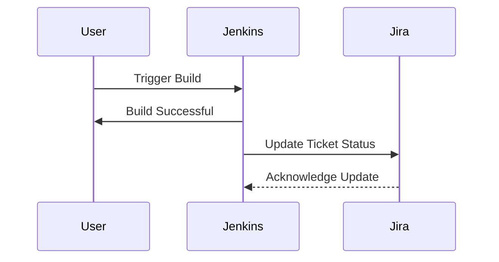
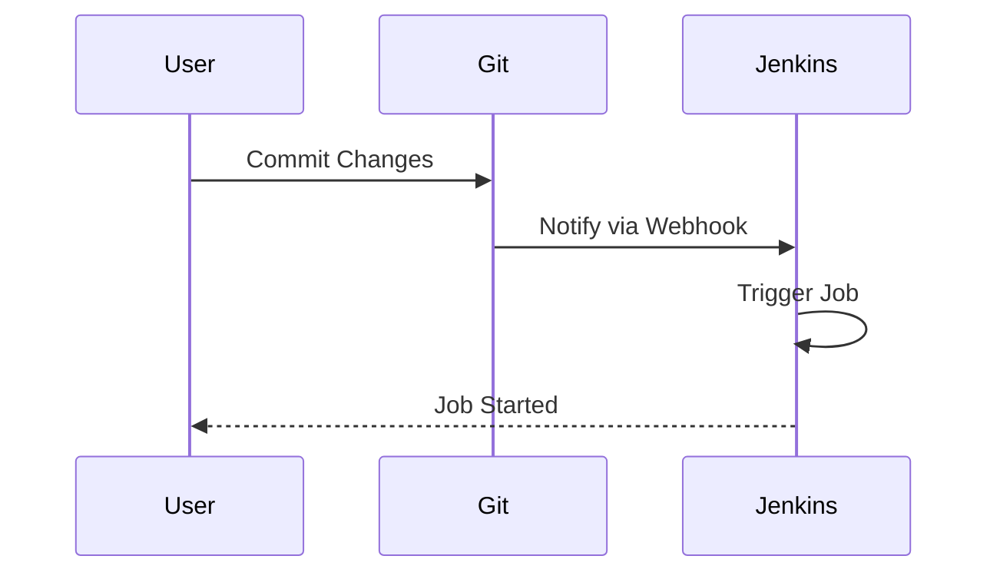
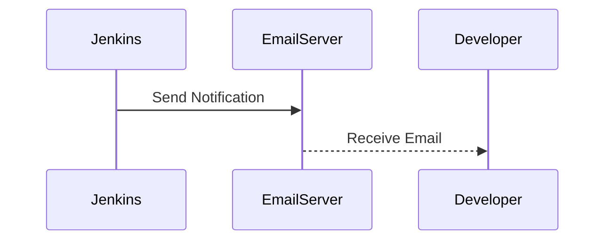
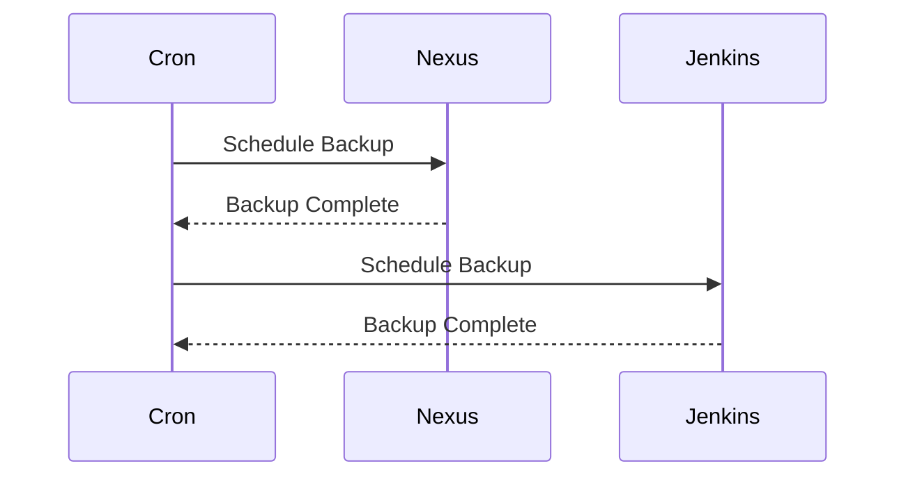
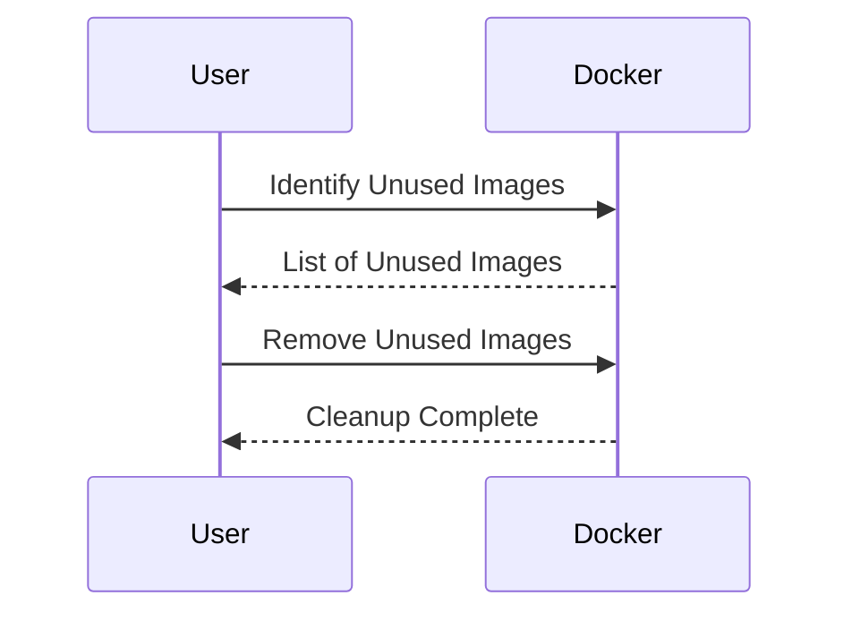

## Introduction to Automation in DevOps

In the realm of DevOps, automation plays a pivotal role in streamlining processes, reducing human error, and increasing efficiency. This chapter delves into the advantages of using Python for automating various tasks in software development and DevOps. We will explore specific examples such as updating Jira tickets, triggering Jenkins jobs, sending notifications, performing backups, and cleaning up Docker images. Each task will be explained in detail, including the underlying principles, recent real-world examples, complete code snippets, and diagrams to aid understanding.

### Updating Jira Tickets After Jenkins Build Success

One common task in DevOps is to update Jira tickets after a successful Jenkins build. This ensures that the status of the ticket reflects the current state of the build, providing transparency and traceability.

#### Background Theory

Jira is an issue tracking tool used for bug tracking, issue tracking, and project management. Jenkins is a continuous integration and continuous delivery (CI/CD) tool that automates the building, testing, and deployment of software. Integrating these tools allows for seamless communication between the development lifecycle and project management.

#### Example Scenario

Suppose you have a Jenkins job that builds and tests your application. Upon successful completion, you want to update a corresponding Jira ticket to indicate that the build was successful.

#### Implementation Steps

1. **Install Required Libraries**: You need libraries to interact with both Jenkins and Jira APIs. For Python, you can use `requests` for making HTTP requests and `jira` for interacting with Jira.

```python
pip install requests jira
```

2. **Authenticate with Jira**: Use your Jira credentials to authenticate and create a client object.

```python
from jira import JIRA

jira_options = {'server': 'https://your-jira-instance.com'}
jira = JIRA(options=jira_options, basic_auth=('username', 'password'))
```

3. **Update Jira Ticket**: After a successful Jenkins build, update the Jira ticket.

```python
def update_jira_ticket(ticket_id, new_status):
    issue = jira.issue(ticket_id)
    issue.update(fields={'status': {'name': new_status}})
    print(f"Updated Jira ticket {ticket_id} to status {new_status}")

update_jira_ticket('DEV-123', 'In Progress')
```

#### Mermaid Diagram



#### Real-World Example

A recent example of integrating Jenkins and Jira is the use of these tools in the development of open-source projects like Apache. By automating the update of Jira tickets, the development team ensures that all stakeholders are informed about the progress of the build.

#### Pitfalls and How to Prevent

**Pitfall**: Incorrect authentication credentials can lead to failed API calls.

**Prevention**: Store credentials securely using environment variables or a secrets manager.

```python
import os

jira_options = {'server': 'https://your-jira-instance.com'}
jira = JIRA(options=jira_options, basic_auth=(os.getenv('JIRA_USERNAME'), os.getenv('JIRA_PASSWORD')))
```

### Automatically Triggering Jenkins Jobs

Another common task is to automatically trigger Jenkins jobs based on certain events during the software development process. This can include changes in the code repository, completion of a previous build, or other predefined conditions.

#### Background Theory

Continuous Integration (CI) involves automatically building and testing the codebase whenever changes are committed. Continuous Delivery (CD) extends this by automatically deploying the code to a staging or production environment. Jenkins supports both CI and CD through its extensive plugin ecosystem.

#### Example Scenario

Suppose you want to trigger a Jenkins job whenever a new commit is pushed to the `main` branch of your Git repository.

#### Implementation Steps

1. **Set Up Jenkins Job**: Create a Jenkins job that listens for changes in the Git repository.

2. **Configure Webhook**: Set up a webhook in your Git provider (e.g., GitHub) to notify Jenkins of changes.

3. **Trigger Jenkins Job**: Use the Jenkins API to trigger the job programmatically.

```python
import requests

def trigger_jenkins_job(job_name):
    url = f"https://your-jenkins-instance.com/job/{job_name}/build"
    auth = ('username', 'token')
    response = requests.post(url, auth=auth)
    if response.status_code == 201:
        print(f"Successfully triggered Jenkins job {job_name}")
    else:
        print(f"Failed to trigger Jenkins job {job_name}: {response.status_code}")

trigger_jenkins_job('MyJob')
```

#### Mermaid Diagram



#### Real-World Example

A real-world example of this setup is the CI/CD pipeline used by companies like Netflix. They use Jenkins to automatically build and test their applications whenever changes are made, ensuring that the codebase remains stable and reliable.

#### Pitfalls and How to Prevent

**Pitfall**: Incorrect webhook configuration can result in missed triggers.

**Prevention**: Verify the webhook URL and ensure that the Jenkins instance is correctly configured to receive notifications.

### Sending Notifications

Sending notifications to team members upon specific events is crucial for maintaining communication and ensuring that everyone is aware of the current state of the system.

#### Background Theory

Notifications can be sent via various channels such as email, Slack, or custom integrations. These notifications help in keeping the team informed about critical events like build failures, deployment issues, or application errors.

#### Example Scenario

Suppose you want to send a notification to the development team whenever a build fails.

#### Implementation Steps

1. **Set Up Notification Service**: Use a service like Slack or email to send notifications.

2. **Integrate with Jenkins**: Configure Jenkins to send notifications upon specific events.

```python
import smtplib
from email.mime.text import MIMEText

def send_email_notification(to_address, subject, body):
    msg = MIMEText(body)
    msg['Subject'] = subject
    msg['From'] = 'jenkins@yourcompany.com'
    msg['To'] = to_address

    server = smtplib.SMTP('smtp.yourcompany.com', 587)
    server.starttls()
    server.login('username', 'password')
    server.sendmail(msg['From'], [msg['To']], msg.as_string())
    server.quit()

send_email_notification('dev-team@yourcompany.com', 'Build Failed', 'The latest build has failed.')
```

#### Mermaid Diagram



#### Real-World Example

A real-world example of this setup is the use of Slack for notifications in the development of popular applications like Trello. By integrating Slack with Jenkins, the development team receives immediate notifications about the status of their builds.

#### Pitfalls and How to Prevent

**Pitfall**: Incorrect email configuration can result in failed notifications.

**Prevention**: Test the email configuration and ensure that the SMTP server is correctly set up.

### Performing Regular Backups

Regular backups of critical systems such as Nexus, Jenkins servers, and application databases are essential for data recovery and disaster recovery.

#### Background Theory

Backups ensure that data can be restored in case of data loss due to hardware failure, software bugs, or malicious attacks. Regular backups should be scheduled and tested to ensure their effectiveness.

#### Example Scenario

Suppose you want to perform regular backups of your Nexus repository and Jenkins server.

#### Implementation Steps

1. **Schedule Backup Jobs**: Use cron jobs or Jenkins pipelines to schedule backups.

2. **Backup Nexus Repository**: Use the Nexus REST API to backup the repository.

```python
import requests

def backup_nexus_repository():
    url = 'http://your-nexus-instance.com/service/rest/v1/script'
    headers = {'Content-Type': 'application/json'}
    data = {
        "name": "backup",
        "type": "groovy",
        "content": "repositoryManager.backup('default')"
    }
    response = requests.post(url, headers=headers, json=data, auth=('username', 'password'))
    if response.status_code == 201:
        print("Nexus repository backed up successfully")
    else:
        print(f"Nexus repository backup failed: {response.status_code}")

backup_nexus_repository()
```

3. **Backup Jenkins Server**: Use the Jenkins CLI to backup the server.

```bash
java -jar jenkins-cli.jar -s http://your-jenkins-instance.com/ backup /path/to/backup
```

#### Mermaid Diagram



#### Real-World Example

A real-world example of this setup is the use of automated backups in the development of large-scale applications like Google's internal systems. By regularly backing up critical systems, Google ensures that data can be recovered in case of any issues.

#### Pitfalls and How to Prevent

**Pitfall**: Incorrect backup configuration can result in incomplete or failed backups.

**Prevention**: Test the backup configuration and ensure that backups are stored in a secure location.

### Cleaning Up Docker Images

Cleaning up Docker images from the server helps in freeing up disk space and maintaining a clean environment.

#### Background Theory

Docker images can consume significant disk space, especially in environments with frequent builds and deployments. Regular cleanup ensures that the server has enough space for new images and maintains a tidy environment.

#### Example Scenario

Suppose you want to clean up unused Docker images from the server.

#### Implementation Steps

1. **Identify Unused Images**: Use Docker commands to identify unused images.

2. **Remove Unused Images**: Use Docker commands to remove unused images.

```bash
docker image prune -a
```

#### Mermaid Diagram



#### Real-World Example

A real-world example of this setup is the use of automated cleanup scripts in the development of containerized applications like Docker Swarm. By regularly cleaning up unused images, the development team ensures that the server has enough space for new builds.

#### Pitfalls and How to Prevent

**Pitfall**: Incorrect cleanup configuration can result in removal of necessary images.

**Prevention**: Test the cleanup configuration and ensure that only unused images are removed.

### Conclusion

Automation is a key aspect of DevOps, enabling teams to streamline processes, reduce human error, and increase efficiency. Python provides a powerful framework for automating various tasks such as updating Jira tickets, triggering Jenkins jobs, sending notifications, performing backups, and cleaning up Docker images. By following the steps outlined in this chapter, you can effectively automate these tasks and enhance your DevOps workflow.

### Practice Labs

For hands-on practice, consider the following labs:

- **PortSwigger Web Security Academy**: Focuses on web application security but also covers automation in DevOps.
- **OWASP Juice Shop**: A deliberately insecure web application for security training.
- **DVWA (Damn Vulnerable Web Application)**: Another web application for security training.

These labs provide practical experience in automating tasks and integrating different tools in a DevOps environment.

---
<!-- nav -->
[[DevOps/DevOps Bootcamp/03-Python & Scripting/18-Python's Advantages in Software Development and DevOps/00-Overview|Overview]] | [[02-Introduction to Python in DevOps|Introduction to Python in DevOps]]
