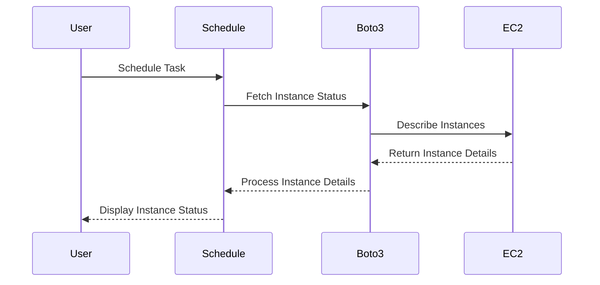

## Introduction to Scheduling Python Tasks with the `schedule` Library

In the realm of DevOps, automating tasks is crucial for maintaining efficiency and reliability in system operations. One such task is monitoring and managing the state of instances in a cloud environment like AWS. This chapter will delve into how to schedule Python tasks using the `schedule` library, which can be used to periodically check the status of AWS instances and provide real-time updates.

### Background Theory

The `schedule` library is a lightweight Python module designed to handle scheduling tasks at specified intervals. It allows you to run Python functions (or any callable) periodically at predefined times or intervals. This is particularly useful for tasks that need to be executed repeatedly, such as checking the status of cloud instances, sending periodic reports, or performing regular maintenance tasks.

#### Key Concepts

- **Task Scheduling**: The process of planning and executing tasks at specific times or intervals.
- **Periodic Execution**: Running a task repeatedly at fixed intervals.
- **Callable Functions**: Functions or methods that can be called and executed.

### Setting Up the Environment

Before diving into the implementation, ensure you have the necessary libraries installed:

```bash
pip install schedule boto3
```

- **`schedule`**: A lightweight library for scheduling tasks.
- **`boto3`**: The AWS SDK for Python, which allows interaction with AWS services.

### Fetching Instance Status from AWS

To fetch the status of AWS instances, we will use the `boto3` library. This involves making API calls to the EC2 service to retrieve the current state of instances in a specific region.

#### Step-by-Step Implementation

1. **Initialize Boto3 Client**:
   Create an instance of the EC2 client using `boto3`.

2. **Describe Instances**:
   Use the `describe_instances` method to get details about the instances.

3. **Filter Instances**:
   Filter the instances based on their state (running, terminated, etc.).

4. **Schedule Periodic Checks**:
   Use the `schedule` library to run the status check function periodically.

Here is a complete example:

```python
import boto3
import schedule
import time

def fetch_instance_status():
    ec2 = boto3.client('ec2', region_name='us-west-2')
    response = ec2.describe_instances()
    
    for reservation in response['Reservations']:
        for instance in reservation['Instances']:
            state = instance['State']['Name']
            print(f"Instance ID: {instance['InstanceId']}, State: {state}")

# Schedule the function to run every 5 minutes
schedule.every(5).minutes.do(fetch_instance_status)

while True:
    schedule.run_pending()
    time.sleep(1)
```

### Explanation of the Code

- **Initialization**:
  - `boto3.client('ec2', region_name='us-west-2')`: Creates an EC2 client for the specified region.
  
- **Fetching Instance Details**:
  - `response = ec2.describe_instances()`: Retrieves details of all instances in the specified region.
  - `for reservation in response['Reservations']`: Iterates through each reservation.
  - `for instance in reservation['Instances']`: Iterates through each instance within a reservation.
  - `print(f"Instance ID: {instance['InstanceId']}, State: {state}")`: Prints the instance ID and its state.

- **Scheduling**:
  - `schedule.every(5).minutes.do(fetch_instance_status)`: Schedules the `fetch_instance_status` function to run every 5 minutes.
  - `while True:`: Continuously checks for pending scheduled tasks.
  - `schedule.run_pending()`: Runs any pending scheduled tasks.
  - `time.sleep(1)`: Pauses the loop for 1 second to avoid high CPU usage.

### Diagramming the Workflow

A mermaid diagram can help visualize the workflow:



### Real-World Example: Monitoring AWS Instances

Consider a scenario where you need to monitor the status of instances in an AWS environment to ensure they are running correctly. This can be crucial for maintaining uptime and performance.

#### Example Scenario

Suppose you have a set of instances running in the `us-west-2` region. You want to periodically check their status and log any changes. Here’s how you can implement this:

```python
import boto3
import schedule
import time
import logging

logging.basicConfig(level=logging.INFO)

def fetch_instance_status():
    ec2 = boto3.client('ec2', region_name='us-west-2')
    response = ec2.describe_instances()
    
    for reservation in response['Reservations']:
        for instance in reservation['Instances']:
            state = instance['State']['Name']
            logging.info(f"Instance ID: {instance['InstanceId']}, State: {state}")

# Schedule the function to run every 5 minutes
schedule.every(5).minutes.do(fetch_instance_status)

while True:
    schedule.run_pending()
    time.sleep(1)
```

### Common Pitfalls and How to Avoid Them

1. **Incorrect Region Configuration**:
   - Ensure you specify the correct region when initializing the `boto3` client.
   - **Prevention**: Double-check the region name and verify it matches the desired region.

2. **Insufficient Permissions**:
   - Ensure the IAM role or user has the necessary permissions to describe instances.
   - **Prevention**: Attach the appropriate IAM policies to the role/user.

3. **High CPU Usage**:
   - The `while True` loop can cause high CPU usage if not properly managed.
   - **Prevention**: Use `time.sleep(1)` to pause the loop and reduce CPU load.

### Secure Coding Practices

1. **Logging Sensitive Information**:
   - Avoid logging sensitive information such as access keys or secret tokens.
   - **Secure Version**:
     ```python
     logging.basicConfig(level=logging.INFO, format='%(asctime)s - %(levelname)s - %(message)s')
     ```

2. **Error Handling**:
   - Implement error handling to manage exceptions gracefully.
   - **Secure Version**:
     ```python
     def fetch_instance_status():
         try:
             ec2 = boto3.client('ec2', region_name='us-west-2')
             response = ec2.describe_instances()
             
             for reservation in response['Reservations']:
                 for instance in reservation['Instances']:
                     state = instance['State']['Name']
                     logging.info(f"Instance ID: {instance['InstanceId']}, State: {state}")
         except Exception as e:
             logging.error(f"An error occurred: {str(e)}")
     ```

### Detection and Prevention

1. **Detection**:
   - Monitor logs for any unexpected errors or warnings.
   - **Tooling**: Use tools like AWS CloudWatch Logs to monitor and alert on log events.

2. **Prevention**:
   - Regularly review IAM roles and permissions to ensure they are appropriately scoped.
   - **Tooling**: Use AWS IAM Access Analyzer to review and analyze IAM policies.

### Conclusion

This chapter covered how to use the `schedule` library to periodically check the status of AWS instances. By following the steps and best practices outlined, you can ensure that your cloud infrastructure is monitored effectively and securely.

### Practice Labs

For hands-on practice, consider the following labs:

- **PortSwigger Web Security Academy**: Focuses on web application security but can be adapted for learning about cloud security.
- **OWASP Juice Shop**: A deliberately insecure web app for practicing security skills.
- **CloudGoat**: A series of labs designed to teach cloud security concepts using AWS.

These labs provide practical experience in applying the concepts learned in this chapter.

---
<!-- nav -->
[[DevOps/DevOps Bootcamp/03-Python & Scripting/19-Scheduling Python Tasks With Schedule Library/00-Overview|Overview]] | [[02-Introduction to Task Scheduling in Python|Introduction to Task Scheduling in Python]]
