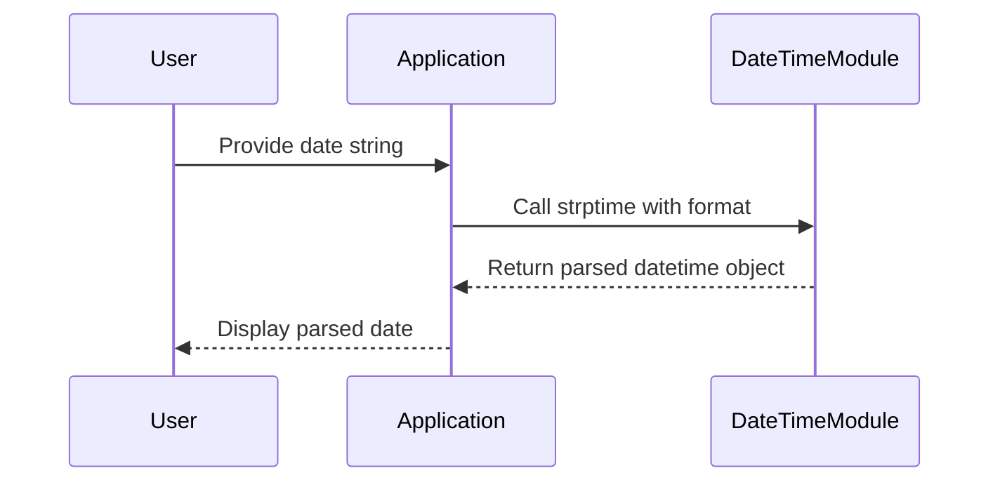

## Introduction to Date Parsing in Python

In the realm of DevOps and software development, handling dates and times is a fundamental task. Whether it's scheduling tasks, logging events, or processing user input, the ability to parse and manipulate dates is crucial. Python provides several built-in modules to handle these operations efficiently. One such module is `datetime`, which allows us to work with dates and times in various formats.

### Understanding Date Formats

Dates can be represented in numerous ways depending on the context, locale, and application requirements. Common formats include:

- **DD.MM.YYYY**: Day, Month, Year (e.g., 15.03.2023)
- **MM/DD/YYYY**: Month, Day, Year (e.g., 03/15/2023)
- **YYYY-MM-DD**: Year, Month, Day (e.g., 2023-03-15)

Each format has its own advantages and disadvantages. For instance, the `YYYY-MM-DD` format is often preferred in international contexts due to its unambiguous nature, whereas the `DD.MM.YYYY` format is commonly used in European countries.

### The `datetime` Module

The `datetime` module in Python provides classes for manipulating dates and times. The primary class we'll focus on is `datetime.datetime`, which represents a date and time.

#### Parsing Dates with `strptime`

To convert a string representation of a date into a `datetime` object, we use the `strptime` method. This method takes two arguments:

1. **String Representation**: The date string to be parsed.
2. **Format String**: A string specifying the format of the input date string.

The format string uses special codes to denote the components of the date. Here are some common format codes:

- `%d`: Day of the month as a zero-padded decimal number (01-31).
- `%m`: Month as a zero-padded decimal number (01-12).
- `%Y`: Year with century as a decimal number (e.g., 2023).

For example, to parse a date string in the format `DD.MM.YYYY`, we would use the format string `"%d.%m.%Y"`.

```python
from datetime import datetime

# Example date string
date_string = "15.03.2023"

# Parse the date string
parsed_date = datetime.strptime(date_string, "%d.%m.%Y")

print(parsed_date)
```

Output:
```
2023-03-15 00:00:00
```

### Handling Different Date Formats

Different applications may require different date formats. For instance, a web application might receive date inputs in various formats based on user preferences or locale settings. To handle this, we can create a function that attempts to parse the date using multiple formats.

```python
def parse_date(date_string):
    formats = ["%d.%m.%Y", "%m/%d/%Y", "%Y-%m-%d"]
    
    for fmt in formats:
        try:
            return datetime.strptime(date_string, fmt)
        except ValueError:
            continue
    
    raise ValueError("Unable to parse date string")

# Example usage
date_string = "03/15/2023"
parsed_date = parse_date(date_string)
print(parsed_date)
```

Output:
```
2023-03-15 00:00:00
```

### Real-World Examples and Security Considerations

Date parsing can introduce security vulnerabilities if not handled carefully. For instance, if an application parses user-provided date strings without validating the format, it may be susceptible to injection attacks.

#### Example: CVE-2021-3116

CVE-2021-3116 is a vulnerability in the `dateutil` library, which is often used alongside `datetime` for more complex date parsing tasks. This vulnerability arises from improper validation of input strings, leading to potential memory corruption.

**Vulnerable Code:**
```python
from dateutil.parser import parse

# User-provided date string
date_string = "2023-03-15T12:34:56Z"

# Parse the date string
parsed_date = parse(date_string)
print(parsed_date)
```

**Secure Code:**
```python
from datetime import datetime

# User-provided date string
date_string = "2023-03-15T12:34:56Z"

# Define allowed formats
formats = ["%Y-%m-%dT%H:%M:%SZ"]

for fmt in formats:
    try:
        parsed_date = datetime.strptime(date_string, fmt)
        print(parsed_date)
        break
    except ValueError:
        continue
else:
    raise ValueError("Invalid date format")
```

### How to Prevent / Defend

#### Detection

To detect potential issues with date parsing, you can use static analysis tools like `bandit` or `pylint`. These tools can identify insecure usage patterns and suggest improvements.

#### Prevention

1. **Validate Input**: Always validate user-provided date strings against a predefined set of allowed formats.
2. **Use Secure Libraries**: Prefer built-in Python modules like `datetime` over third-party libraries unless absolutely necessary.
3. **Error Handling**: Implement robust error handling to catch and respond to parsing failures gracefully.

#### Secure Coding Practices

- **Limit Input Formats**: Restrict the number of allowed date formats to minimize the attack surface.
- **Use Explicit Formats**: Always specify the exact format when parsing dates to avoid ambiguity.

### Conclusion

Handling dates and times in Python is a critical aspect of many applications. By understanding the `datetime` module and its methods, developers can effectively parse and manipulate date strings. However, it's essential to be mindful of security considerations and follow best practices to prevent vulnerabilities.

### Practice Labs

For hands-on practice with date parsing and related security concepts, consider the following labs:

- **PortSwigger Web Security Academy**: Offers exercises on parsing user input securely.
- **OWASP Juice Shop**: Includes challenges related to date parsing and validation.

By mastering these skills, you'll be better equipped to handle date-related tasks in your DevOps and software development projects.



This diagram illustrates the process of parsing a date string using the `datetime` module in Python. The user provides a date string, which is then parsed by the application using the `strptime` method. The parsed date is returned and displayed to the user.

---
<!-- nav -->
[[DevOps/DevOps Bootcamp/03-Python & Scripting/20-Time Management Using Python Built-in Modules/00-Overview|Overview]] | [[02-Introduction to Date and Time Management in Python|Introduction to Date and Time Management in Python]]
