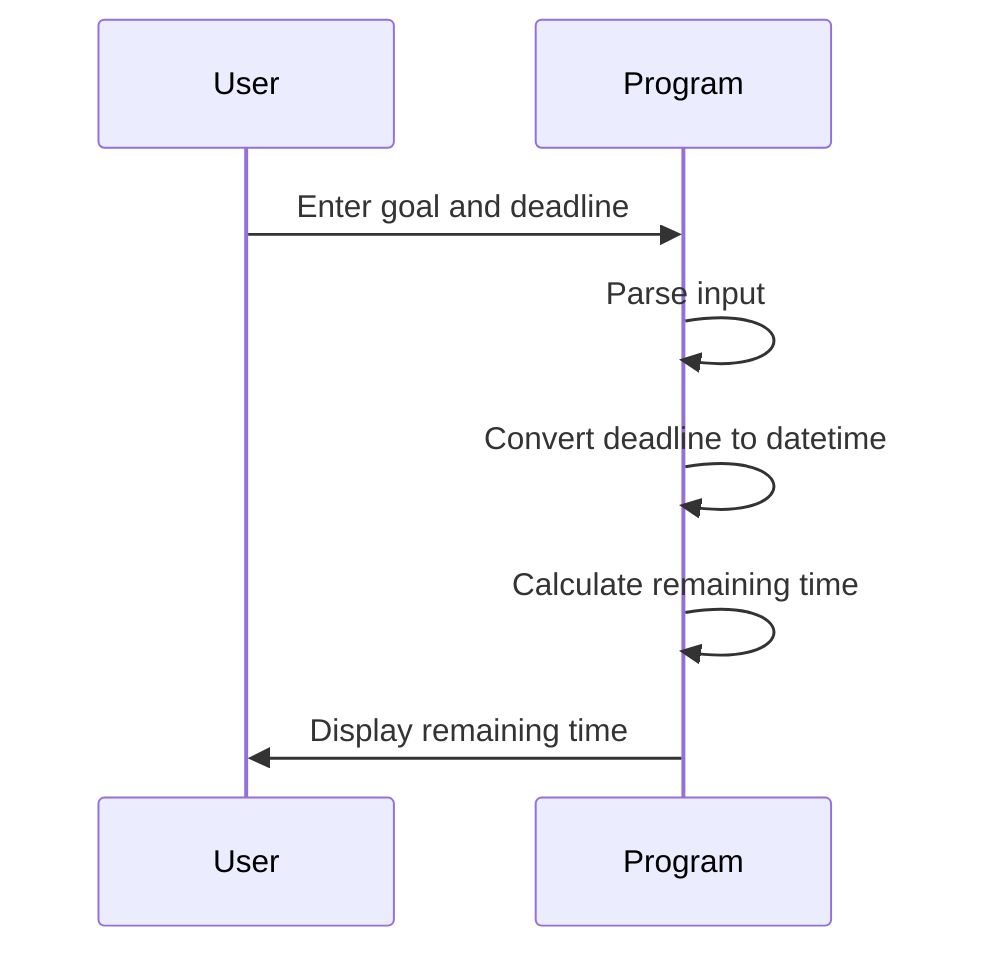

## Introduction to Time Management Using Python Built-in Modules

In this section, we will delve into the practical application of Python's built-in modules to manage time effectively. Specifically, we will focus on creating an application that calculates the time remaining until a specified deadline. This application will utilize Python's `datetime` module, which provides comprehensive tools for handling dates and times.

### Background Theory

#### What is a Built-in Module?

A built-in module in Python is a precompiled module that comes with the Python Standard Library. These modules provide a wide range of functionalities, from basic operations like string manipulation to complex tasks such as network communication and data handling. They are designed to simplify programming tasks and enhance productivity.

#### Why Use Built-in Modules?

Using built-in modules offers several advantages:

1. **Ease of Use**: Built-in modules are readily available and do not require additional installation steps.
2. **Reliability**: These modules are extensively tested and maintained by the Python community, ensuring robustness and stability.
3. **Efficiency**: Built-in modules are optimized for performance, making them ideal for both small scripts and large applications.

### Realistic Example: Time Till Deadline Application

Let's create a Python application that calculates the time remaining until a specified deadline. This application will accept user input for a goal and a deadline date, then compute and display the remaining time.

#### Step-by-Step Implementation

1. **Create a New File**
   - Open your preferred code editor and create a new file named `time_till_deadline.py`.

2. **Import the `datetime` Module**
   - The `datetime` module provides classes for manipulating dates and times. Import it at the beginning of your script:
     ```python
     import datetime
     ```

3. **Accept User Input**
   - Prompt the user to enter their goal and the corresponding deadline date. The input should be in the format: `goal:deadline_date`.
     ```python
     user_input = input("Enter your goal with a deadline (separated by colon): ")
     ```

4. **Parse the User Input**
   - Split the user input into the goal and the deadline date.
     ```python
     goal, deadline_str = user_input.split(":")
     ```

5. **Convert the Deadline Date to a `datetime` Object**
   - Parse the deadline date string into a `datetime` object. Assume the date format is `YYYY-MM-DD`.
     ```python
     deadline_date = datetime.datetime.strptime(deadline_str, "%Y-%m-%d")
     ```

6. **Calculate the Remaining Time**
   - Compute the difference between the current date and the deadline date.
     ```python
     current_date = datetime.datetime.now()
     remaining_time = deadline_date - current_date
     ```

7. **Display the Remaining Time**
   - Print the remaining time in a human-readable format.
     ```python
     days_remaining = remaining_time.days
     hours_remaining = remaining_time.seconds // 3600
     minutes_remaining = (remaining_time.seconds % 3600) // 60
     seconds_remaining = remaining_time.seconds % 60

     print(f"Time remaining until {goal} deadline: {days_remaining} days, {hours_remaining} hours, {minutes_remaining} minutes, {seconds_remaining} seconds.")
     ```

### Complete Code Example

Here is the complete code for the `time_till_deadline.py` script:

```python
import datetime

# Accept user input
user_input = input("Enter your goal with a deadline (separated by colon): ")

# Parse the user input
goal, deadline_str = user_input.split(":")

# Convert the deadline date to a datetime object
deadline_date = datetime.datetime.strptime(deadline_str, "%Y-%m-%d")

# Calculate the remaining time
current_date = datetime.datetime.now()
remaining_time = deadline_date - current_date

# Display the remaining time
days_remaining = remaining_time.days
hours_remaining = remaining_time.seconds // 3600
minutes_remaining = (remaining_time.seconds % 3600) // 60
seconds_remaining = remaining_time.seconds % 60

print(f"Time remaining until {goal} deadline: {days_remaining} days, {hours_remaining} hours, {minutes_remaining} minutes, {seconds_remaining} seconds.")
```

### Mermaid Diagram: Application Flow

To visualize the flow of the application, we can use a mermaid sequence diagram:



### Pitfalls and Common Mistakes

1. **Incorrect Date Format**
   - Ensure the user inputs the date in the correct format (`YYYY-MM-DD`). Incorrect formats will raise a `ValueError`.
   
2. **Handling Future Dates**
   - The application assumes the deadline is in the future. If the user enters a past date, the remaining time will be negative. You might want to handle this case explicitly.

3. **Edge Cases**
   - Consider edge cases such as leap years and time zones. The `datetime` module handles these internally, but you should be aware of potential issues.

### How to Prevent / Defend

#### Detection

- **Input Validation**: Validate the user input to ensure it matches the expected format.
  ```python
  import re

  def validate_input(user_input):
      pattern = r"^[^:]+:[0-9]{4}-[0-9]{2}-[0-9]{2}$"
      return bool(re.match(pattern, user_input))

  if not validate_input(user_input):
      print("Invalid input format. Please use the format: goal:YYYY-MM-DD")
      exit(1)
  ```

#### Prevention

- **Error Handling**: Implement error handling to manage exceptions gracefully.
  ```python
  try:
      deadline_date = datetime.datetime.strptime(deadline_str, "%Y-%m-%d")
  except ValueError:
      print("Invalid date format. Please use YYYY-MM-DD.")
      exit(1)
  ```

#### Secure Coding Fixes

- **Vulnerable Code**:
  ```python
  deadline_date = datetime.datetime.strptime(deadline_str, "%Y-%m-%d")
  ```

- **Secure Code**:
  ```python
  try:
      deadline_date = datetime.datetime.strptime(deadline_str, "%Y-%m-%d")
  except ValueError:
      print("Invalid date format. Please use YYYY-MM-DD.")
      exit(1)
  ```

### Real-World Examples

#### Recent CVEs and Breaches

While this specific application does not directly relate to security vulnerabilities, improper handling of date and time can lead to security issues. For example, incorrect date validation can allow attackers to bypass authentication mechanisms.

#### Example: CVE-2021-3156

CVE-2021-3156, also known as "Log4Shell," is a critical vulnerability in the Apache Log4j library. While not directly related to date handling, it demonstrates the importance of thorough input validation and error handling.

### Hands-On Labs

For hands-on practice with Python and time management, consider the following resources:

- **PortSwigger Web Security Academy**: Offers interactive labs on various web security topics.
- **OWASP Juice Shop**: A deliberately insecure web application for practicing web security skills.
- **DVWA (Damn Vulnerable Web Application)**: A PHP/MySQL web application that is riddled with vulnerabilities.

These resources provide a comprehensive learning experience and help solidify your understanding of Python and time management concepts.

### Conclusion

In this section, we explored the practical application of Python's built-in modules to manage time effectively. By creating an application that calculates the time remaining until a specified deadline, we demonstrated the power and flexibility of Python's `datetime` module. Through detailed explanations, real-world examples, and secure coding practices, you now have a robust foundation in time management using Python.

---
<!-- nav -->
[[02-Introduction to Date and Time Management in Python|Introduction to Date and Time Management in Python]] | [[DevOps/DevOps Bootcamp/03-Python & Scripting/20-Time Management Using Python Built-in Modules/00-Overview|Overview]] | [[04-Time Management Using Python Built-in Modules|Time Management Using Python Built-in Modules]]
