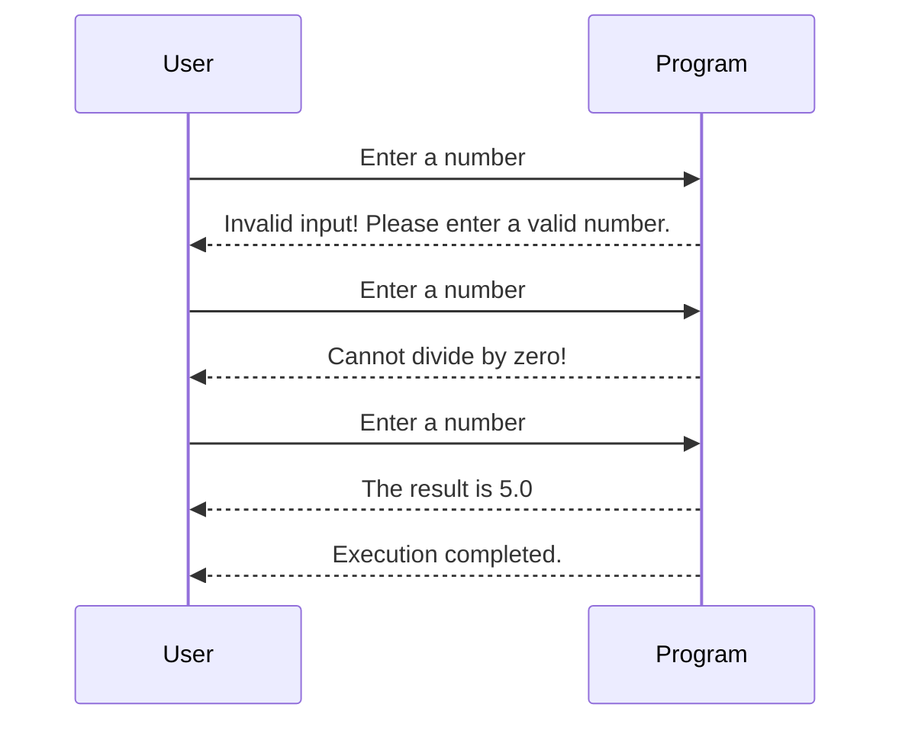

## Introduction to Error Handling in Python

Error handling is a critical aspect of programming that ensures your application can gracefully handle unexpected situations without crashing. In Python, one of the most powerful mechanisms for error handling is the `try-except` block. This mechanism allows you to attempt to execute a piece of code and catch any exceptions that might occur during its execution. By doing so, you can provide a more robust and user-friendly experience.

### Why Use `try-except`?

When writing programs, it's inevitable that errors will occur due to various reasons such as incorrect user input, file I/O issues, network failures, and more. Without proper error handling, these errors can cause your program to crash, leading to a poor user experience and potential data loss. The `try-except` block helps you manage these errors by allowing you to define what should happen when an error occurs.

### Basic Syntax of `try-except`

The basic structure of a `try-except` block in Python looks like this:

```python
try:
    # Code that might raise an exception
except ExceptionType:
    # Code to handle the exception
```

Here’s a breakdown of the components:

- **`try` Block**: This is where you place the code that might raise an exception. If an exception occurs within this block, the execution immediately jumps to the corresponding `except` block.
  
- **`except` Block**: This block catches the exception raised in the `try` block. You can specify the type of exception you want to catch, and the code inside this block will be executed if that specific exception is raised.

### Example: Handling User Input

Let's consider a simple example where we ask the user to input a number and perform some calculations. We'll use the `try-except` block to handle potential errors.

#### Vulnerable Code

```python
user_input = input("Enter a number: ")
number = int(user_input)
result = 10 / number
print(f"The result is {result}")
```

In this code, if the user inputs something other than a valid integer, the program will raise a `ValueError`. Similarly, if the user inputs `0`, the program will raise a `ZeroDivisionError`.

#### Secure Code Using `try-except`

To make this code more robust, we can use a `try-except` block to handle these exceptions:

```python
try:
    user_input = input("Enter a number: ")
    number = int(user_input)
    result = 10 / number
    print(f"The result is {result}")
except ValueError:
    print("Invalid input! Please enter a valid number.")
except ZeroDivisionError:
    print("Cannot divide by zero!")
```

### Explanation of Each Component

- **`try` Block**:
  - `user_input = input("Enter a number: ")`: Prompts the user to enter a number.
  - `number = int(user_input)`: Converts the user input to an integer.
  - `result = 10 / number`: Performs division by the user-provided number.
  - `print(f"The result is {result}")`: Prints the result of the division.

- **`except ValueError`**:
  - Catches the `ValueError` that occurs if the user input cannot be converted to an integer.
  - Prints an error message indicating invalid input.

- **`except ZeroDivisionError`**:
  - Catches the `ZeroDivisionError` that occurs if the user inputs `0`.
  - Prints an error message indicating that division by zero is not allowed.

### Real-World Examples and CVEs

Error handling is crucial in real-world applications to prevent crashes and ensure security. Here are a couple of recent examples where improper error handling led to vulnerabilities:

- **CVE-2021-21972**: A vulnerability in the Apache Struts framework allowed attackers to bypass input validation and execute arbitrary code. Proper error handling and input validation could have prevented this issue.
- **CVE-2021-3427**: A vulnerability in the Jenkins Continuous Integration server allowed attackers to execute arbitrary code due to insufficient error handling in plugin installations.

### How to Prevent / Defend

#### Detection

To detect potential issues with error handling, you can use static analysis tools like PyLint, Bandit, or SonarQube. These tools can help identify areas where exceptions might be raised but not properly handled.

#### Prevention

1. **Use Specific Exceptions**: Catch specific exceptions rather than a generic `Exception` to ensure you handle only the expected errors.
2. **Provide Meaningful Error Messages**: Ensure that error messages are informative and helpful to users.
3. **Log Errors**: Log detailed information about errors to help diagnose issues later.
4. **Test Thoroughly**: Write unit tests to cover different scenarios and ensure your error handling works as expected.

#### Secure Coding Fixes

Here’s a comparison between vulnerable and secure code:

**Vulnerable Code**

```python
user_input = input("Enter a number: ")
number = int(user_input)
result = 10 / number
print(f"The result is {result}")
```

**Secure Code**

```python
try:
    user_input = input("Enter a number: ")
    number = int(user_input)
    result = 10 / number
    print(f"The result is {result}")
except ValueError:
    print("Invalid input! Please enter a valid number.")
except ZeroDivisionError:
    print("Cannot divide by zero!")
```

### Advanced Usage of `try-except`

#### Multiple `except` Blocks

You can have multiple `except` blocks to handle different types of exceptions:

```python
try:
    user_input = input("Enter a number: ")
    number = int(user_input)
    result = 10 / number
    print(f"The result is {result}")
except ValueError:
    print("Invalid input! Please enter a valid number.")
except ZeroDivisionError:
    print("Cannot divide by zero!")
except Exception as e:
    print(f"An unexpected error occurred: {str(e)}")
```

#### `else` and `finally` Clauses

You can also use the `else` and `finally` clauses to further refine your error handling:

- **`else` Clause**: Executes if no exceptions are raised in the `try` block.
- **`finally` Clause**: Executes regardless of whether an exception was raised or not.

```python
try:
    user_input = input("Enter a number: ")
    number = int(user_input)
    result = 10 / number
except ValueError:
    print("Invalid input! Please enter a valid number.")
except ZeroDivisionError:
    print("Cannot divide by zero!")
else:
    print(f"The result is {result}")
finally:
    print("Execution completed.")
```

### Mermaid Diagrams

#### Sequence Diagram

A sequence diagram can help visualize the flow of execution and error handling:



### Hands-On Practice

For hands-on practice with error handling in Python, consider the following resources:

- **PortSwigger Web Security Academy**: Offers interactive labs to practice web application security concepts, including error handling.
- **OWASP Juice Shop**: A deliberately insecure web application for practicing web security skills, including error handling.
- **DVWA (Damn Vulnerable Web Application)**: Another intentionally vulnerable web application for learning web security.

These resources provide practical exercises to reinforce your understanding of error handling in Python and its importance in building secure applications.

By thoroughly understanding and implementing proper error handling techniques, you can create more robust and secure applications that gracefully handle unexpected situations.

---
<!-- nav -->
[[DevOps/DevOps Bootcamp/03-Python & Scripting/21-Try Except Handling in Python/00-Overview|Overview]] | [[02-Error Handling in Python `try` and `except`|Error Handling in Python `try` and `except`]]
