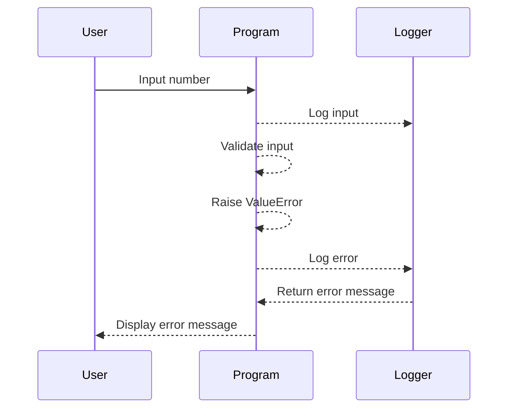

## Error Handling in Python: `try` and `except`

Error handling is a critical aspect of programming, ensuring that your applications can gracefully handle unexpected situations without crashing. In Python, the `try` and `except` blocks provide a robust mechanism for managing exceptions. This section will delve deep into the concepts, mechanics, and practical applications of `try` and `except`, including recent real-world examples, complete code snippets, and detailed explanations.

### What Are Exceptions?

In Python, an exception is an event that occurs during the execution of a program that disrupts the normal flow of instructions. When an error occurs, Python raises an exception. If the exception is not handled, the program terminates abruptly.

#### Common Types of Exceptions

- **ValueError**: Raised when a function receives an argument of the correct type but an inappropriate value.
- **TypeError**: Raised when an operation or function is applied to an object of inappropriate type.
- **ZeroDivisionError**: Raised when the second argument of a division or modulo operation is zero.
- **FileNotFoundError**: Raised when a file or directory is requested but doesn't exist.

### The `try` and `except` Blocks

The `try` block lets you test a block of code for errors. The `except` block lets you handle the error.

```python
try:
    # Code that might raise an exception
    result = 10 / 0
except ZeroDivisionError:
    # Handle the specific exception
    print("Cannot divide by zero")
```

#### General Exception Handling

If you want to handle any type of exception, you can leave the `except` block without specifying a particular exception type. However, this approach is generally discouraged because it can mask unexpected errors and make debugging difficult.

```python
try:
    # Code that might raise an exception
    result = 10 / 0
except:
    # Handle any exception
    print("An error occurred")
```

### Specific Exception Handling

It's better to specify the exact type of exception you expect to handle. This allows you to write more targeted and meaningful error-handling code.

```python
try:
    # Code that might raise an exception
    result = int(input("Enter a number: "))
except ValueError:
    # Handle the specific exception
    print("Invalid input. Please enter a valid integer.")
```

### Multiple `except` Blocks

You can have multiple `except` blocks to handle different types of exceptions.

```python
try:
    # Code that might raise an exception
    result = 10 / 0
except ZeroDivisionError:
    # Handle ZeroDivisionError
    print("Cannot divide by zero")
except TypeError:
    # Handle TypeError
    print("Type mismatch")
```

### `else` Block

The `else` block can be used to execute code if no exceptions were raised.

```python
try:
    # Code that might raise an exception
    result = 1
except ZeroDivisionError:
    # Handle ZeroDivisionError
    print("Cannot divide by zero")
else:
    # Execute if no exceptions were raised
    print("No exceptions occurred")
```

### `finally` Block

The `finally` block is executed regardless of whether an exception was raised or not. It is often used for cleanup actions.

```python
try:
    # Code that might raise an exception
    result = 10 / 0
except ZeroDivisionError:
    # Handle ZeroDivisionError
    print("Cannot divide by zero")
finally:
    # Execute regardless of exceptions
    print("This block is always executed")
```

### Real-World Example: Handling File Operations

Consider a scenario where you are reading from a file. If the file does not exist, a `FileNotFoundError` will be raised.

```python
try:
    # Open a file
    with open('nonexistent_file.txt', 'r') as file:
        data = file.read()
except FileNotFoundError:
    # Handle the specific exception
    print("The file does not exist")
```

### Recent Real-World Examples

#### CVE-2021-44228 (Log4j)

In December 2021, a critical vulnerability was discovered in Apache Log4j, a widely used logging library. The vulnerability allowed attackers to execute arbitrary code on affected systems. Proper error handling could have helped mitigate the impact of this vulnerability.

```python
try:
    # Logging a message
    logger.info("User accessed resource")
except Exception as e:
    # Handle any exception
    print(f"Logging failed: {e}")
```

### How to Prevent / Defend

#### Detection

To detect potential issues, you can use static analysis tools like PyLint or Bandit. These tools can help identify common coding mistakes and potential security vulnerabilities.

#### Prevention

1. **Use Specific Exception Handling**: Always specify the exact type of exception you expect to handle.
2. **Validate Inputs**: Ensure that inputs are valid before using them in your code.
3. **Use `finally` for Cleanup**: Always use the `finally` block to ensure resources are properly released.

#### Secure Coding Fixes

Here is an example of a vulnerable code snippet and its secure counterpart:

**Vulnerable Code**

```python
def read_file(filename):
    with open(filename, 'r') as file:
        return file.read()
```

**Secure Code**

```python
def read_file(filename):
    try:
        with open(filename, 'r') as file:
            return file.read()
    except FileNotFoundError:
        print("The file does not exist")
    except Exception as e:
        print(f"An error occurred: {e}")
```

### Complete Example: Handling Negative Numbers

Let's consider a scenario where we need to handle both positive and negative numbers. We will use `try` and `except` to manage potential errors and validate the input.

```python
def convert_to_positive(number):
    try:
        if number < 0:
            raise ValueError("Negative number entered")
        return abs(number)
    except ValueError as e:
        print(e)
        return None

# Test the function
print(convert_to_positive(-10))  # Output: Negative number entered
print(convert_to_positive(10))   # Output: 10
```

### Mermaid Diagrams

#### Sequence Diagram for Error Handling



### Hands-On Labs

For hands-on practice, consider the following labs:

- **PortSwigger Web Security Academy**: Offers interactive labs to practice web security concepts.
- **OWASP Juice Shop**: A deliberately insecure web application for practicing web security skills.
- **DVWA (Damn Vulnerable Web Application)**: A PHP/MySQL web application that is riddled with vulnerabilities.

These labs provide a practical environment to apply the concepts learned in this chapter.

### Conclusion

Proper error handling is essential for building robust and reliable applications. By using `try` and `except` blocks effectively, you can manage exceptions gracefully and ensure that your code handles unexpected situations without failing. Always strive to use specific exception handling, validate inputs, and use `finally` for cleanup to write secure and maintainable code.

---
<!-- nav -->
[[01-Introduction to Error Handling in Python|Introduction to Error Handling in Python]] | [[DevOps/DevOps Bootcamp/03-Python & Scripting/21-Try Except Handling in Python/00-Overview|Overview]] | [[DevOps/DevOps Bootcamp/03-Python & Scripting/21-Try Except Handling in Python/03-Practice Questions & Answers|Practice Questions & Answers]]
