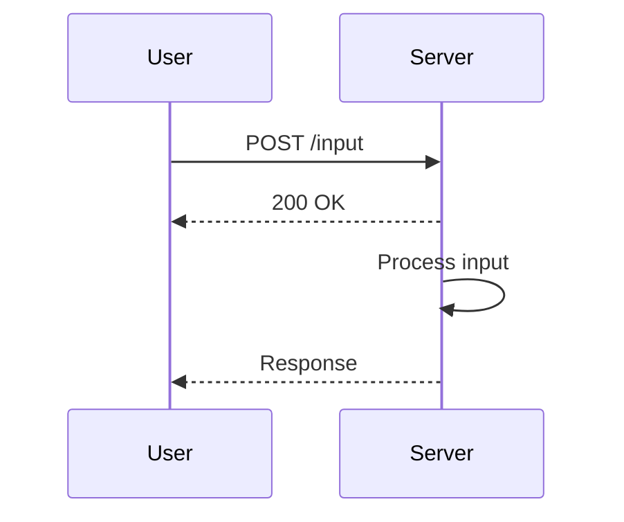

## Introduction to User Input Handling in Python Applications

Handling user input is a fundamental aspect of developing interactive applications in Python. Whether you are building a simple command-line interface (CLI) or a complex web application, understanding how to properly handle user input is crucial for both functionality and security. This chapter delves deep into the mechanics of handling user input in Python, including best practices, potential pitfalls, and security considerations.

### Background Theory

In Python, user input can be collected through various methods, but the most common ones are `input()` for CLI applications and form data for web applications. The `input()` function reads a line from input (usually the keyboard) and returns it as a string. This means that any data entered by the user is treated as a string unless explicitly converted to another type.

#### Example: Basic User Input with `input()`

```python
# Collecting user input
user_input = input("Enter your name: ")
print(f"Hello, {user_input}!")
```

### Function Execution and Return Values

When designing functions that process user input, it is essential to understand how functions work in Python. A function is a block of code that performs a specific task. Functions can take parameters (inputs) and return results (outputs).

#### Function Without Return Value

Consider a simple function that does not return a value:

```python
def greet_user():
    user_input = input("Enter your name: ")
    print(f"Hello, {user_input}!")

greet_user()
```

In this example, the function `greet_user` collects user input and prints a greeting. However, this function does not return any value, which can lead to issues if you want to use the result elsewhere in your program.

#### Function With Return Value

To make the function more useful, you can modify it to return the greeting string:

```python
def greet_user():
    user_input = input("Enter your name: ")
    return f"Hello, {user_input}!"

greeting = greet_user()
print(greeting)
```

Here, the function `greet_user` returns the greeting string, which can be stored in a variable and used later.

### Why Return Values Matter

Returning values from functions is important for several reasons:

1. **Modularity**: Functions can be reused in different parts of the program.
2. **Encapsulation**: Functions encapsulate logic, making the code cleaner and easier to maintain.
3. **Flexibility**: Returned values can be processed further or used in other functions.

### Potential Pitfalls

While returning values from functions is beneficial, there are several pitfalls to watch out for:

1. **Type Errors**: Ensure that the returned value is of the expected type.
2. **Logic Errors**: Make sure the function logic is correct and handles all possible inputs.
3. **Security Risks**: User input should be validated and sanitized to prevent security vulnerabilities.

### Real-World Examples

#### Recent CVEs and Breaches

One of the most significant security risks associated with user input is SQL injection. Consider the following example:

```python
import sqlite3

def get_user_data(user_id):
    conn = sqlite3.connect('example.db')
    cursor = conn.cursor()
    query = f"SELECT * FROM users WHERE id = {user_id}"
    cursor.execute(query)
    result = cursor.fetchone()
    conn.close()
    return result

user_data = get_user_data(input("Enter user ID: "))
print(user_data)
```

If an attacker enters a malicious input such as `1 OR 1=1`, the query becomes:

```sql
SELECT * FROM users WHERE id = 1 OR 1=1
```

This query returns all rows from the `users` table, potentially exposing sensitive data.

#### How to Prevent / Defend

1. **Use Parameterized Queries**: Instead of concatenating strings, use parameterized queries to prevent SQL injection.

```python
def get_user_data(user_id):
    conn = sqlite3.connect('example.db')
    cursor = conn.cursor()
    query = "SELECT * FROM users WHERE id = ?"
    cursor.execute(query, (user_id,))
    result = cursor.fetchone()
    conn.close()
    return result

user_data = get_user_data(input("Enter user ID: "))
print(user_data)
```

2. **Input Validation**: Validate and sanitize user input to ensure it meets expected criteria.

```python
def validate_user_id(user_id):
    if not user_id.isdigit():
        raise ValueError("User ID must be a number")
    return int(user_id)

def get_user_data(user_id):
    user_id = validate_user_id(user_id)
    conn = sqlite3.connect('example.db')
    cursor = conn.cursor()
    query = "SELECT * FROM users WHERE id = ?"
    cursor.execute(query, (user_id,))
    result = cursor.fetchone()
    conn.close()
    return result

try:
    user_data = get_user_data(input("Enter user ID: "))
    print(user_data)
except ValueError as e:
    print(e)
```

### Complete Example: User Input Handling in a Web Application

Consider a simple Flask web application that processes user input:

```python
from flask import Flask, request, render_template_string

app = Flask(__name__)

@app.route('/', methods=['GET', 'POST'])
def index():
    if request.method == 'POST':
        user_input = request.form['user_input']
        return render_template_string(f"<h1>Hello, {user_input}!</h1>")
    return render_template_string('''
        <form method="post">
            <label for="user_input">Enter your name:</label>
            <input type="text" id="user_input" name="user_input">
            <button type="submit">Submit</button>
        </form>
    ''')

if __name__ == '__main__':
    app.run(debug=True)
```

#### Potential Security Risks

1. **Cross-Site Scripting (XSS)**: If user input is not properly sanitized, it can lead to XSS attacks.

#### How to Prevent / Defend

1. **Sanitize User Input**: Use Flask's built-in utilities to escape HTML.

```python
from flask import Flask, request, render_template_string

app = Flask(__name__)

@app.route('/', methods=['GET', 'POST'])
def index():
    if request.method == 'POST':
        user_input = request.form['user_input']
        return render_template_string(f"<h1>Hello, {{ user_input|e }}!</h1>", user_input=user_input)
    return render_template_string('''
        <form method="post">
            <label for="user_input">Enter your name:</label>
            <input type="text" id="user_input" name="user_input">
            <button type="submit">Submit</button>
        </form>
    ''')

if __name__ == '__main__':
    app.run(debug=True)
```

### Mermaid Diagrams

#### Sequence Diagram for User Input Handling



### Conclusion

Properly handling user input in Python applications is crucial for both functionality and security. By understanding the mechanics of functions, return values, and potential pitfalls, you can build robust and secure applications. Always validate and sanitize user input to prevent common security vulnerabilities such as SQL injection and XSS attacks.

### Practice Labs

For hands-on practice, consider the following labs:

- **PortSwigger Web Security Academy**: Offers comprehensive modules on web security, including user input handling.
- **OWASP Juice Shop**: A deliberately insecure web application for practicing web security skills.
- **DVWA (Damn Vulnerable Web Application)**: Another intentionally vulnerable web application for learning security concepts.

These labs provide real-world scenarios to apply the concepts learned in this chapter.

---
<!-- nav -->
[[DevOps/DevOps Bootcamp/03-Python & Scripting/23-User Input Handling In Python Applications/00-Overview|Overview]] | [[02-User Input Handling in Python Applications|User Input Handling in Python Applications]]
