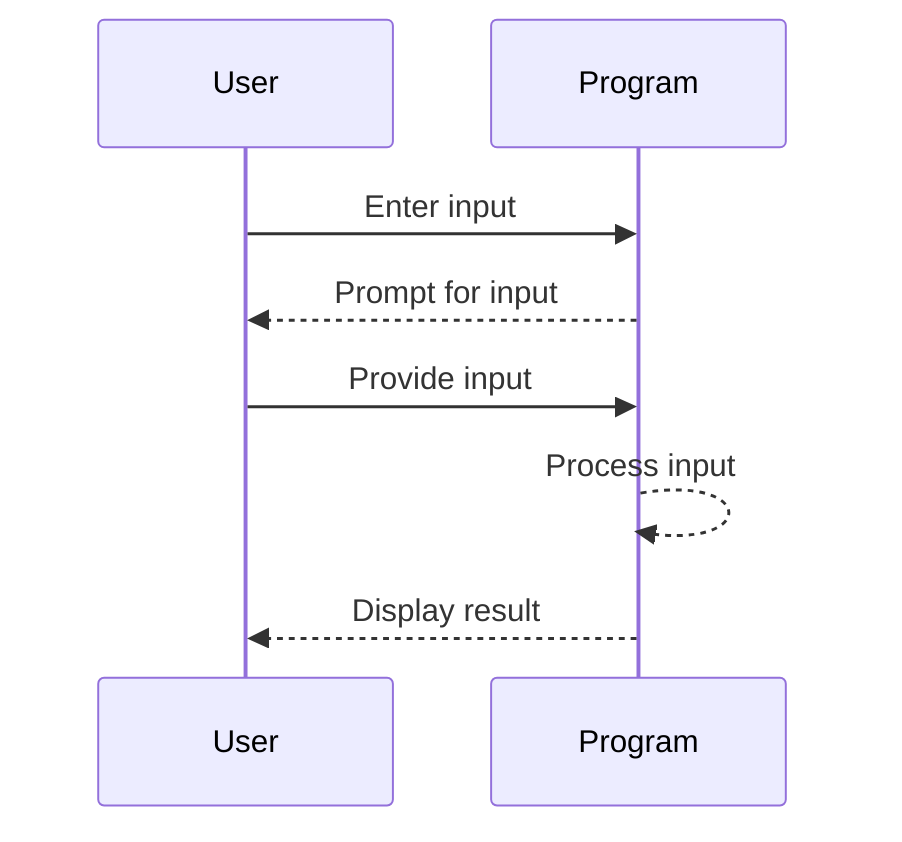
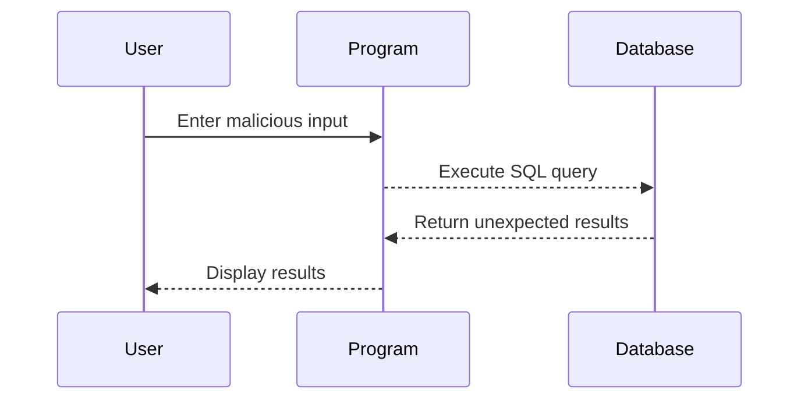

## User Input Handling in Python Applications

In this section, we will delve into the concept of handling user input in Python applications. This is a fundamental aspect of building interactive programs that can adapt to user needs dynamically. We'll start with the basics and gradually move towards more complex scenarios, including security considerations and best practices.

### What is User Input?

User input refers to data provided by a user through various means such as keyboard, mouse, touchscreen, or voice commands. In the context of Python programming, user input typically comes from the console (command line interface) or graphical user interfaces (GUIs).

#### Why Handle User Input?

Handling user input allows your application to be dynamic and responsive. Instead of being hardcoded with specific values, your application can accept inputs from users and perform calculations or operations based on those inputs. This makes your application more versatile and user-friendly.

### Basic User Input in Python

Let's start with a simple example where we calculate the number of hours given a certain number of days. Initially, we might have hardcoded values:

```python
days = 4
hours_per_day = 24
total_hours = days * hours_per_day
print(f"Total hours in {days} days: {total_hours}")
```

This code calculates the total number of hours in 4 days. However, this is not flexible. To make it more dynamic, we can accept user input for the number of days.

#### Using the `input()` Function

Python provides a built-in function called `input()` which prompts the user to enter data. Here’s how you can modify the previous code to accept user input:

```python
# Prompt the user to enter the number of days
days_input = input("Enter the number of days: ")

# Convert the input string to an integer
days = int(days_input)

# Calculate the total number of hours
hours_per_day = 24
total_hours = days * hours_per_day

# Print the result
print(f"Total hours in {days} days: {total_hours}")
```

### Understanding the `input()` Function

The `input()` function works as follows:

1. **Prompt**: The function takes a string argument which serves as a prompt to the user. This string is displayed to the user to guide them on what to input.
2. **Input**: The user types their input and presses Enter. The input is read as a string.
3. **Return Value**: The `input()` function returns the user's input as a string.

#### Example Breakdown

- **Prompt**: `"Enter the number of days: "`
- **User Input**: Suppose the user enters `5`.
- **Return Value**: The function returns the string `"5"`.

To perform numerical operations, you need to convert the string to an integer using `int()`.

### Handling Different Types of Input

While the above example works for integers, you might also need to handle other types of input such as floats or strings. Here’s how you can handle different types of input:

#### Float Input

If you expect the user to input a floating-point number, you can use `float()` instead of `int()`:

```python
# Prompt the user to enter a floating-point number
number_input = input("Enter a floating-point number: ")

# Convert the input string to a float
number = float(number_input)

# Perform some operation
result = number * 2

# Print the result
print(f"The result is: {result}")
```

#### String Input

For string inputs, no conversion is needed since `input()` already returns a string:

```python
# Prompt the user to enter a string
name = input("Enter your name: ")

# Print a greeting
print(f"Hello, {name}!")
```

### Handling Errors and Validation

When accepting user input, it's crucial to handle potential errors and validate the input to ensure it meets the expected criteria.

#### Error Handling

If the user enters non-numeric data when expecting a number, `int()` or `float()` will raise a `ValueError`. You can handle this using a try-except block:

```python
while True:
    try:
        # Prompt the user to enter the number of days
        days_input = input("Enter the number of days: ")
        
        # Convert the input string to an integer
        days = int(days_input)
        
        # Calculate the total number of hours
        hours_per_day = 24
        total_hours = days * hours_per_day
        
        # Print the result
        print(f"Total hours in {days} days: {total_hours}")
        break
    except ValueError:
        print("Invalid input! Please enter a valid number.")
```

#### Input Validation

You can also validate the input to ensure it falls within a specific range or meets certain conditions:

```python
while True:
    try:
        # Prompt the user to enter the number of days
        days_input = input("Enter the number of days (between 1 and 365): ")
        
        # Convert the input string to an integer
        days = int(days_input)
        
        # Validate the input
        if 1 <= days <= 365:
            # Calculate the total number of hours
            hours_per_day = 24
            total_hours = days * hours_per_day
            
            # Print the result
            print(f"Total hours in {days} days: {total_hours}")
            break
        else:
            print("Invalid input! Please enter a number between 1 and 365.")
    except ValueError:
        print("Invalid input! Please enter a valid number.")
```

### Security Considerations

Handling user input can introduce security risks, especially if the input is used in a way that can affect the execution of the program. Here are some common security issues and how to prevent them:

#### Injection Attacks

Injection attacks occur when untrusted input is used in a way that affects the execution of the program. For example, if user input is used in SQL queries, it can lead to SQL injection attacks.

##### Example: SQL Injection

Suppose you have a Python script that interacts with a database:

```python
import sqlite3

# Connect to the database
conn = sqlite3.connect('example.db')
cursor = conn.cursor()

# Get user input
username = input("Enter username: ")
password = input("Enter password: ")

# Construct the SQL query
query = f"SELECT * FROM users WHERE username='{username}' AND password='{password}'"

# Execute the query
cursor.execute(query)
results = cursor.fetchall()

# Print the results
for row in results:
    print(row)
```

If a malicious user enters `' OR '1'='1` as the username, the query becomes:

```sql
SELECT * FROM users WHERE username='' OR '1'='1' AND password=''
```

This query will return all rows from the `users` table, bypassing authentication.

##### How to Prevent SQL Injection

Use parameterized queries to safely incorporate user input into SQL statements:

```python
import sqlite3

# Connect to the database
conn = sqlite3.connect('example.db')
cursor = conn.cursor()

# Get user input
username = input("Enter username: ")
password = input("Enter password: ")

# Construct the SQL query with parameters
query = "SELECT * FROM users WHERE username=? AND password=?"

# Execute the query with parameters
cursor.execute(query, (username, password))
results = cursor.fetchall()

# Print the results
for row in results:
    print(row)
```

#### Command Injection

Command injection occurs when untrusted input is used in system commands. For example, if user input is used in a shell command, it can lead to command injection attacks.

##### Example: Command Injection

Suppose you have a Python script that runs a shell command:

```python
import os

# Get user input
filename = input("Enter filename: ")

# Run the shell command
os.system(f"cat {filename}")
```

If a malicious user enters `; rm -rf /`, the command becomes:

```sh
cat ; rm -rf /
```

This command will delete all files in the root directory.

##### How to Prevent Command Injection

Use safe methods to execute shell commands, such as `subprocess.run()` with `shell=False`:

```python
import subprocess

# Get user input
filename = input("Enter filename: ")

# Run the shell command safely
try:
    result = subprocess.run(["cat", filename], check=True, stdout=subprocess.PIPE, stderr=subprocess.PIPE)
    print(result.stdout.decode())
except subprocess.CalledProcessError as e:
    print(f"Error: {e.stderr.decode()}")
```

### Real-World Examples and CVEs

#### CVE-2019-1010081: Apache Struts Command Injection

In 2019, a critical vulnerability was discovered in Apache Struts, a popular Java framework. The vulnerability allowed attackers to inject arbitrary commands via user input, leading to remote code execution.

**Impact**: Attackers could gain full control of the server.

**Prevention**: Ensure proper validation and sanitization of user input. Use parameterized queries and safe methods to execute commands.

#### CVE-2020-14882: WordPress REST API SQL Injection

In 2020, a vulnerability was found in the WordPress REST API, allowing attackers to inject SQL commands via user input, leading to unauthorized access to sensitive data.

**Impact**: Attackers could retrieve sensitive information from the database.

**Prevention**: Use prepared statements and parameterized queries to safely incorporate user input into SQL statements.

### Mermaid Diagrams

#### User Input Flow



#### SQL Injection Attack



### Practice Labs

For hands-on practice with user input handling in Python, consider the following labs:

- **PortSwigger Web Security Academy**: Offers interactive labs on web security, including input validation and sanitization.
- **OWASP Juice Shop**: A deliberately insecure web application for practicing web security skills.
- **DVWA (Damn Vulnerable Web Application)**: A PHP/MySQL web application that contains numerous security vulnerabilities.

### Conclusion

Handling user input in Python applications is essential for creating dynamic and interactive programs. By understanding the basics of user input, validating and sanitizing input, and preventing common security issues, you can build robust and secure applications. Always ensure that user input is handled safely to prevent potential security risks.

---
<!-- nav -->
[[01-Introduction to User Input Handling in Python Applications|Introduction to User Input Handling in Python Applications]] | [[DevOps/DevOps Bootcamp/03-Python & Scripting/23-User Input Handling In Python Applications/00-Overview|Overview]] | [[DevOps/DevOps Bootcamp/03-Python & Scripting/23-User Input Handling In Python Applications/03-Practice Questions & Answers|Practice Questions & Answers]]
