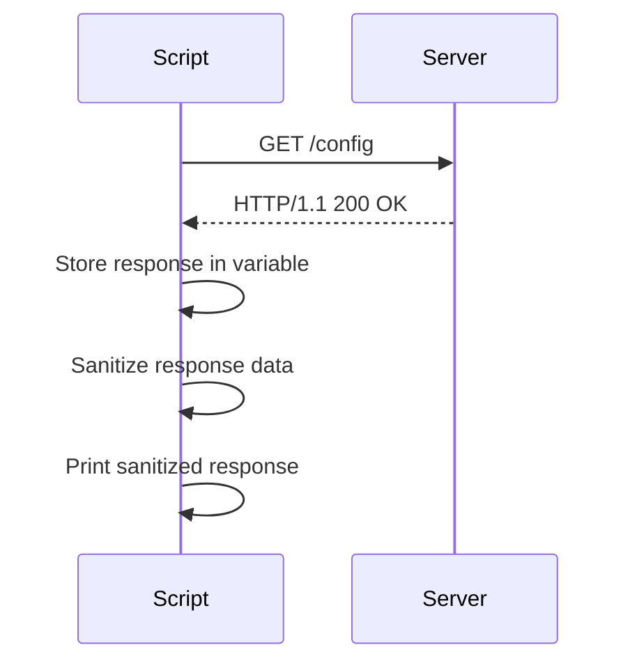

## Variable Usage and Command Output Capture in Scripting

In scripting languages like Bash, variables are essential for storing data and reusing it throughout your scripts. One powerful feature is the ability to capture the output of a command and store it in a variable. This allows you to reuse the command's output multiple times within your script without having to rerun the command each time. Let's dive into the details of how this works and explore some practical examples.

### Capturing Command Output in Variables

To capture the output of a command and store it in a variable, you use the following syntax:

```bash
variable_name=$(command)
```

Here, `$(command)` is the syntax for command substitution, which runs the command inside the parentheses and captures its output. The output is then assigned to the variable `variable_name`.

#### Example: Listing Configuration Files

Let's consider an example where we want to list all configuration files in a directory and store the output in a variable. Suppose we have a directory named `config` containing several configuration files.

```bash
config_files=$(ls config)
echo "Contents of config folder: $config_files"
```

In this example:
- `ls config` lists all files in the `config` directory.
- The output of `ls config` is captured and stored in the variable `config_files`.
- `echo "Contents of config folder: $config_files"` prints the contents of the `config` folder.

### Handling Non-Existent Directories

What happens if the `config` directory does not exist? Let's explore this scenario.

```bash
config_files=$(ls config)
echo "Contents of config folder: $config_files"
```

If the `config` directory does not exist, the `ls config` command will fail and produce an error message. However, the output of the command (which includes the error message) will still be captured by the `config_files` variable.

```bash
$ config_files=$(ls config)
$ echo "Contents of config folder: $config_files"
Contents of config folder: ls: cannot access 'config': No such file or directory
```

This behavior can lead to unexpected results, especially if you plan to use the `config_files` variable later in your script. To handle this situation more gracefully, you should check if the directory exists before attempting to list its contents.

### Conditional Checks Before Command Execution

Before executing a command that might fail, it's a good practice to perform a conditional check to ensure the command will succeed. This prevents errors and ensures your script behaves predictably.

#### Checking Directory Existence

You can use the `-d` flag with the `test` command (or `[ ]`) to check if a directory exists.

```bash
if [ -d "config" ]; then
    config_files=$(ls config)
    echo "Contents of config folder: $config_files"
else
    echo "Config directory does not exist."
fi
```

In this example:
- `[ -d "config" ]` checks if the `config` directory exists.
- If the directory exists, the `ls config` command is executed, and the output is stored in `config_files`.
- If the directory does not exist, a message is printed indicating that the directory does not exist.

### Real-World Examples and Security Implications

#### CVE-2021-44228 (Log4Shell)

The Log4Shell vulnerability (CVE-2021-44228) is a critical security flaw in the Apache Log4j library. This vulnerability allows attackers to execute arbitrary code on affected systems. While this vulnerability is not directly related to command output capture, it highlights the importance of handling command outputs securely.

Consider a scenario where a script captures log data and stores it in a variable. If the log data contains malicious input, it could potentially be exploited if not handled properly.

```bash
log_data=$(cat /var/log/app.log)
echo "Log data: $log_data"
```

To prevent such vulnerabilities, ensure that any data captured from external sources is sanitized and validated before being used in your script.

### How to Prevent / Defend

#### Secure Coding Practices

1. **Sanitize Input**: Always sanitize and validate input data before using it in your script.
2. **Use Conditionals**: Check if directories or files exist before attempting to read their contents.
3. **Error Handling**: Implement error handling to manage unexpected situations gracefully.

#### Example: Secure Code

Here's an example of secure code that handles directory existence and sanitizes input:

```bash
if [ -d "config" ]; then
    config_files=$(ls config)
    sanitized_config_files=$(echo "$config_files" | sed 's/[&/\]/\\&/g')
    echo "Contents of config folder: $sanitized_config_files"
else
    echo "Config directory does not exist."
fi
```

In this example:
- The `sed` command is used to escape special characters in the `config_files` variable to prevent potential injection attacks.
- Error messages are handled gracefully, providing clear feedback to the user.

### Complete Example with Full HTTP Request and Response

While this example primarily deals with shell scripting, let's consider a scenario where a script interacts with an HTTP server to fetch configuration data.

#### HTTP Request and Response

Suppose we have a script that fetches configuration data from an HTTP server and stores it in a variable.

```bash
#!/bin/bash

# Fetch configuration data from an HTTP server
response=$(curl -s http://example.com/config)

# Check if the request was successful
if [ $? -eq 0 ]; then
    # Sanitize the response data
    sanitized_response=$(echo "$response" | sed 's/[&/\]/\\&/g')
    echo "Configuration data: $sanitized_response"
else
    echo "Failed to fetch configuration data."
fi
```

#### Full HTTP Request and Response

Here's the full HTTP request and response for the above example:

**HTTP Request:**

```http
GET /config HTTP/1.1
Host: example.com
User-Agent: curl/7.74.0
Accept: */*
```

**HTTP Response:**

```http
HTTP/1.1 200 OK
Date: Mon, 20 Mar 2023 12:00:00 GMT
Server: Apache/2.4.41 (Ubuntu)
Content-Type: application/json
Content-Length: 37

{
  "config": {
    "key": "value"
  }
}
```

In this example:
- The `curl` command sends an HTTP GET request to `http://example.com/config`.
- The response is captured in the `response` variable.
- The response is checked for success using `$?`, which returns the exit status of the previous command.
- The response data is sanitized using `sed` to prevent potential injection attacks.

### Mermaid Diagrams

#### Sequence Diagram

A sequence diagram can help visualize the interaction between the script and the HTTP server.



### Common Pitfalls and Best Practices

#### Pitfall: Not Handling Errors Gracefully

Failing to handle errors gracefully can lead to unexpected behavior and security vulnerabilities. Always check the exit status of commands and provide clear feedback to the user.

#### Best Practice: Use Conditionals and Error Handling

Using conditionals and error handling ensures that your script behaves predictably and securely. Always validate input data and sanitize it before using it in your script.

### Hands-On Labs

For hands-on practice with variable usage and command output capture in scripting, consider the following labs:

- **PortSwigger Web Security Academy**: Offers interactive labs on web security, including scripting and command injection.
- **OWASP Juice Shop**: A deliberately insecure web application for practicing web security skills.
- **DVWA (Damn Vulnerable Web Application)**: A PHP/MySQL web application that is riddled with vulnerabilities for educational purposes.

These labs provide real-world scenarios where you can apply the concepts learned in this chapter.

### Conclusion

Capturing command output in variables is a powerful feature in scripting languages like Bash. By understanding how to use variables effectively and implementing secure coding practices, you can write robust and secure scripts. Always validate and sanitize input data, and use conditionals to handle unexpected situations gracefully.

---
<!-- nav -->
[[03-Arithmetic Operations in Bash|Arithmetic Operations in Bash]] | [[DevOps/DevOps Bootcamp/03-Python & Scripting/24-Variable Usage And Command Output Capture In Scripting/00-Overview|Overview]] | [[05-Variables in Scripting|Variables in Scripting]]
