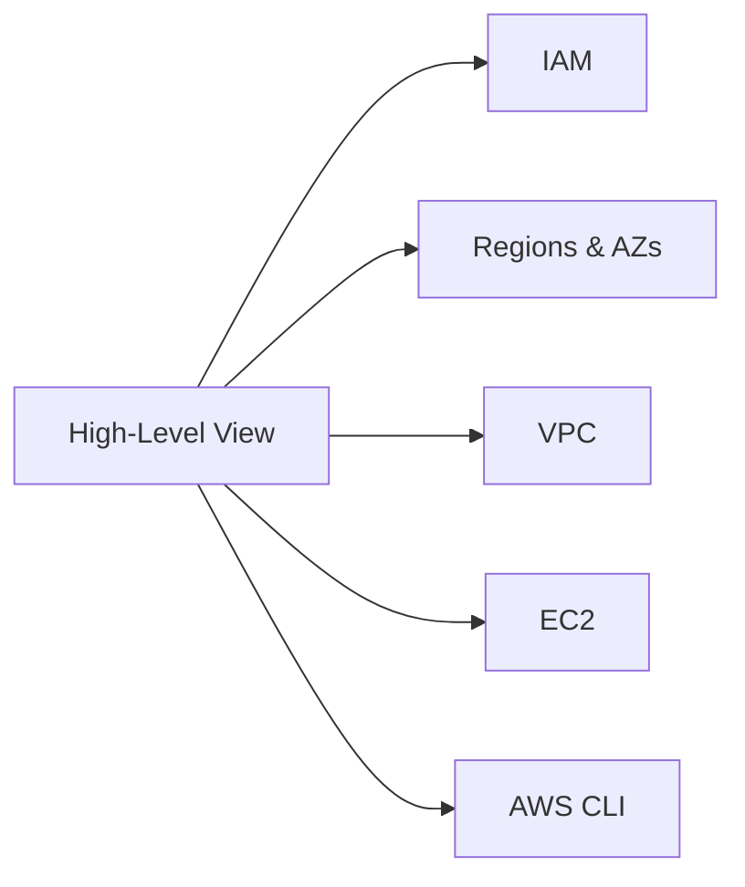

## Introduction to AWS

Amazon Web Services (AWS) is one of the most widely used cloud platforms today. It provides Infrastructure as a Service (IaaS), allowing users to configure their infrastructure at a very granular level, offering more flexibility and power compared to other cloud providers like DigitalOcean. This makes AWS particularly suitable for large enterprises and complex applications, such as those used by Netflix.

### Why AWS?

AWS offers a wide range of services that cater to various aspects of cloud computing, including compute, storage, networking, databases, analytics, machine learning, and more. This comprehensive suite of services enables developers and IT professionals to build, deploy, and manage applications efficiently.

#### Granular Configuration

One of the key advantages of AWS is its ability to configure infrastructure at a very granular level. This means that users can customize almost every aspect of their cloud environment, from the type of virtual machines (VMs) they use to the network topology and security settings. This level of control is crucial for deploying complex applications that require specific configurations.

### Popular AWS Services

Throughout this module, we will explore several key AWS services:

1. **IAM (Identity and Access Management)**
2. **Regions and Availability Zones**
3. **VPC (Virtual Private Cloud)**
4. **EC2 (Elastic Compute Cloud)**
5. **AWS CLI (Command Line Interface)**

We will also cover how to integrate these services into a continuous deployment pipeline using tools like Jenkins.

### High-Level View of AWS Services

Before diving into the details, let's take a high-level view of the AWS services we will be covering:



### IAM (Identity and Access Management)

IAM is a service that helps you securely control access to AWS resources. It allows you to create and manage AWS users and groups, and grant them permissions to perform specific actions.

#### Concepts

- **Users**: Individual accounts that can log in to the AWS Management Console or make API calls.
- **Groups**: Collections of users that share similar permissions.
- **Policies**: Documents that specify permissions for users or groups.

#### Creating Users and Groups

To create a user in IAM, follow these steps:

1. Log in to the AWS Management Console.
2. Navigate to the IAM dashboard.
3. Click on "Users" and then "Add user".
4. Enter the user name and select the type of access (programmatic access or AWS Management Console access).
5. Set permissions by attaching policies to the user.

Here is an example of creating a user via the AWS CLI:

```bash
aws iam create-user --user-name my-user
```

#### Policies

Policies define what actions a user can perform and on which resources. There are two types of policies:

- **Managed Policies**: Predefined policies that can be attached to users, groups, or roles.
- **Inline Policies**: Custom policies that are embedded directly into a user, group, or role.

Example of an inline policy:

```json
{
    "Version": "2012-10-17",
    "Statement": [
        {
            "Effect": "Allow",
            "Action": "s3:*",
            "Resource": "*"
        }
    ]
}
```

This policy allows the user to perform all S3 actions on all S3 resources.

#### How to Prevent / Defend

- **Least Privilege Principle**: Grant users only the permissions they need to perform their tasks.
- **Regular Audits**: Periodically review IAM policies to ensure they are up-to-date and secure.
- **Multi-Factor Authentication (MFA)**: Enable MFA for all IAM users to add an extra layer of security.

### Regions and Availability Zones

AWS is designed to be highly available and fault-tolerant. To achieve this, AWS divides its global infrastructure into regions and availability zones.

#### Regions

A region is a geographical area that contains multiple data centers. Each region is isolated from others to provide redundancy and reduce latency. For example, the `us-east-1` region is located in Northern Virginia.

#### Availability Zones

An availability zone is a physically separate location within a region. Each availability zone has independent power, cooling, and networking. This design ensures that even if one availability zone fails, others remain operational.

#### Example

Consider a scenario where you have a web application deployed across multiple availability zones within a region. If one availability zone experiences an outage, the application can continue to serve traffic from the other availability zones.

### VPC (Virtual Private Cloud)

A VPC is a logically isolated section of the AWS cloud where you can launch AWS resources in a virtual network that you define. This allows you to have complete control over the network environment.

#### Components

- **Subnets**: Segments of the VPC IP address range.
- **Internet Gateway**: A gateway that allows instances in the VPC to communicate with the internet.
- **NAT Gateway**: A gateway that allows instances in a private subnet to access the internet without exposing their IP addresses.

#### Creating a VPC

To create a VPC, follow these steps:

1. Log in to the AWS Management Console.
2. Navigate to the VPC dashboard.
3. Click on "Create VPC".
4. Specify the CIDR block (e.g., `10.0.0.0/16`).
5. Add subnets and configure routing tables.

Here is an example of creating a VPC via the AWS CLI:

```bash
aws ec2 create-vpc --cidr-block 10.0.0.0/16
```

#### How to Prevent / Defend

- **Network Segmentation**: Use subnets to segment your network and limit the spread of attacks.
- **Security Groups**: Use security groups to control inbound and outbound traffic to instances.
- **NACLs (Network Access Control Lists)**: Use NACLs to filter traffic at the subnet level.

### EC2 (Elastic Compute Cloud)

EC2 is a service that provides resizable compute capacity in the cloud. You can launch virtual machines (EC2 instances) to run your applications.

#### Instance Types

EC2 offers various instance types optimized for different use cases, such as general-purpose, compute-optimized, memory-optimized, and GPU-optimized instances.

#### Launching an Instance

To launch an instance, follow these steps:

1. Log in to the AWS Management Console.
2. Navigate to the EC2 dashboard.
3. Click on "Launch Instance".
4. Choose an AMI (Amazon Machine Image).
5. Select an instance type.
6. Configure instance details, such as subnet and security group.
7. Review and launch the instance.

Here is an example of launching an instance via the AWS CLI:

```bash
aws ec2 run-instances --image-id ami-0c94855ba95c71c99 --count 1 --instance-type t2.micro --key-name MyKeyPair --security-group-ids sg-0123456789abcdef0 --subnet-id subnet-0123456789abcdef0
```

#### Running Applications with Docker

Once you have an EC2 instance, you can run your applications using Docker and Docker Compose.

1. Install Docker on the EC2 instance.
2. Create a `Dockerfile` and `docker-compose.yml` files.
3. Build and run your application using Docker Compose.

Example `Dockerfile`:

```Dockerfile
FROM python:3.9-slim
WORKDIR /app
COPY requirements.txt .
RUN pip install -r requirements.txt
COPY . .
CMD ["python", "app.py"]
```

Example `docker-compose.yml`:

```yaml
version: '3'
services:
  web:
    build: .
    ports:
      - "5000:5000"
```

Run the application:

```bash
docker-compose up
```

#### How to Prevent / Defend

- **Security Groups**: Use security groups to restrict inbound and outbound traffic.
- **IAM Roles**: Attach IAM roles to EC2 instances to grant them necessary permissions.
- **Monitoring**: Use CloudWatch to monitor the health and performance of your instances.

### AWS CLI (Command Line Interface)

The AWS CLI is a powerful tool that allows you to interact with AWS services from the command line.

#### Installation

To install the AWS CLI, follow these steps:

1. Download the installation package from the AWS website.
2. Run the installation script.
3. Configure the CLI with your AWS credentials.

Example of installing the AWS CLI on Ubuntu:

```bash
curl "https://awscli.amazonaws.com/awscli-exe-linux-x86_64.zip" -o "awscliv2.zip"
unzip awscliv2.zip
sudo ./aws/install
```

Configure the CLI:

```bash
aws configure
```

Enter your AWS access key ID, secret access key, default region, and output format.

#### Using the AWS CLI

You can use the AWS CLI to perform various operations, such as creating and managing resources, querying information, and automating tasks.

Example of listing all EC2 instances:

```bash
aws ec2 describe-instances
```

#### How to Prevent / Defend

- **Secure Credentials**: Store your AWS credentials securely and rotate them regularly.
- **IAM Policies**: Use IAM policies to restrict the permissions of the CLI user.
- **Logging**: Enable CloudTrail to log all API calls made using the CLI.

### Continuous Deployment with Jenkins

Jenkins is a popular open-source automation server that can be used to automate the deployment process.

#### Setting Up Jenkins

1. Install Jenkins on an EC2 instance.
2. Configure Jenkins to use the AWS CLI.
3. Create a Jenkins job to build and deploy your application.

Example of a Jenkinsfile:

```groovy
pipeline {
    agent any
    stages {
        stage('Build') {
            steps {
                sh 'docker-compose build'
            }
        }
        stage('Deploy') {
            steps {
                sh 'docker-compose up -d'
            }
        }
    }
}
```

#### How to Prevent / Defend

- **Pipeline Security**: Use Jenkins security features to restrict access to the pipeline.
- **Environment Variables**: Store sensitive information, such as AWS credentials, in environment variables.
- **Logging**: Enable logging in Jenkins to track the deployment process.

### Conclusion

By the end of this module, you will have a solid understanding of the key AWS services and how to use them effectively. You will also be able to set up a continuous deployment pipeline using Jenkins and the AWS CLI.

### Practice Labs

For hands-on practice, consider the following labs:

- **PortSwigger Web Security Academy**: Focuses on web application security.
- **OWASP Juice Shop**: A deliberately insecure web application for practicing security skills.
- **DVWA (Damn Vulnerable Web Application)**: Another intentionally vulnerable web application for security training.
- **WebGoat**: An interactive web application security training tool.

These labs will help you apply the concepts learned in this module to real-world scenarios.

---

This expanded chapter covers the essential concepts and practical aspects of AWS services, providing a deep dive into each topic with detailed explanations, real-world examples, and comprehensive code snippets. The inclusion of mermaid diagrams and detailed security practices ensures a thorough understanding of the material.

---
<!-- nav -->
[[DevOps/DevOps Bootcamp/04-Cloud Computing (AWS & DigitalOcean)/01-AWS Services Overview And Hands-On Deployment/00-Overview|Overview]] | [[DevOps/DevOps Bootcamp/04-Cloud Computing (AWS & DigitalOcean)/01-AWS Services Overview And Hands-On Deployment/02-Practice Questions & Answers|Practice Questions & Answers]]
