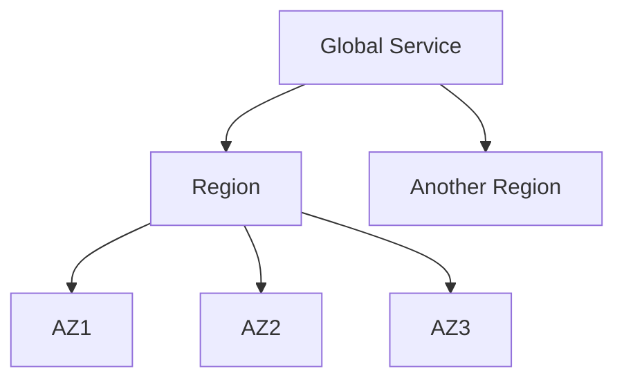

## Introduction to AWS Services and Scopes

In the realm of cloud computing, Amazon Web Services (AWS) stands out as a leader, offering a vast array of services designed to support various aspects of software development and deployment. One of the foundational concepts in AWS is the idea of **scopes** within which services are deployed. This includes **Availability Zones**, **Regions**, and **Global** scopes. Understanding these scopes is crucial for effective resource management, reliability, and security.

### Availability Zones

An **Availability Zone (AZ)** is a distinct location within a Region that is engineered to be isolated from failures in other AZs within the same Region. Each AZ has its own power supply, cooling systems, and networking infrastructure, ensuring high availability and fault tolerance. 

#### Why Availability Zones Matter

Availability Zones are essential because they provide redundancy and resilience. By deploying resources across multiple AZs, you can ensure that your application remains available even if one AZ experiences an outage. This is particularly important for mission-critical applications where downtime can result in significant financial and reputational losses.

#### How Availability Zones Work

When you create an EC2 instance, RDS database, or block storage volume, you typically choose an AZ within a Region. AWS automatically manages the underlying infrastructure to ensure that each AZ is independent and isolated from others. This means that if one AZ fails, the others continue to operate normally.

#### Example: Creating an EC2 Instance in an AZ

Here’s how you might create an EC2 instance in a specific AZ using the AWS Management Console:

1. Log in to the AWS Management Console.
2. Navigate to the EC2 Dashboard.
3. Click on "Instances" and then "Launch Instance."
4. Choose an AMI (Amazon Machine Image) and configure the instance details.
5. In the "Configure Instance Details" section, select the desired AZ from the dropdown menu.

Alternatively, you can use the AWS CLI to launch an EC2 instance in a specific AZ:

```bash
aws ec2 run-instances --image-id ami-0c94855ba95c71c99 --count 1 --instance-type t2.micro --key-name MyKeyPair --security-group-ids sg-0123456789abcdef0 --subnet-id subnet-0123456789abcdef0 --placement '{"AvailabilityZone": "us-west-2a"}'
```

This command specifies the `--placement` option to set the AZ to `us-west-2a`.

### Regions

A **Region** is a geographical area that contains multiple AZs. Each Region is designed to be isolated from other Regions to ensure that failures in one Region do not affect others. Regions are typically named after their geographic location, such as `us-east-1` (US East) or `eu-central-1` (EU Central).

#### Why Regions Matter

Regions are important because they allow you to deploy resources closer to your users, reducing latency and improving performance. Additionally, some compliance requirements may mandate that data be stored within certain geographic boundaries, making the choice of Region critical.

#### How Regions Work

When you create an AWS account, you can choose which Regions to enable. Once enabled, you can deploy resources in any AZ within that Region. AWS provides a wide range of Regions globally, allowing you to choose the one that best meets your needs.

#### Example: Creating an RDS Database in a Region

To create an RDS database in a specific Region, you would first enable the Region in your AWS account. Then, you can use the AWS Management Console or AWS CLI to create the database.

Using the AWS CLI:

```bash
aws rds create-db-instance \
    --db-instance-identifier mydbinstance \
    --engine mysql \
    --master-username admin \
    --master-user-password password \
    --allocated-storage 20 \
    --db-instance-class db.t2.micro \
    --availability-zone us-west-2a \
    --region us-west-2
```

This command creates an RDS MySQL database instance in the `us-west-2` Region, specifically in the `us-west-2a` AZ.

### Global Services

Some AWS services are considered **global**, meaning they are not tied to a specific Region or AZ. Examples include AWS Identity and Access Management (IAM), Route 53 DNS service, and AWS CloudTrail. These services are designed to be accessible from any Region and are often used to manage cross-Region resources.

#### Why Global Services Matter

Global services are essential for managing AWS resources across multiple Regions. For example, IAM allows you to manage user permissions and access controls regardless of where your resources are located. Route 53 enables you to manage DNS records for domains hosted in different Regions.

#### How Global Services Work

Global services operate independently of Regions and AZs. When you interact with a global service, you typically do not need to specify a Region or AZ. Instead, the service is designed to be globally accessible and consistent.

#### Example: Managing IAM Users Globally

To manage IAM users, you can use the AWS Management Console or AWS CLI. Here’s an example of creating an IAM user:

```bash
aws iam create-user --user-name myuser
```

This command creates an IAM user named `myuser`, which can be managed from any Region.

### Diagramming AWS Scopes

To better visualize the relationship between Regions, AZs, and global services, consider the following mermaid diagram:



This diagram shows how a Region contains multiple AZs, and how global services can interact with multiple Regions.

### Common Pitfalls and Best Practices

#### Common Pitfalls

1. **Single AZ Deployment**: Deploying all resources in a single AZ can lead to single points of failure. If that AZ experiences an outage, your entire application could go down.
2. **Incorrect Region Selection**: Choosing the wrong Region can result in higher latency and increased costs due to data transfer fees between Regions.
3. **Ignoring Global Services**: Not utilizing global services like IAM and Route 53 can lead to inconsistent and less secure management of resources across multiple Regions.

#### Best Practices

1. **Multi-AZ Deployment**: Deploy critical resources across multiple AZs to ensure high availability and fault tolerance.
2. **Optimal Region Selection**: Choose Regions based on proximity to your users and compliance requirements.
3. **Use Global Services**: Leverage global services like IAM and Route 53 to manage resources consistently across multiple Regions.

### Real-World Examples

#### Example: High Availability with Multi-AZ Deployment

Consider a scenario where a company deploys a web application across multiple AZs to ensure high availability. If one AZ fails, the application continues to operate from the other AZs.

#### Example: Compliance Requirements

A healthcare company may need to store patient data within a specific geographic region due to regulatory requirements. By choosing the appropriate Region, the company ensures compliance with data sovereignty laws.

### How to Prevent / Defend

#### Detection

1. **Monitoring**: Use AWS CloudWatch to monitor the health and performance of your resources across multiple AZs and Regions.
2. **Logging**: Enable AWS CloudTrail to log API calls and management actions, providing visibility into how your resources are being accessed and modified.

#### Prevention

1. **Multi-AZ Deployment**: Deploy critical resources across multiple AZs to ensure high availability and fault tolerance.
2. **Optimal Region Selection**: Choose Regions based on proximity to your users and compliance requirements.
3. **Use Global Services**: Leverage global services like IAM and Route 53 to manage resources consistently across multiple Regions.

#### Secure-Coding Fixes

1. **IAM Policies**: Ensure IAM policies are correctly configured to restrict access to specific resources and actions.
2. **Security Groups**: Configure security groups to allow traffic only from trusted sources and deny unnecessary inbound and outbound traffic.

#### Configuration Hardening

1. **Enable Encryption**: Enable encryption for data at rest and in transit to protect sensitive information.
2. **Use VPCs**: Deploy resources within Virtual Private Clouds (VPCs) to isolate them from the public internet and control network access.

### Conclusion

Understanding the scopes within which AWS services are deployed—Availability Zones, Regions, and Global services—is fundamental to effective resource management, reliability, and security. By leveraging multi-AZ deployments, optimal Region selection, and global services, you can build robust and compliant cloud environments.

### Practice Labs

For hands-on experience with AWS services and scopes, consider the following labs:

- **PortSwigger Web Security Academy**: Offers practical exercises on securing web applications in AWS.
- **OWASP Juice Shop**: Provides a vulnerable web application to practice securing in an AWS environment.
- **CloudGoat**: A series of labs designed to help you understand and secure AWS services.

By engaging with these labs, you can deepen your understanding of AWS services and scopes and apply the concepts learned in real-world scenarios.

---
<!-- nav -->
[[DevOps/DevOps Bootcamp/04-Cloud Computing (AWS & DigitalOcean)/02-Navigating Essential AWS Services For General Software Development/00-Overview|Overview]] | [[02-Introduction to AWS Services for General Software Development|Introduction to AWS Services for General Software Development]]
