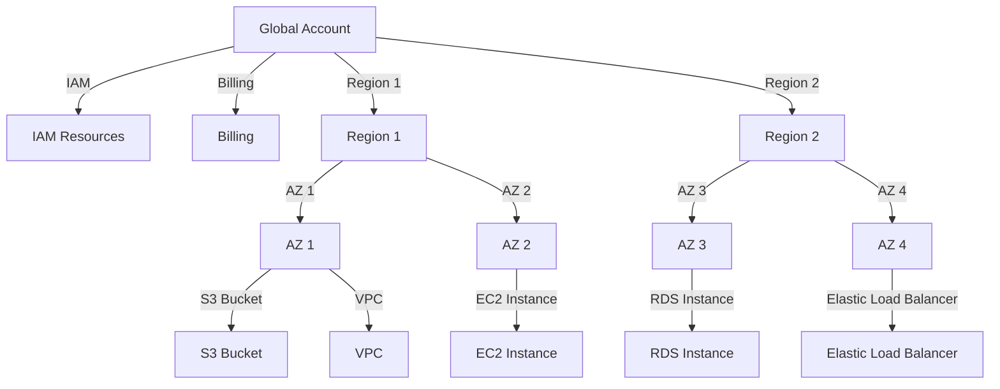

## Introduction to AWS Services for General Software Development

When embarking on a journey to build complex and complete software development and deployment workflows, understanding the essential AWS services is crucial. These services form the backbone of your infrastructure, enabling you to create robust and scalable applications. In this chapter, we will delve deep into the core AWS services needed for general software development, explore their functionalities, and provide practical examples and configurations.

### Understanding AWS Account and Global Scope

When you create an AWS account, you automatically receive a global top-level resource, which is your account itself. This account serves as the primary container for all your AWS resources and services. One of the key aspects of an AWS account is its global scope, which means certain resources and services are applicable across all regions within AWS.

#### IAM Service: Managing Users and Permissions

The Identity and Access Management (IAM) service is one of the most critical components of your AWS account. IAM allows you to manage access to your AWS services and resources securely. Here’s a detailed breakdown of how IAM works:

- **Global Scope**: IAM resources, such as users, groups, roles, and policies, are created at the global scope. This means that once you create a user or role with specific permissions, those permissions are applicable across all regions within your AWS account.

- **User Creation**: To create a user, you can use the AWS Management Console or the AWS CLI. Below is an example using the AWS CLI:

```bash
aws iam create-user --user-name my-user
```

- **Policy Assignment**: After creating a user, you can assign policies to grant specific permissions. Policies define what actions a user can perform on which resources. Here’s an example of creating and attaching a policy:

```bash
# Create a policy
aws iam create-policy --policy-name MyPolicy --policy-document file://my-policy.json

# Attach the policy to a user
aws iam attach-user-policy --user-name my-user --policy-arn arn:aws:iam::123456789012:policy/MyPolicy
```

- **Example Policy Document** (`my-policy.json`):

```json
{
    "Version": "2012-10-17",
    "Statement": [
        {
            "Effect": "Allow",
            "Action": [
                "s3:*"
            ],
            "Resource": "*"
        }
    ]
}
```

- **Secure Coding Practices**: Always ensure that policies are least privilege, meaning they grant only the necessary permissions required for a task. Avoid using wildcard actions or resources unless absolutely necessary.

#### Billing and Cost Management

Another aspect of the global scope is billing. All charges for your AWS usage are aggregated under a single billing account, making it easier to manage costs. AWS provides various tools and services to help you monitor and control your spending, such as Cost Explorer and Budgets.

### Region and Availability Zone Scopes

AWS is designed to be highly available and resilient. To achieve this, AWS divides its infrastructure into regions and availability zones (AZs).

#### Regions

A region is a geographical location where AWS has multiple data centers. Each region is independent and isolated from other regions, providing redundancy and fault tolerance. When you create resources in a specific region, they remain within that region unless explicitly moved.

- **Creating Resources in a Region**: Many AWS services allow you to specify the region when creating resources. For example, when creating an S3 bucket, you can specify the region:

```bash
aws s3api create-bucket --bucket my-bucket --region us-west-2
```

- **Regional Services**: Some services, like Amazon S3 and Amazon VPC, are created per region. This means that if you want to use these services in multiple regions, you need to create separate instances in each region.

#### Availability Zones

Within each region, AWS has multiple availability zones. An AZ is a distinct location within a region that is engineered to be isolated from failures in other AZs. This isolation ensures high availability and fault tolerance.

- **Creating Resources in an AZ**: When creating EC2 instances or other resources that require specific AZs, you can specify the AZ:

```bash
aws ec2 run-instances --image-id ami-0abcdef1234567890 --count 1 --instance-type t2.micro --key-name MyKeyPair --subnet-id subnet-0123456789abcdef0 --security-group-ids sg-0123456789abcdef0
```

- **Multi-AZ Deployments**: For high availability, it’s recommended to deploy resources across multiple AZs within a region. This can be achieved using services like Elastic Load Balancing (ELB) and Auto Scaling Groups (ASG).

### Example: Creating an S3 Bucket and VPC

Let’s walk through an example of creating an S3 bucket and a VPC in a specific region.

#### Creating an S3 Bucket

1. **Create the S3 Bucket**:

```bash
aws s3api create-bucket --bucket my-bucket --region us-west-2
```

2. **Verify the Bucket Creation**:

```bash
aws s3 ls my-bucket
```

#### Creating a VPC

1. **Create the VPC**:

```bash
aws ec2 create-vpc --cidr-block 10.0.0.0/16 --region us-west-2
```

2. **Verify the VPC Creation**:

```bash
aws ec2 describe-vpcs --filters Name=isDefault,Values=false
```

### Diagrams and Topologies

To better understand the relationship between regions, AZs, and global resources, let’s visualize it using a Mermaid diagram.



### Common Pitfalls and How to Prevent Them

#### Over-provisioning Resources

One common pitfall is over-provisioning resources, leading to unnecessary costs. To prevent this:

- **Use Cost Explorer**: Regularly review your spending using Cost Explorer to identify and optimize unused resources.
- **Implement Budgets**: Set up budgets to alert you when you exceed certain thresholds.

#### Insecure IAM Policies

Insecure IAM policies can lead to unauthorized access and potential breaches. To prevent this:

- **Least Privilege Principle**: Ensure that IAM policies grant only the minimum permissions required for a task.
- **Regular Audits**: Conduct regular audits of IAM policies to identify and correct overly permissive policies.

### Real-World Examples and Breaches

#### Example: AWS S3 Bucket Exposure

In 2019, a major breach occurred due to misconfigured S3 buckets. A company accidentally exposed sensitive data due to incorrect IAM policies and bucket settings.

- **Detection**: Use AWS Trusted Advisor and Security Hub to detect misconfigured S3 buckets.
- **Prevention**: Ensure S3 buckets are configured with proper encryption and access controls. Use bucket policies to restrict access to specific IP addresses or IAM roles.

### Conclusion

Understanding the core AWS services and their scopes is fundamental to building robust and scalable software development workflows. By leveraging IAM for identity management, creating resources in appropriate regions and AZs, and following secure coding practices, you can ensure a secure and efficient AWS environment.

### Practice Labs

For hands-on experience with AWS services, consider the following labs:

- **PortSwigger Web Security Academy**: Focuses on web application security but includes modules on AWS security.
- **CloudGoat**: Provides a series of challenges to learn about securing AWS environments.
- **AWS Official Workshops**: Offers guided tutorials and labs to practice setting up and managing AWS services.

By combining theoretical knowledge with practical experience, you can master the essential AWS services for general software development.

---
<!-- nav -->
[[01-Introduction to AWS Services and Scopes|Introduction to AWS Services and Scopes]] | [[DevOps/DevOps Bootcamp/04-Cloud Computing (AWS & DigitalOcean)/02-Navigating Essential AWS Services For General Software Development/00-Overview|Overview]] | [[03-Introduction to Amazon Web Services (AWS)|Introduction to Amazon Web Services (AWS)]]
