## Introduction to Amazon Web Services (AWS)

Amazon Web Services (AWS) is a comprehensive and broadly adopted cloud platform provided by Amazon. It offers over 200 fully featured services from data centers globally, making it a powerful tool for developers, businesses, and organizations to build, deploy, and manage applications and infrastructure. AWS provides a wide range of services categorized into various domains such as compute, storage, databases, networking, analytics, machine learning, and more. Understanding these services and their categorization is crucial for leveraging AWS effectively in your software development projects.

### Understanding the AWS Service Catalog

The AWS service catalog is vast and can be overwhelming at first glance. However, it is organized into several categories to help users find the services they need based on their specific use cases. These categories include:

- **Compute**: Services that provide computing resources, such as EC2 (Elastic Compute Cloud).
- **Storage**: Services for storing data, such as S3 (Simple Storage Service).
- **Databases**: Managed database services, such as RDS (Relational Database Service) and DynamoDB.
- **Networking & Content Delivery**: Services for managing network infrastructure and delivering content, such as VPC (Virtual Private Cloud) and CloudFront.
- **Security, Identity & Compliance**: Services for securing and managing access to resources, such as IAM (Identity and Access Management) and KMS (Key Management Service).
- **Management Tools**: Services for monitoring and managing AWS resources, such as CloudWatch and CloudFormation.
- **Developer Tools**: Tools for software development, such as CodeCommit, CodeBuild, and CodeDeploy.
- **Machine Learning**: Services for building and deploying machine learning models, such as SageMaker.
- **AR & VR**: Services for augmented reality and virtual reality applications, such as Sumerian.
- **Blockchain**: Services for building blockchain applications, such as Managed Blockchain.
- **Internet of Things (IoT)**: Services for connecting and managing IoT devices, such as IoT Core.
- **Media Services**: Services for processing and delivering media content, such as MediaConvert and Elemental MediaLive.
- **Game Development**: Services for building and deploying games, such as GameLift.

### Key Concepts in AWS Services

#### Compute Services

**EC2 (Elastic Compute Cloud)** is one of the most fundamental compute services offered by AWS. It allows you to launch and run virtual servers in the cloud. EC2 instances can be used for a variety of tasks, including web servers, application servers, and database servers.

##### How EC2 Works

EC2 instances are launched from AMIs (Amazon Machine Images), which are pre-configured templates that contain the information required to launch an instance, including the operating system, applications, and associated settings. You can choose from a variety of AMIs provided by AWS or create your own custom AMI.

When you launch an EC2 instance, you specify the instance type, which determines the hardware configuration of the instance, such as the number of vCPUs and memory. You can also configure the storage options, including the root volume and additional EBS (Elastic Block Store) volumes.

##### Example: Launching an EC2 Instance

To launch an EC2 instance, you can use the AWS Management Console or the AWS CLI (Command Line Interface). Here is an example using the AWS CLI:

```bash
aws ec2 run-instances --image-id ami-0c94855ba95c71c99 --count 1 --instance-type t2.micro --key-name MyKeyPair --security-group-ids sg-0123456789abcdef0 --subnet-id subnet-0123456789abcdef0
```

This command launches a single `t2.micro` instance using the specified AMI, key pair, security group, and subnet.

##### Security Considerations

When launching an EC2 instance, it is essential to consider security best practices. This includes:

- Using IAM roles to grant permissions to the instance.
- Configuring security groups to control inbound and outbound traffic.
- Enabling encryption for EBS volumes.
- Regularly updating the operating system and applications running on the instance.

##### How to Prevent / Defend

**Detection**:
- Use AWS CloudTrail to log API calls made to EC2 and other AWS services.
- Monitor security group rules and network traffic using AWS VPC Flow Logs.

**Prevention**:
- Use IAM roles with least privilege access.
- Enable encryption for EBS volumes.
- Regularly update the operating system and applications.

**Secure-Coding Fixes**:
- Ensure that the instance is configured with the latest security patches.
- Use IAM roles instead of hard-coded credentials.

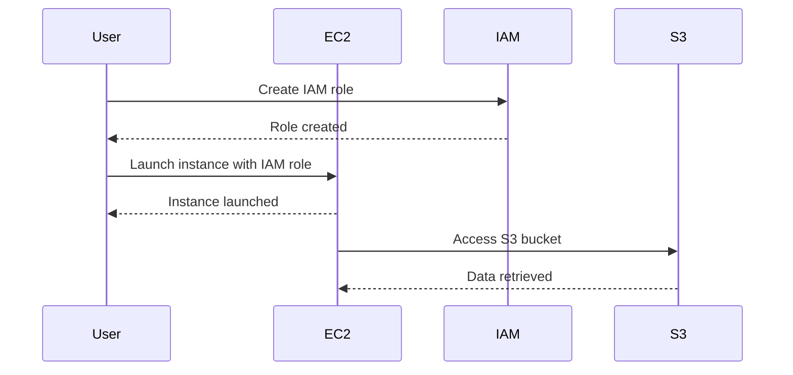

### Storage Services

**S3 (Simple Storage Service)** is a highly scalable, durable, and cost-effective object storage service. It is designed to store and retrieve any amount of data from anywhere on the web. S3 is widely used for storing static website content, backup and restore operations, data archiving, and more.

##### How S3 Works

S3 stores data as objects within buckets. Each object consists of the data itself, metadata, and a unique key. Buckets are containers for objects and can be configured with various access controls, lifecycle policies, and encryption settings.

##### Example: Creating and Managing an S3 Bucket

To create an S3 bucket, you can use the AWS Management Console or the AWS CLI. Here is an example using the AWS CLI:

```bash
aws s3api create-bucket --bucket my-bucket --region us-west-2 --create-bucket-configuration LocationConstraint=us-west-2
```

This command creates an S3 bucket named `my-bucket` in the `us-west-2` region.

##### Security Considerations

When creating and managing S3 buckets, it is essential to consider security best practices. This includes:

- Configuring bucket policies to control access.
- Enabling server-side encryption for data at rest.
- Using IAM roles to grant permissions to the bucket.
- Regularly auditing bucket access logs.

##### How to Prevent / Defend

**Detection**:
- Use AWS CloudTrail to log API calls made to S3.
- Monitor bucket access logs using AWS CloudWatch.

**Prevention**:
- Configure bucket policies with least privilege access.
- Enable server-side encryption for data at rest.
- Use IAM roles to grant permissions to the bucket.

**Secure-Coding Fixes**:
- Ensure that the bucket is configured with the latest security settings.
- Use IAM roles instead of hard-coded credentials.

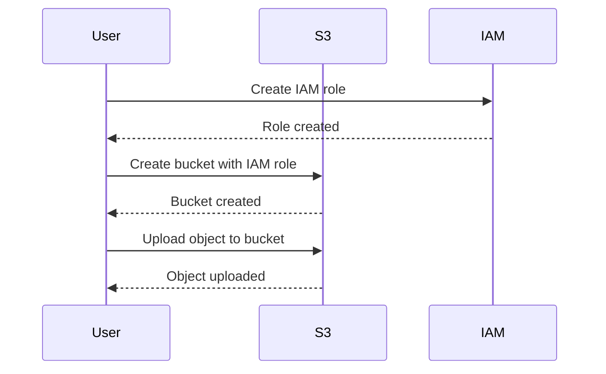

### Databases

**RDS (Relational Database Service)** is a managed database service that makes it easy to set up, operate, and scale relational databases in the cloud. RDS supports popular database engines such as MySQL, PostgreSQL, Oracle, SQL Server, and MariaDB.

##### How RDS Works

RDS manages the underlying infrastructure, including provisioning, patching, backups, and replication. You can choose from various instance types and storage options to meet your performance and capacity requirements.

##### Example: Creating an RDS Instance

To create an RDS instance, you can use the AWS Management Console or the AWS CLI. Here is an example using the AWS CLI:

```bash
aws rds create-db-instance --db-instance-identifier mydbinstance --engine mysql --allocated-storage 20 --db-instance-class db.t2.micro --master-username admin --master-user-password password
```

This command creates an RDS instance running MySQL with 20 GB of storage and a `db.t2.micro` instance class.

##### Security Considerations

When creating and managing RDS instances, it is essential to consider security best practices. This includes:

- Configuring security groups to control inbound and outbound traffic.
- Enabling encryption for data at rest.
- Using IAM roles to grant permissions to the database.
- Regularly updating the database engine and applying security patches.

##### How to Prevent / Defend

**Detection**:
- Use AWS CloudTrail to log API calls made to RDS.
- Monitor database activity using AWS CloudWatch.

**Prevention**:
- Configure security groups with least privilege access.
- Enable encryption for data at rest.
- Use IAM roles to grant permissions to the database.

**Secure-Coding Fixes**:
- Ensure that the database is configured with the latest security settings.
- Use IAM roles instead of hard-coded credentials.

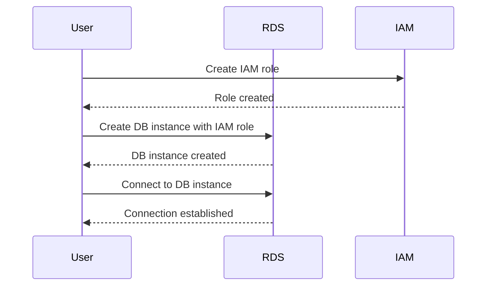

### Networking & Content Delivery

**VPC (Virtual Private Cloud)** is a service that enables you to launch AWS resources in a virtual network that you define. A VPC allows you to have complete control over the IP address range, subnets, routing tables, gateways, and security settings.

##### How VPC Works

A VPC is a logically isolated section of the AWS cloud where you can launch resources. You can create subnets within the VPC to segment the network and control access to resources. You can also configure routing tables, internet gateways, and NAT gateways to manage network traffic.

##### Example: Creating a VPC

To create a VPC, you can use the AWS Management Console or the AWS CLI. Here is an example using the AWS CLI:

```bash
aws ec2 create-vpc --cidr-block 10.0.0.0/16
```

This command creates a VPC with the CIDR block `10.0.0.0/16`.

##### Security Considerations

When creating and managing VPCs, it is essential to consider security best practices. This includes:

- Configuring security groups to control inbound and outbound traffic.
- Enabling encryption for data in transit.
- Using IAM roles to grant permissions to the VPC.
- Regularly auditing VPC access logs.

##### How to Prevent / Defend

**Detection**:
- Use AWS CloudTrail to log API calls made to VPC.
- Monitor VPC access logs using AWS CloudWatch.

**Prevention**:
- Configure security groups with least privilege access.
- Enable encryption for data in transit.
- Use IAM roles to grant permissions to the VPC.

**Secure-Coding Fixes**:
- Ensure that the VPC is configured with the latest security settings.
- Use IAM roles instead of hard-coded credentials.

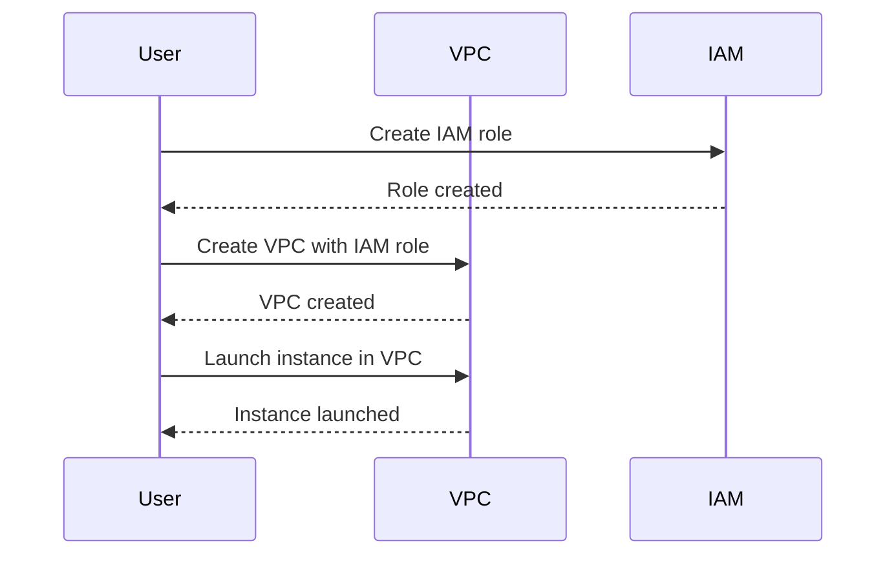

### Security, Identity & Compliance

**IAM (Identity and Access Management)** is a service that helps you securely control access to AWS resources. IAM allows you to create and manage AWS users, groups, and permissions.

##### How IAM Works

IAM enables you to define fine-grained permissions for users and groups, ensuring that they have only the access they need to perform their jobs. You can also use IAM roles to grant temporary permissions to resources.

##### Example: Creating an IAM User

To create an IAM user, you can use the AWS Management Console or the AWS CLI. Here is an example using the AWS CLI:

```bash
aws iam create-user --user-name myuser
```

This command creates an IAM user named `myuser`.

##### Security Considerations

When creating and managing IAM users, it is essential to consider security best practices. This includes:

- Using multi-factor authentication (MFA) for IAM users.
- Configuring IAM policies with least privilege access.
- Regularly auditing IAM access logs.

##### How to Prevent / Defend

**Detection**:
- Use AWS CloudTrail to log API calls made to IAM.
- Monitor IAM access logs using AWS CloudWatch.

**Prevention**:
- Use multi-factor authentication (MFA) for IAM users.
- Configure IAM policies with least privilege access.

**Secure-Coding Fixes**:
- Ensure that IAM users are configured with the latest security settings.
- Use IAM roles instead of hard-coded credentials.

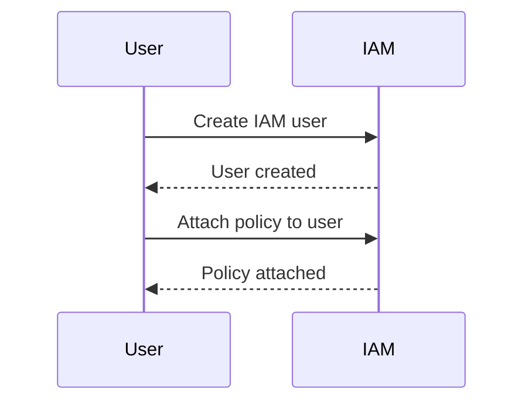

### Management Tools

**CloudWatch** is a monitoring and observability service that provides visibility into your AWS resources and applications. CloudWatch collects and tracks metrics, collects and monitors log files, and responds to changes in your AWS resources.

##### How CloudWatch Works

CloudWatch allows you to monitor the performance and health of your AWS resources, including EC2 instances, RDS databases, and S3 buckets. You can set up alarms to notify you when certain conditions are met, and you can use CloudWatch Logs to collect and analyze log data.

##### Example: Setting Up a CloudWatch Alarm

To set up a CloudWatch alarm, you can use the AWS Management Console or the AWS CLI. Here is an example using the AWS CLI:

```bash
aws cloudwatch put-metric-alarm --alarm-name HighCPUAlarm --metric-name CPUUtilization --namespace AWS/EC2 --statistic Average --period 300 --threshold 80 --comparison-operator GreaterThanThreshold --dimensions Name=InstanceId,Value=i-0123456789abcdef0 --evaluation-periods 1 --alarm-actions arn:aws:sns:us-west-2:123456789012:MyTopic
```

This command sets up an alarm that triggers when the average CPU utilization of an EC2 instance exceeds 80% for 5 minutes.

##### Security Considerations

When setting up and managing CloudWatch alarms, it is essential to consider security best practices. This includes:

- Configuring IAM policies to control access to CloudWatch.
- Enabling encryption for log data.
- Regularly auditing CloudWatch access logs.

##### How to Prevent / Defend

**Detection**:
- Use AWS CloudTrail to log API calls made to CloudWatch.
- Monitor CloudWatch access logs using AWS CloudWatch.

**Prevention**:
- Configure IAM policies with least privilege access.
- Enable encryption for log data.

**Secure-Coding Fixes**:
- Ensure that CloudWatch is configured with the latest security settings.
- Use IAM roles instead of hard-coded credentials.

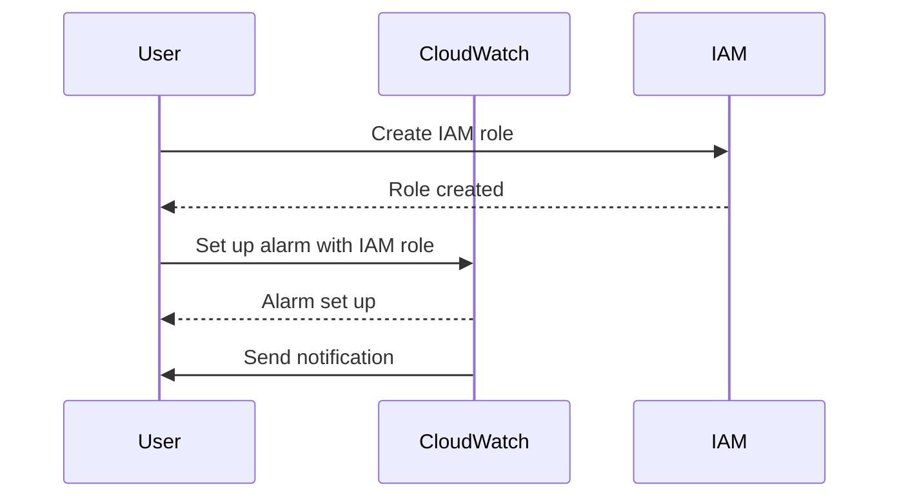

### Developer Tools

**CodeCommit** is a fully managed source control service that hosts private Git repositories. CodeCommit allows you to store and manage your code in the cloud, and it integrates seamlessly with other AWS services.

##### How CodeCommit Works

CodeCommit provides a secure and scalable environment for storing and managing your code. You can use CodeCommit with Git clients and tools, and you can integrate it with other AWS services such as CodePipeline and CodeBuild.

##### Example: Creating a CodeCommit Repository

To create a CodeCommit repository, you can use the AWS Management Console or the AWS CLI. Here is an example using the AWS CLI:

```bash
aws codecommit create-repository --repository-name myrepo
```

This command creates a CodeCommit repository named `myrepo`.

##### Security Considerations

When creating and managing CodeCommit repositories, it is essential to consider security best practices. This includes:

- Configuring IAM policies to control access to CodeCommit.
- Enabling encryption for repository data.
- Regularly auditing CodeCommit access logs.

##### How to Prevent / Defend

**Detection**:
- Use AWS CloudTrail to log API calls made to CodeCommit.
- Monitor CodeCommit access logs using AWS CloudWatch.

**Prevention**:
- Configure IAM policies with least privilege access.
- Enable encryption for repository data.

**Secure-Coding Fixes**:
- Ensure that CodeCommit is configured with the latest security settings.
- Use IAM roles instead of hard-coded credentials.

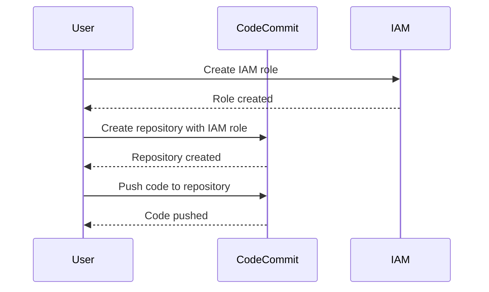

### Machine Learning

**SageMaker** is a fully managed service that provides developers and data scientists with the ability to build, train, and deploy machine learning models quickly and easily.

##### How SageMaker Works

SageMaker provides a complete development environment for the entire machine learning workflow, from data labeling and preprocessing to model training and deployment. You can use SageMaker with popular deep learning frameworks such as TensorFlow, PyTorch, and MXNet.

##### Example: Training a Model with SageMaker

To train a model with SageMaker, you can use the AWS Management Console or the AWS SDK. Here is an example using the AWS SDK for Python (Boto3):

```python
import boto3

# Initialize SageMaker client
sm = boto3.client('sagemaker')

# Define training job parameters
job_name = 'my-training-job'
role_arn = 'arn:aws:iam::123456789012:role/SageMakerRole'
input_data_config = [
    {
        'DataSource': {
            'S3DataSource': {
                'S3DataType': 'S3Prefix',
                'S3Uri': 's3://my-bucket/data/',
                'S3DataDistributionType': 'FullyReplicated'
            }
        },
        'TargetAttributeName': 'label'
    }
]
output_data_config = {
    'S3OutputPath': 's3://my-bucket/output/'
}
resource_config = {
    'InstanceCount': 1,
    'InstanceType': 'ml.m4.xlarge',
    'VolumeSizeInGB': 30
}
algorithm_specification = {
    'TrainingImage': '123456789012.dkr.ecr.us-west-2.amazonaws.com/my-algorithm:latest',
    'TrainingInputMode': 'File'
}

# Create training job
response = sm.create_training_job(
    TrainingJobName=job_name,
    RoleArn=role_arn,
    InputDataConfig=input_data_config,
    OutputDataConfig=output_data_config,
    ResourceConfig=resource_config,
    AlgorithmSpecification=algorithm_specification
)
```

This code creates a training job with SageMaker using the specified parameters.

##### Security Considerations

When training and deploying machine learning models with SageMaker, it is essential to consider security best practices. This includes:

- Configuring IAM policies to control access to SageMaker.
- Enabling encryption for model data.
- Regularly auditing SageMaker access logs.

##### How to Prevent / Defend

**Detection**:
- Use AWS CloudTrail to log API calls made to SageMaker.
- Monitor SageMaker access logs using AWS CloudWatch.

**Prevention**:
- Configure IAM policies with least privilege access.
- Enable encryption for model data.

**Secure-Coding Fixes**:
- Ensure that SageMaker is configured with the latest security settings.
- Use IAM roles instead of hard-coded credentials.

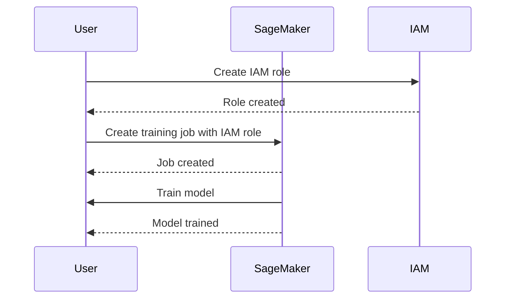

### AR & VR

**Sumerian** is a service that allows you to create immersive 3D experiences for the web, mobile devices, and virtual reality headsets. Sumerian provides a visual editor and a set of pre-built components to help you build interactive scenes and characters.

##### How Sumerian Works

Sumerian allows you to create 3D scenes and characters using a visual editor, and you can add interactivity using scripts written in JavaScript. You can publish your scenes to the web or to virtual reality platforms such as Oculus and HTC Vive.

##### Example: Creating a Scene with Sumerian

To create a scene with Sumerian, you can use the Sumerian editor in the AWS Management Console. Here is an example of creating a simple scene:

1. Open the Sumerian editor.
2. Create a new scene.
3. Add a 3D model to the scene.
4. Add a camera to the scene.
5. Add a script to the scene to control the camera.

##### Security Considerations

When creating and publishing scenes with Sumerian, it is essential to consider security best practices. This includes:

- Configuring IAM policies to control access to Sumerian.
- Enabling encryption for scene data.
- Regularly auditing Sumerian access logs.

##### How to Prevent / Defend

**Detection**:
- Use AWS CloudTrail to log API calls made to Sumerian.
- Monitor Sumerian access logs using AWS CloudWatch.

**Prevention**:
- Configure IAM policies with least privilege access.
- Enable encryption for scene data.

**Secure-Coding Fixes**:
- Ensure that Sumerian is configured with the latest security settings.
- Use IAM roles instead of hard-coded credentials.

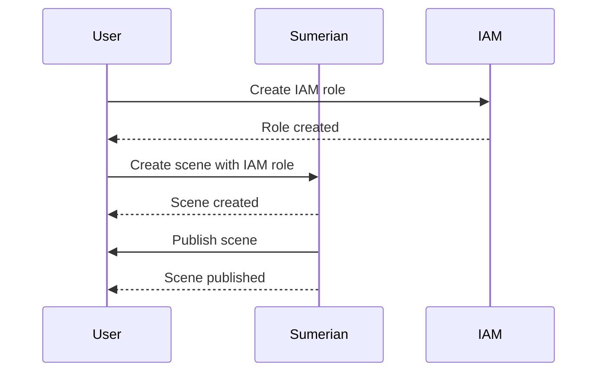

### Blockchain

**Managed Blockchain** is a service that makes it easy to create and manage scalable blockchain networks using open-source frameworks such as Ethereum and Hyperledger Fabric.

##### How Managed Blockchain Works

Managed Blockchain allows you to create and manage blockchain networks without having to worry about the underlying infrastructure. You can choose from various node types and configurations to meet your performance and capacity requirements.

##### Example: Creating a Blockchain Network

To create a blockchain network with Managed Blockchain, you can use the AWS Management Console or the AWS CLI. Here is an example using the AWS CLI:

```bash
aws managedblockchain create-network --network-specification '{"Name": "my-network", "Framework": "HYPERLEDGER_FABRIC", "FrameworkVersion": "1.4", "FrameworkConfiguration": {"Fabric": {"Edition": "STANDARD"}}}' --voting-policy '{"ApprovalThresholdPolicy": {"ThresholdPercentage": 50}}' --member-configuration '{"InvitationMetadata": {"Message": "Join my network"}, "MemberConfiguration": {"Name": "my-member", "FrameworkConfiguration": {"Fabric": {"AdminUsername": "admin", "AdminPassword": "password"}}}}'
```

This command creates a blockchain network using the Hyperledger Fabric framework.

##### Security Considerations

When creating and managing blockchain networks with Managed Blockchain, it is essential to consider security best practices. This includes:

- Configuring IAM policies to control access to Managed Blockchain.
- Enabling encryption for blockchain data.
- Regularly auditing Managed Blockchain access logs.

##### How to Prevent / Defend

**Detection**:
- Use AWS CloudTrail to log API calls made to Managed Blockchain.
- Monitor Managed Blockchain access logs using AWS CloudWatch.

**Prevention**:
- Configure IAM policies with least privilege access.
- Enable encryption for blockchain data.

**Secure-Coding Fixes**:
- Ensure that Managed Blockchain is configured with the latest security settings.
- Use IAM roles instead of hard-coded credentials.

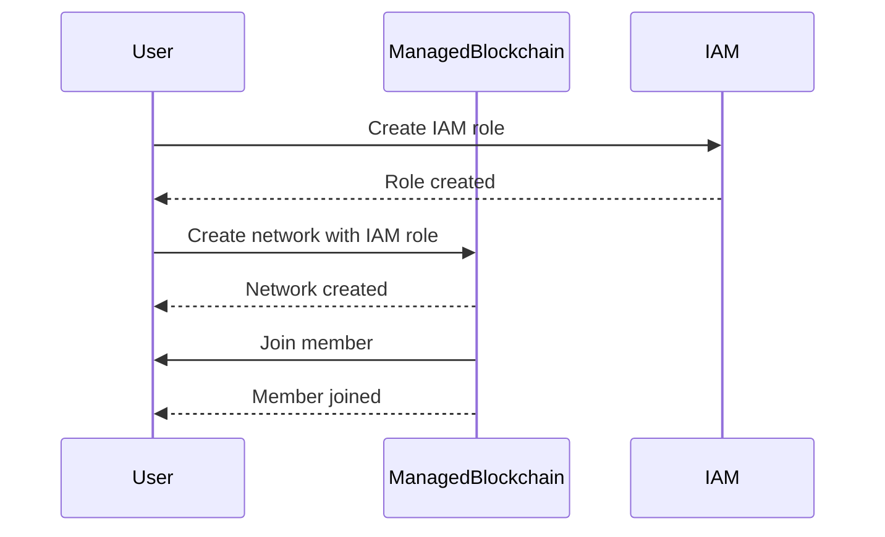

### Internet of Things (IoT)

**IoT Core** is a service that allows you to securely connect, manage, and ingest data from millions of IoT devices. IoT Core provides a reliable and scalable infrastructure for building IoT applications.

##### How IoT Core Works

IoT Core allows you to connect and manage IoT devices using MQTT, HTTP, and WebSocket protocols. You can use IoT Core to ingest data from devices, process the data using AWS Lambda functions, and store the data in AWS services such as S3 and DynamoDB.

##### Example: Connecting a Device to IoT Core

To connect a device to IoT Core, you can use the AWS IoT Device SDK. Here is an example of connecting a device using the AWS IoT Device SDK for Python:

```python
from AWSIoTPythonSDK.MQTTLib import AWSIoTMQTTClient

# Initialize MQTT client
client = AWSIoTMQTTClient("my-device")
client.configureEndpoint("your-endpoint.iot.region.amazonaws.com", 8883)
client.configureCredentials("root-ca.pem", "private.pem.key", "certificate.pem.crt")

# Connect to IoT Core
client.connect()

# Publish a message
client.publish("my-topic", "Hello, IoT Core!", 0)

# Disconnect from IoT Core
client.disconnect()
```

This code connects a device to IoT Core and publishes a message to a topic.

##### Security Considerations

When connecting and managing devices with IoT Core, it is essential to consider security best practices. This includes:

- Configuring IAM policies to control access to IoT Core.
- Enabling encryption for device data.
- Regularly auditing IoT Core access logs.

##### How to Prevent / Defend

**Detection**:
- Use AWS CloudTrail to log API calls made to IoT Core.
- Monitor IoT Core access logs using AWS CloudWatch.

**Prevention**:
- Configure IAM policies with least privilege access.
- Enable encryption for device data.

**Secure-Coding Fixes**:
- Ensure that IoT Core is configured with the latest security settings.
- Use IAM roles instead of hard-coded credentials.

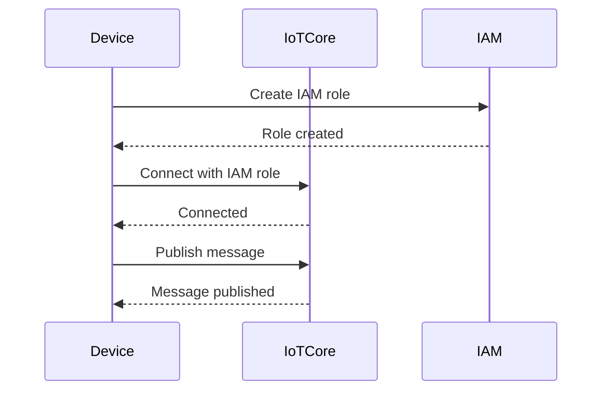

### Media Services

**MediaConvert** is a service that allows you to convert video and audio into popular output formats and resolutions. MediaConvert provides a reliable and scalable infrastructure for transcoding media content.

##### How MediaConvert Works

MediaConvert allows you to transcode media content using a simple and intuitive interface. You can choose from various input and output formats, and you can customize the transcoding settings to meet your requirements.

##### Example: Transcoding a Video with MediaConvert

To transcode a video with MediaConvert, you can use the AWS Management Console or the AWS CLI. Here is an example using the AWS CLI:

```bash
aws mediaconvert create-job --role arn:aws:iam::123456789012:role/MediaConvertRole --settings '{"Inputs": [{"FileInput": "s3://my-bucket/input.mp4"}], "OutputGroups": [{"Name": "File Group", "Outputs": [{"ContainerSettings": {"Container": "MP4"}, "VideoDescription": {"CodecSettings": {"Codec": "H_264", "H264Settings": {"RateControlMode": "CBR", "Bitrate": 5000000, "MaxBitrate": 5000000, "MinBitrate": 5000000, "NumRefFrames": 3, "FramerateControl": "SPECIFIED", "FramerateNumerator": 30, "FramerateDenominator": 1, "GopSize": 90, "GopSizeUnits": "FRAMES", "ParControl": "SPECIFIED", "ParNumerator": 16, "ParDenominator": 9}}, "Width": 1920, "Height": 1080}, "AudioDescriptions": [{"CodecSettings": {"Codec": "AAC", "AacSettings": {"Bitrate": 128000, "CodingMode": "CODING_MODE_2_0", "SampleRate": 48000}}}]}, {"ContainerSettings": {"Container": "MP4"}, "VideoDescription": {"CodecSettings": {"Codec": "H_264", "H264Settings": {"RateControlMode": "CBR", "Bitrate": 2000000, "MaxBitrate": 2000000, "MinBitrate": 2000000, "NumRefFrames": 3, "FramerateControl": "SPECIFIED", "FramerateNumerator": 30, "FramerateDenominator": 1, "GopSize": 90, "GopSizeUnits": "FRAMES", "ParControl": "SPECIFIED", "ParNumerator": 16, "ParDenominator": 9}}, "Width": 1280, "Height": 720}, "AudioDescriptions": [{"CodecSettings": {"Codec": "AAC", "AacSettings": {"Bitrate": 128000, "CodingMode": "CODING_MODE_2_0", "SampleRate": 48000}}}]}, {"ContainerSettings": {"Container": "MP4"}, "VideoDescription": {"CodecSettings": {"Codec": "H_264", "H264Settings": {"RateControlMode": "CBR", "Bitrate": 1000000, "MaxBitrate": 1000000, "MinBitrate": 1000000, "NumRefFrames": 3, "FramerateControl": "SPECIFIED", "FramerateNumerator": 30, "FramerateDenominator": 1, "GopSize": 90, "GopSizeUnits": "FRAMES", "ParControl": "SPECIFIED", "ParNumerator": 16, "ParDenominator": 9}}, "Width": 640, "Height": 360}, "AudioDescriptions": [{"CodecSettings": {"Codec": "AAC", "AacSettings": {"Bitrate": 128000, "CodingMode": "CODING_MODE_2_0", "SampleRate": 48000}}}]}}]}'
```

This command creates a job to transcode a video from an S3 bucket.

##### Security Considerations

When transcoding media content with MediaConvert, it is essential to consider security best practices. This includes:

- Configuring IAM policies to control access to MediaConvert.
- Enabling encryption for media data.
- Regularly auditing MediaConvert access logs.

##### How to Prevent / Defend

**Detection**:
- Use AWS CloudTrail to log API calls made to MediaConvert.
- Monitor MediaConvert access logs using AWS CloudWatch.

**Prevention**:
- Configure IAM policies with least privilege access.
- Enable encryption for media data.

**Secure-Coding Fixes**:
- Ensure that MediaConvert is configured with the latest security settings.
- Use IAM roles instead of hard-coded credentials.

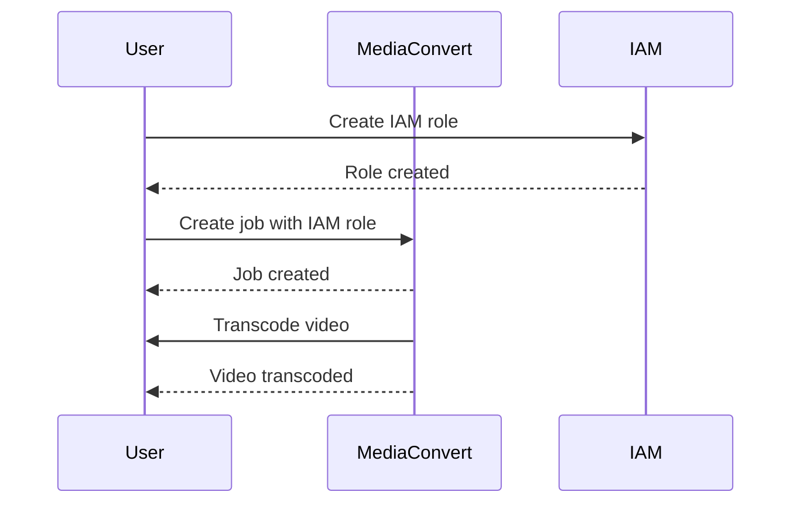

### Game Development

**GameLift** is a service that allows you to deploy, manage, and scale dedicated game servers in the cloud. GameLift provides a reliable and scalable infrastructure for building multiplayer games.

##### How GameLift Works

GameLift allows you to deploy and manage game servers using a simple and intuitive interface. You can choose from various game server images and configurations, and you can customize the scaling settings to meet your requirements.

##### Example: Deploying a Game Server with GameLift

To deploy a game server with GameLift, you can use the AWS Management Console or the AWS CLI. Here is an example using the AWS CLI:

```bash
aws gamelift create-game-session --game-session-name my-game-session --maximum-player-capacity 10 --fleet-id fleet-0123456789abcdef0
```

This command creates a game session with a maximum player capacity of 10 on the specified fleet.

##### Security Considerations

When deploying and managing game servers with GameLift, it is essential to consider security best practices. This includes:

- Configuring IAM policies to control access to GameLift.
- Enabling encryption for game data.
- Regularly auditing GameLift access logs.

##### How to Prevent / Defend

**Detection**:
- Use AWS CloudTrail to log API calls made to GameLift.
- Monitor GameLift access logs using AWS CloudWatch.

**Prevention**:
- Configure IAM policies with least privilege access.
- Enable encryption for game data.

**Secure-Coding Fixes**:
- Ensure that GameLift is configured with the latest security settings.
- Use IAM roles instead of hard-coded credentials.

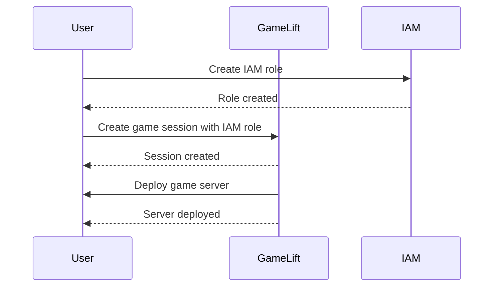

### Conclusion

Understanding and leveraging the essential AWS services for general software development is crucial for building, deploying, and managing applications in the cloud. By focusing on the core services such as EC2, S3, RDS, VPC, IAM, CloudWatch, CodeCommit, SageMaker, Sumerian, Managed Blockchain, IoT Core, MediaConvert, and GameLift, you can effectively utilize AWS to meet your specific use cases and requirements.

Remember to follow security best practices and regularly audit your AWS resources to ensure the security and integrity of your applications. With the right knowledge and tools, you can harness the power of AWS to build robust and scalable applications in the cloud.

### Practice Labs

For hands-on experience with AWS services, consider the following practice labs:

- **PortSwigger Web Security Academy**: Focuses on web application security but also covers AWS services used in web applications.
- **OWASP Juice Shop**: A deliberately insecure web application for practicing web security skills, which can be deployed on AWS.
- **DVWA (Damn Vulnerable Web Application)**: Another web application for practicing web security skills, which can be deployed on AWS.
- **WebGoat**: An interactive web application security training tool that can be deployed on AWS.
- **CloudGoat**: A set of labs for practicing cloud security skills on AWS.
- **flaws.cloud**: A set of labs for practicing cloud security skills on AWS.
- **flaws2.cloud**: Another set of labs for practicing cloud security skills on AWS.
- **AWS Official Workshops**: Provides guided tutorials and labs for learning AWS services.
- **Pacu**: A set of labs for practicing cloud security skills on AWS.

By engaging in these practice labs, you can gain practical experience with AWS services and improve your skills in building and securing applications in the cloud.

---
<!-- nav -->
[[02-Introduction to AWS Services for General Software Development|Introduction to AWS Services for General Software Development]] | [[DevOps/DevOps Bootcamp/04-Cloud Computing (AWS & DigitalOcean)/02-Navigating Essential AWS Services For General Software Development/00-Overview|Overview]] | [[04-AWS Database Services|AWS Database Services]]
