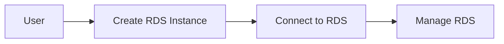

## AWS Database Services

### Introduction to AWS Database Services

AWS offers a range of managed database services, including relational and non-relational databases. These services handle tasks such as setup, patching, and scaling, allowing you to focus on your application.

#### Why Use AWS Database Services?

1. **Managed Services**: AWS manages the underlying infrastructure, reducing operational overhead.
2. **Scalability**: Easily scale database capacity as needed.
3. **High Availability**: Built-in replication and failover mechanisms ensure high availability.
4. **Security**: Enhanced security features, such as encryption and access controls.

#### Types of Database Services

1. **Amazon RDS (Relational Database Service)**: Managed relational databases (e.g., MySQL, PostgreSQL).
2. **Amazon DynamoDB**: Managed NoSQL database.
3. **Amazon Aurora**: High-performance, MySQL-compatible relational database.

### Using Amazon RDS for Relational Databases

Amazon RDS simplifies the deployment and management of relational databases. It supports popular engines such as MySQL, PostgreSQL, and Oracle.

#### Steps to Use Amazon RDS

1. **Create an RDS Instance**:
   - Log in to the AWS Management Console.
   - Navigate to the RDS dashboard and create a new instance.
   - Choose the database engine (e.g., PostgreSQL) and configure settings (e.g., instance type, storage, security).

2. **Connect to the RDS Instance**:
   - Use the endpoint provided by RDS to connect to the database using a client (e.g., psql for PostgreSQL).

     ```bash
     psql -h my-rds-instance.xxxxxx.us-east-1.rds.amazonaws.com -U my-user
     ```

3. **Manage the RDS Instance**:
   - Perform administrative tasks such as creating databases, managing users, and applying patches.

#### Pitfalls and Best Practices

- **Security**: Use security groups to restrict access to the RDS instance.
- **Backup and Restore**: Enable automated backups and test restore procedures.
- **Performance Tuning**: Monitor performance metrics and adjust settings as needed.

### How to Prevent / Defend

- **Use IAM Roles**: Assign IAM roles to RDS instances to control access.
- **Enable Encryption**: Encrypt data at rest and in transit.
- **Regular Audits**: Perform regular audits to ensure compliance with security policies.



---
<!-- nav -->
[[03-Introduction to Amazon Web Services (AWS)|Introduction to Amazon Web Services (AWS)]] | [[DevOps/DevOps Bootcamp/04-Cloud Computing (AWS & DigitalOcean)/02-Navigating Essential AWS Services For General Software Development/00-Overview|Overview]] | [[05-Container Services on AWS|Container Services on AWS]]
