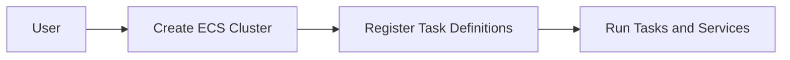

## Container Services on AWS

### Introduction to AWS Container Services

AWS offers several container services to help you build, deploy, and manage containerized applications. These services simplify the process of running containers at scale.

#### Why Use AWS Container Services?

1. **Scalability**: Easily scale containerized applications as needed.
2. **Management**: Simplified management of containerized applications.
3. **Integration**: Seamless integration with other AWS services.
4. **Cost-Effective**: Pay only for the resources you use.

#### Types of Container Services

1. **Amazon ECS (Elastic Container Service)**: Orchestrates Docker containers.
2. **Amazon EKS (Elastic Kubernetes Service)**: Manages Kubernetes clusters.
3. **Amazon ECR (Elastic Container Registry)**: Stores and manages Docker images.

### Using Amazon ECS for Container Orchestration

Amazon ECS allows you to run and manage Docker containers at scale without having to install and operate your own cluster management and scheduling software.

#### Steps to Use Amazon ECS

1. **Create an ECS Cluster**:
   - Log in to the AWS Management Console.
   - Navigate to the ECS dashboard and create a new cluster.
   - Configure cluster settings (e.g., instance type, number of instances).

2. **Register Task Definitions**:
   - Define task definitions to describe the containers to run.
   - Specify container images, CPU and memory requirements, and network settings.

3. **Run Tasks and Services**:
   - Run tasks and services to deploy and manage containers.
   - Use the ECS console or AWS CLI to run tasks and services.

#### Pitfalls and Best Practices

- **Security**: Use security groups and network ACLs to restrict access.
- **Monitoring**: Monitor container performance and resource usage.
- **Scaling**: Scale containers based on demand using auto-scaling policies.

### How to Prevent / Defend

- **Use IAM Policies**: Restrict access to ECS resources using IAM policies.
- **Enable Logging**: Enable CloudWatch logging to monitor ECS activity.
- **Regular Audits**: Perform regular audits to ensure compliance with security policies.

---
<!-- nav -->
[[04-AWS Database Services|AWS Database Services]] | [[DevOps/DevOps Bootcamp/04-Cloud Computing (AWS & DigitalOcean)/02-Navigating Essential AWS Services For General Software Development/00-Overview|Overview]] | [[06-Identity and Access Management (IAM)|Identity and Access Management (IAM)]]
