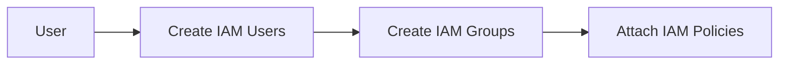

## Identity and Access Management (IAM)

### Introduction to IAM

AWS Identity and Access Management (IAM) is a service that helps you securely control access to AWS resources. IAM allows you to create and manage AWS users, groups, and permissions.

#### Why Use IAM?

1. **Control Access**: Granular control over who can access what resources.
2. **Security**: Enhanced security through least privilege principles.
3. **Compliance**: Meet regulatory requirements by controlling access.
4. **Cost-Effective**: Manage costs by controlling access to paid services.

#### Components of IAM

1. **Users**: Individual accounts for accessing AWS resources.
2. **Groups**: Collections of users with similar access requirements.
3. **Policies**: Documents that define permissions for users and groups.

### Using IAM for User Management

IAM allows you to create and manage users, groups, and permissions to control access to AWS resources.

#### Steps to Use IAM

1. **Create Users**:
   - Log in to the AWS Management Console.
   - Navigate to the IAM dashboard and create new users.
   - Assign permissions to users (e.g., programmatic access, console access).

2. **Create Groups**:
   - Create groups to manage permissions for multiple users.
   - Attach policies to groups to define permissions.

3. **Attach Policies**:
   - Create and attach policies to users and groups to define permissions.
   - Use managed policies or custom policies to define permissions.

#### Pitfalls and Best Practices

- **Least Privilege**: Grant users only the permissions they need to perform their tasks.
- **Multi-Factor Authentication (MFA)**: Enable MFA for added security.
- **Regular Audits**: Perform regular audits to ensure compliance with security policies.

### How to Prevent / Defend

- **Use IAM Policies**: Restrict access to resources using IAM policies.
- **Enable MFA**: Enable multi-factor authentication for added security.
- **Regular Audits**: Perform regular audits to ensure compliance with security policies.

---
<!-- nav -->
[[05-Container Services on AWS|Container Services on AWS]] | [[DevOps/DevOps Bootcamp/04-Cloud Computing (AWS & DigitalOcean)/02-Navigating Essential AWS Services For General Software Development/00-Overview|Overview]] | [[07-Networking Services on AWS|Networking Services on AWS]]
