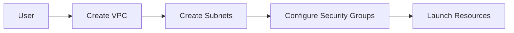

## Networking Services on AWS

### Introduction to AWS Networking Services

AWS provides several networking services to help you build and manage complex network architectures. These services enable you to securely connect resources within and across regions.

#### Why Use AWS Networking Services?

1. **Scalability**: Easily scale network capacity as needed.
2. **Security**: Enhanced security features, such as firewalls and encryption.
3. **Global Reach**: Connect resources across multiple regions.
4. **Cost-Effective**: Pay only for the network resources you use.

#### Types of Networking Services

1. **VPC (Virtual Private Cloud)**: Isolated network environment.
2. **Subnets**: Logical segments of a VPC.
3. **Security Groups**: Network-level access controls.
4. **Route Tables**: Define routing rules for traffic.

### Using VPC for Network Configuration

Amazon VPC allows you to create a logically isolated section of the AWS cloud where you can launch resources in a virtual network that you define.

#### Steps to Use VPC

1. **Create a VPC**:
   - Log in to the AWS Management Console.
   - Navigate to the VPC dashboard and create a new VPC.
   - Configure VPC settings (e.g., CIDR block, DNS support).

2. **Create Subnets**:
   - Create subnets within the VPC to segment the network.
   - Configure subnet settings (e.g., availability zone, route table).

3. **Configure Security Groups**:
   - Create security groups to control inbound and outbound traffic.
   - Define rules for allowed traffic (e.g., SSH, HTTP).

4. **Launch Resources in VPC**:
   - Launch EC2 instances, RDS instances, and other resources within the VPC.
   - Configure network interfaces and associate them with subnets and security groups.

#### Pitfalls and Best Practices

- **Security**: Use security groups to restrict access to resources.
- **Network Design**: Plan the network architecture carefully to ensure optimal performance and security.
- **Monitoring**: Monitor network traffic and performance using tools such as AWS CloudWatch.

### How to Prevent / Defend

- **Use IAM Policies**: Restrict access to VPC resources using IAM policies.
- **Enable Logging**: Enable VPC flow logs to monitor network traffic.
- **Regular Audits**: Perform regular audits to ensure compliance with security policies.

---
<!-- nav -->
[[06-Identity and Access Management (IAM)|Identity and Access Management (IAM)]] | [[DevOps/DevOps Bootcamp/04-Cloud Computing (AWS & DigitalOcean)/02-Navigating Essential AWS Services For General Software Development/00-Overview|Overview]] | [[08-Storage Services on AWS|Storage Services on AWS]]
