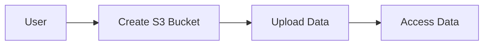

## Storage Services on AWS

### Introduction to AWS Storage Services

AWS offers several storage services to meet different requirements, such as object storage, block storage, and file storage. These services provide durability, scalability, and performance for storing and retrieving data.

#### Why Use AWS Storage Services?

1. **Durability**: Data is replicated across multiple Availability Zones to ensure high availability.
2. **Scalability**: You can scale storage capacity as needed without downtime.
3. **Performance**: Optimized for low latency and high throughput.
4. **Cost-Effective**: Pay only for the storage you use.

#### Types of Storage Services

1. **Amazon S3 (Simple Storage Service)**: Object storage for unstructured data.
2. **Amazon EBS (Elastic Block Store)**: Block storage for persistent data.
3. **Amazon EFS (Elastic File System)**: File storage for shared access.

### Using Amazon S3 for Data Persistence

Amazon S3 is a highly durable, scalable, and secure object storage service. It is commonly used for storing static website content, backups, and large datasets.

#### Steps to Use Amazon S3

1. **Create an S3 Bucket**:
   - Log in to the AWS Management Console.
   - Navigate to the S3 dashboard and create a new bucket.
   - Configure bucket settings (e.g., region, versioning, encryption).

2. **Upload Data to S3**:
   - Use the AWS Management Console, AWS CLI, or SDKs to upload files to the S3 bucket.

     ```bash
     aws s3 cp local-file.txt s3://my-bucket/
     ```

3. **Access Data from S3**:
   - Retrieve files from the S3 bucket using the AWS Management Console, AWS CLI, or SDKs.

     ```bash
     aws s3 cp s3://my-bucket/local-file.txt .
     ```

#### Pitfalls and Best Practices

- **Security**: Enable bucket policies and access control lists (ACLs) to restrict access.
- **Versioning**: Enable versioning to keep multiple versions of objects.
- **Encryption**: Use server-side encryption to protect data at rest.

### How to Prevent / Defend

- **Use IAM Policies**: Restrict access to S3 buckets using IAM policies.
- **Enable Logging**: Enable access logging to monitor S3 bucket activity.
- **Regular Audits**: Perform regular audits to ensure compliance with security policies.



---
<!-- nav -->
[[07-Networking Services on AWS|Networking Services on AWS]] | [[DevOps/DevOps Bootcamp/04-Cloud Computing (AWS & DigitalOcean)/02-Navigating Essential AWS Services For General Software Development/00-Overview|Overview]] | [[09-Virtual Servers on AWS|Virtual Servers on AWS]]
