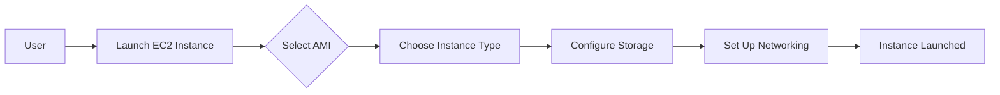
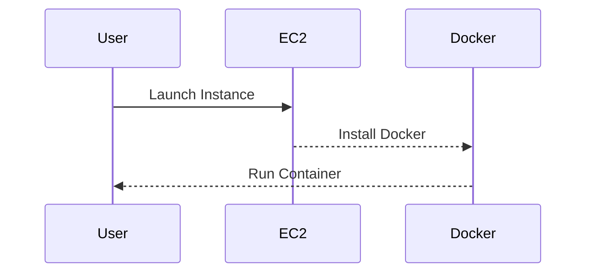

## Virtual Servers on AWS

### Introduction to EC2 Instances

Amazon Elastic Compute Cloud (EC2) provides scalable computing capacity in the Amazon Web Services (AWS) cloud. EC2 enables you to launch and run virtual servers, known as instances, in the cloud. These instances are essentially virtual machines that you can use to host your applications, run Docker containers, and perform various computational tasks.

#### Why Use EC2?

Using EC2 instances offers several advantages:

1. **Scalability**: You can easily scale up or down based on demand.
2. **Flexibility**: You can choose from a variety of instance types, each optimized for different use cases.
3. **Cost-Effective**: You pay only for the resources you use, making it cost-effective compared to maintaining physical servers.
4. **Global Reach**: EC2 instances can be deployed in multiple regions around the world, allowing you to serve users globally.

#### How EC2 Works

When you launch an EC2 instance, you select an Amazon Machine Image (AMI), which contains the operating system and additional software. You can then specify the type of instance, storage, and networking configurations. Once launched, the instance is assigned a public IP address and can be accessed via SSH (for Linux instances) or RDP (for Windows instances).



### Deploying Docker Containers on EC2

One common use case for EC2 instances is deploying Docker containers. Docker allows you to package your application and its dependencies into a lightweight, portable container that can run consistently across different environments.

#### Steps to Deploy Docker Containers on EC2

1. **Launch an EC2 Instance**:
   - Choose an appropriate AMI (e.g., Ubuntu Server).
   - Select an instance type (e.g., t2.micro for testing).
   - Configure storage (e.g., 8 GB root volume).
   - Set up networking (e.g., assign a public IP address).

2. **Install Docker**:
   - Connect to the EC2 instance via SSH.
   - Install Docker using the following commands:

     ```bash
     sudo apt-get update
     sudo apt-get install -y docker.io
     ```

3. **Run a Docker Container**:
   - Pull a Docker image from a registry (e.g., Docker Hub).
   - Run the container using the `docker run` command.

     ```bash
     docker pull nginx
     docker run -d -p 80:80 --name my-nginx nginx
     ```

4. **Verify the Deployment**:
   - Access the deployed application via the public IP address of the EC2 instance.

#### Pitfalls and Best Practices

- **Security**: Ensure that the EC2 instance is properly secured with firewalls and security groups.
- **Resource Management**: Monitor resource usage and scale instances as needed.
- **Backup and Recovery**: Regularly back up important data and configurations.

### How to Prevent / Defend

- **Secure SSH Access**: Use key-based authentication instead of passwords.
- **Use Security Groups**: Restrict inbound and outbound traffic to only necessary ports and protocols.
- **Enable CloudWatch Monitoring**: Monitor EC2 instances for performance and availability issues.



---
<!-- nav -->
[[08-Storage Services on AWS|Storage Services on AWS]] | [[DevOps/DevOps Bootcamp/04-Cloud Computing (AWS & DigitalOcean)/02-Navigating Essential AWS Services For General Software Development/00-Overview|Overview]] | [[DevOps/DevOps Bootcamp/04-Cloud Computing (AWS & DigitalOcean)/02-Navigating Essential AWS Services For General Software Development/10-Conclusion|Conclusion]]
